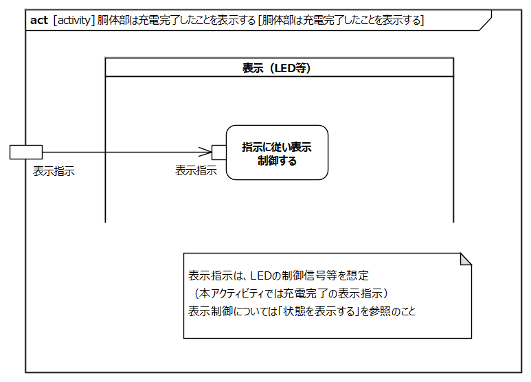
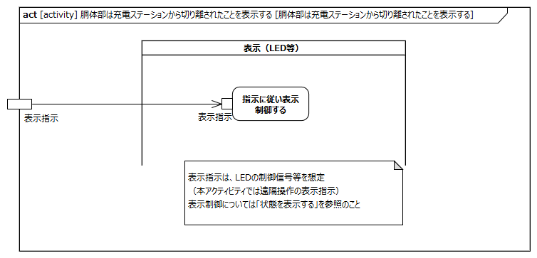
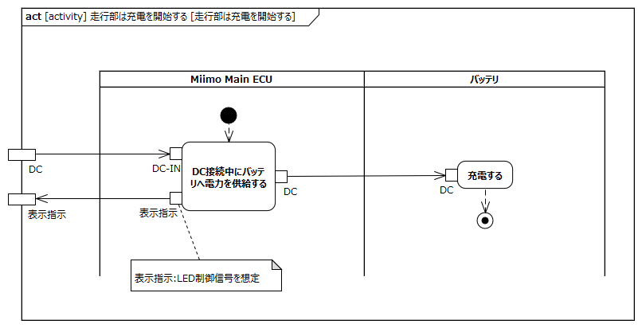
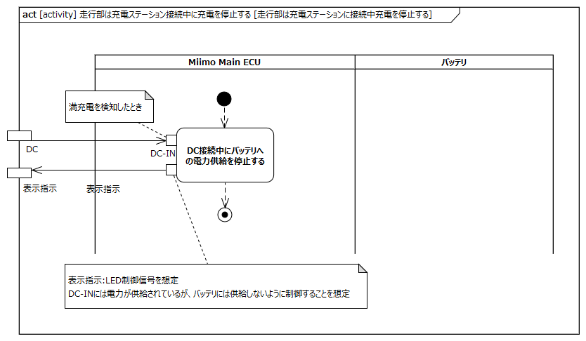

<!-- 表紙ページのための改ページ -->

# はじめに

## 本書の目的

本書の目的は、USDMによる要求記述のため、テレプレゼンスロボット本体のL0要求「SysRS-16:充電する」のL1要求分析結果に基づき、HGLCが担当するL1要求に対してL2要求を抽出することである。

## 適用

本要件の適用対象は、テレプレゼンスロボット とする。

## 用語の定義

|用語|説明|
|:---|:---|
|特に無し|---|

## 関連資料

|資料名|説明|
|:---|:---|
|テレプレゼンスロボット要求一覧&USDM.xlsx|本文書の要求分析結果をまとめ、USDMの形式で記述したファイル|
|機能干渉マトリクス.xlsx|本文書の要求分析および今後の仕様化を進める際に検討が必要な機能干渉についてマトリクス表で整理を行ったファイル|
|テレプレゼンスロボット要求分析_L0L1要求抽出.docx|テレプレゼンスロボット本体のL0/L1要求分析についての検討過程を記述したファイル|

# L2要求分析

「SysRS-16:充電する」のアクティビティ図を以下に示す。

上記L0のアクティビティ図のアクション/デシジョン等から導出された胴体部・走行部のL1要求に対するL2要求分析を行う。  
※頭部に対してはavatarin側の責務のため、本書では対象外とする。

## 胴体部は充電中であることを表示する

**L2要求抽出**

|要求|備考|
|:---|:---|
|表示（LED等）はMiimo Main ECUから受信した表示指示に従い表示制御する|表示制御については「状態を表示する」参照|

## 胴体部は充電完了したことを表示する

**L2要求抽出**

|要求|備考|
|:---|:---|
|表示（LED等）はMiimo Main ECUから受信した表示指示に従い表示制御する|表示制御については「状態を表示する」参照|

## 胴体部は充電ステーションから取り外されたことを表示する

**L2要求抽出**

|要求|備考|
|:---|:---|
|表示（LED等）はMiimo Main ECUから受信した表示指示に従い表示制御する|表示制御については「状態を表示する」参照|

## 走行部は充電ステーションに接続する

**L2要求抽出**

|要求|備考|
|:---|:---|
|Miimo Main ECUはDC接続を検出する||

## 走行部は充電を開始する

**L2要求抽出**

|要求|備考|
|:---|:---|
|Miimo Main ECUはDC接続中にバッテリへ電力を供給する||
|バッテリは充電する||

## 走行部は充電ステーション接続中に充電を停止する

**L2要求抽出**

|要求|備考|
|:---|:---|
|Miimo Main ECUはDC接続中にバッテリへの電力を停止する||

## 走行部は充電ステーションから取り出す

**L2要求抽出**

|要求|備考|
|:---|:---|
|Miimo Main ECUはDC切断を検出する||

## 走行部は充電ステーション未接続中に充電を停止する

**L2要求抽出**

|要求|備考|
|:---|:---|
|Miimo Main ECUはDC未接続中にバッテリへの電力を停止する||
