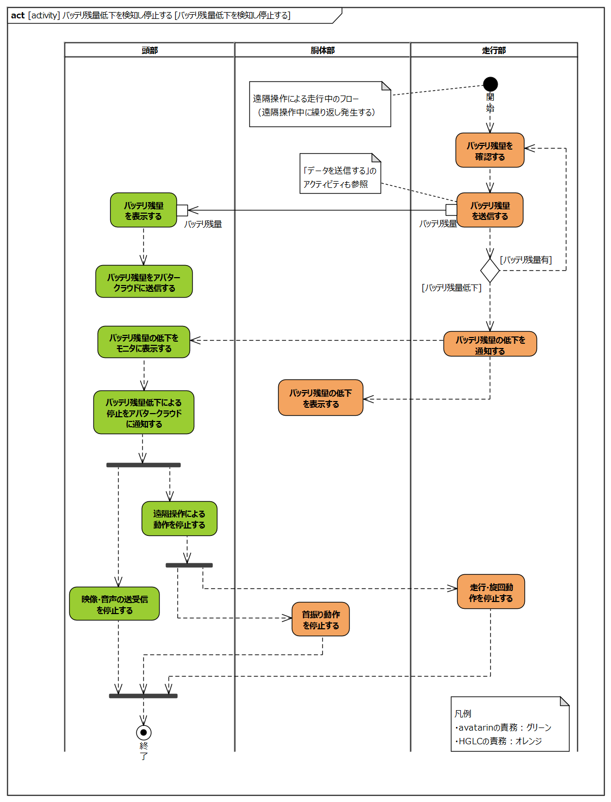
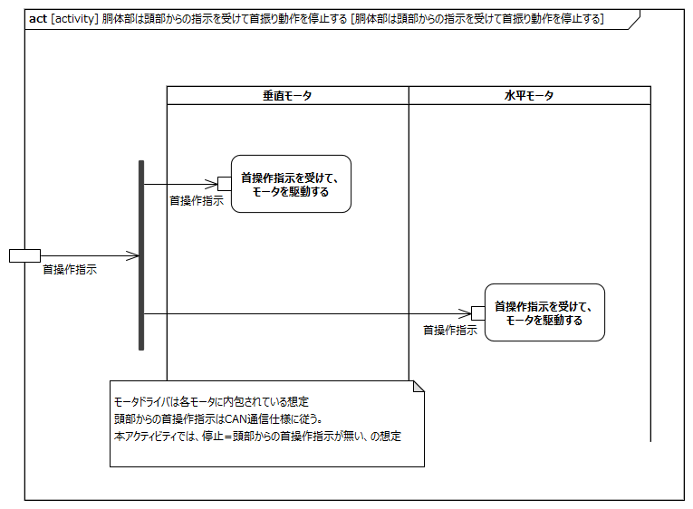
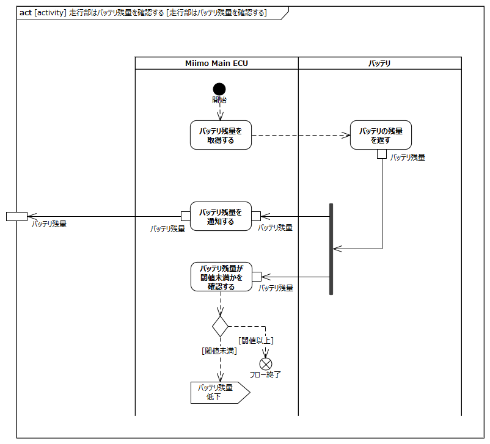

<!-- ↑表紙ページのための情報 -->

# はじめに

## 本書の目的

本書の目的は、USDMによる要求記述のため、テレプレゼンスロボット本体のL0要求「バッテリ残量低下を検知し停止する」のL1要求分析結果に基づき、HGLCが担当するL1要求に対してL2要求を抽出することである。

## 適用

本要件の適用対象は、テレプレゼンスロボット とする。

## 用語の定義

|用語|説明|
|:---|:---|
|特に無し|---|

## 関連資料

|資料名|説明|
|:---|:---|
|テレプレゼンスロボット要求一覧&USDM.xlsx|本文書の要求分析結果をまとめ、USDMの形式で記述したファイル|
|機能干渉マトリクス.xlsx|本文書の要求分析および今後の仕様化を進める際に検討が必要な機能干渉についてマトリクス表で整理を行ったファイル|
|テレプレゼンスロボット要求分析.docx|テレプレゼンスロボット本体のL0/L1要求分析についての検討過程を記述したファイル|

# L2要求分析

「バッテリ残量低下を検知し停止する」のアクティビティ図を以下に示す。

上記L0のアクティビティ図のアクション/デシジョン等から導出された胴体部・走行部のL1要求に対するL2要求分析を行う。  
※頭部に対してはavatarin側の責務のため、本書では対象外とする。

## 頭部はバッテリ残量をモニタに表示する

avatarin側の責務のため、対象外とする。

## 頭部はバッテリ残量をアバタークラウドに送信する

avatarin側の責務のため、対象外とする。

## 頭部はバッテリ残量の低下をモニタに表示する

avatarin側の責務のため、対象外とする。

## 頭部はバッテリ残量の低下による停止をアバタークラウドに通知する

avatarin側の責務のため、対象外とする。

## 頭部はバッテリ残量不足により遠隔操作による動作を停止する

avatarin側の責務のため、対象外とする。

## 頭部はバッテリ残量不足により映像・音声の送受信を停止する

avatarin側の責務のため、対象外とする。

## 胴体部はバッテリ残量の低下を本体に表示する

**L2要求抽出**

|要求|備考|
|:---|:---|
|表示（LED等）はMiimo Main ECUから受信した表示指示に従い表示制御する|表示制御については「状態を表示する」参照|

## 胴体部は頭部からの指示を受けて首振り動作を停止する

**L2要求抽出**

|要求|備考|
|:---|:---|
|垂直モータは頭部からの首操作指示を受けて、モータを駆動する|※1|
|水平モータは頭部からの首操作指示を受けて、モータを駆動する|※1|
※1:本アクティビティでは首操作指示が無い＝停止指示の想定

## 走行部はバッテリ残量を確認する

**L2要求抽出**

|要求|備考|
|:---|:---|
|Miimo Main ECUはバッテリからバッテリ残量を取得する||
|Miimo Main ECUはバッテリ残量をアバターコアに通知する|残量をCAN通信で送信する想定|
|Miimo Main ECUはバッテリ残量が閾値未満かを確認する|閾値未満であれば「走行部はバッテリ残量が低下した場合、頭部にバッテリ残量の低下を通知する」アクティビティを呼び出す|
|バッテリはバッテリ残量を返す||

## 走行部はバッテリ残量を頭部に送信する

**L2要求抽出**

|要求|備考|
|:---|:---|
|→L2要求としては「走行部はバッテリ残量を確認する」内で実施||

## 走行部はバッテリ残量が低下した場合、頭部にバッテリ残量の低下を通知する

**L2要求抽出**

|要求|備考|
|:---|:---|
|Miimo Main ECUはアバターコアにバッテリ残量低下を通知する||
|Miimo Main ECUはバッテリ残量低下の表示指示を表示(LED等)に送信する|・L1分析時のフォーク要素から導出された要求 ・表示指示は「状態を表示する」参照|

## 走行部は頭部からの指示を受けて走行・旋回動作を停止する

**L2要求抽出**

|要求|備考|
|:---|:---|
|Miimo Main ECUは走行操作コマンドから左右モータ駆動信号に変換する|・走行操作コマンドはCAN通信（併進速度とヨーレート指令） ・本アクティビティでは走行操作コマンドで併進速度=0、ヨーレート指令=0の想定|
|右走行モータはモータ駆動信号によりモータを駆動する|※1|
|左走行モータはモータ駆動信号によりモータを駆動する|※1|
※1:本アクティビティでは停止=モータ駆動信号が来ない想定
