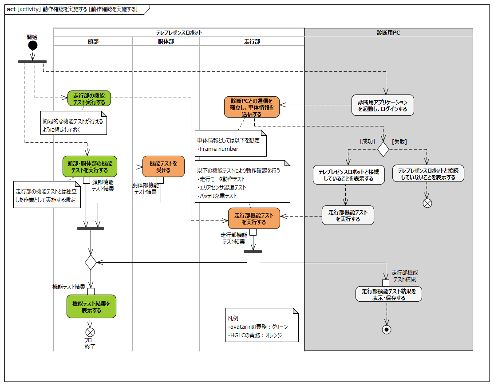
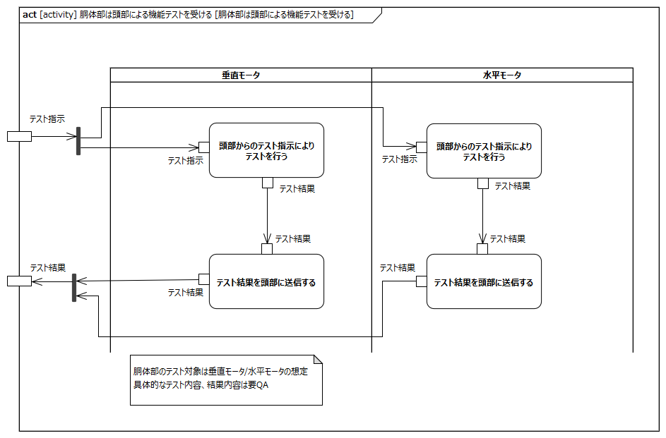
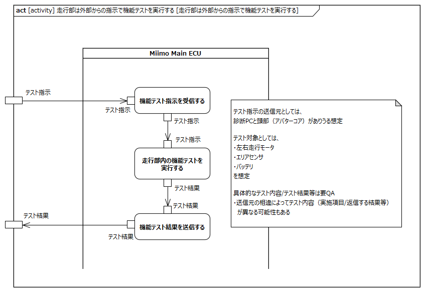

<!-- ↑表紙ページのための情報 -->

# はじめに

## 本書の目的

本書の目的は、USDMによる要求記述のため、テレプレゼンスロボット本体のL0要求「SysRS-21:動作確認を実施する」のL1要求分析結果に基づき、HGLCが担当するL1要求に対してL2要求を抽出することである。

## 適用

本要件の適用対象は、テレプレゼンスロボット とする。

## 用語の定義

|用語|説明|
|:---|:---|
|特に無し|---|

## 関連資料

|資料名|説明|
|:---|:---|
|テレプレゼンスロボット要求一覧&USDM.xlsx|本文書の要求分析結果をまとめ、USDMの形式で記述したファイル|
|機能干渉マトリクス.xlsx|本文書の要求分析および今後の仕様化を進める際に検討が必要な機能干渉についてマトリクス表で整理を行ったファイル|
|テレプレゼンスロボット要求分析_L0L1要求抽出.docx|テレプレゼンスロボット本体のL0/L1要求分析についての検討過程を記述したファイル|

# L2要求分析

「SysRS-21:動作確認を実施する」のアクティビティ図を以下に示す。

  
modelID:{SysRM-act21}

上記L0のアクティビティ図のアクション/デシジョン等から導出された胴体部・走行部のL1要求に対するL2要求分析を行う。  
※頭部に対してはavatarin側の責務のため、本書では対象外とする。

## 頭部は走行部の機能テストを実行する

avatarin側の責務のため、対象外とする。

## 頭部は頭部・胴体部の機能テストを実行する

avatarin側の責務のため、対象外とする。

## 頭部は機能テスト結果を表示する

avatarin側の責務のため、対象外とする。

## 胴体部は頭部による機能テストを受ける

  
modelID:{SysRM-act21-01}

**L2要求抽出**

|要求|備考|
|:---|:---|
|垂直モータは頭部からのテスト指示によりテストを行う||
|垂直モータはテスト結果を頭部に送信する||
|水平モータは頭部からのテスト指示によりテストを行う||
|水平モータはテスト結果を頭部に送信する||
※具体的なテスト内容/結果内容は要QA

## 走行部は診断PCとの通信を確立し、車体情報を送信する

  
modelID:{SysRM-act21-02}

**L2要求抽出**

|要求|備考|
|:---|:---|
|Miimo Main ECUは診断PCとの通信を確立する|※1※2|
|Miimo Main ECUはEEPROMに車体番号の読み出しを依頼する||
|Miimo Main ECUはEEPROMから受けた車体番号を診断PCに送信する|※1|
|EEPROMはMiimo Main ECUの依頼を受けて車体番号を返す|※3|
※1:診断PCとの通信はリプロ用コネクタを経由する想定  
※2:テストモードの起動/通信確立手順の詳細は状態分析とともに要QA  
※3:車体番号の保存先をEEPROMと想定

## 走行部は外部からの指示で機能テストを実行する

  
modelID:{SysRM-act21-03}

**L2要求抽出**

|要求|備考|
|:---|:---|
|Miimo Main ECUは外部から機能テスト指示を受信する|※1※2|
|Miimo Main ECUは右走行モータの機能テストを実行する|※3|
|Miimo Main ECUは左走行モータの機能テストを実行する|※3|
|Miimo Main ECUはエリアセンサの機能テストを実行する|※3|
|Miimo Main ECUはバッテリの機能テストを実行する|※3|
|Miimo Main ECUは走行部内の機能テスト結果を外部に送信する|※1※2※3|
※1:テスト指示の送信元としては診断PCまたは頭部がありうる想定  
※2:指示元によってテスト内容が異なる場合もありうる想定（ex.頭部から指示されるのは簡易テスト）  
※3:テスト対象毎の具体的な実施項目および結果の形式等は要QA