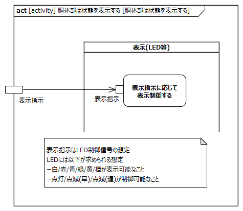
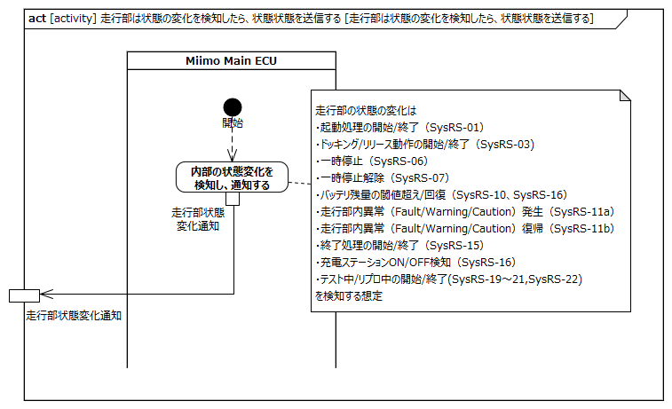
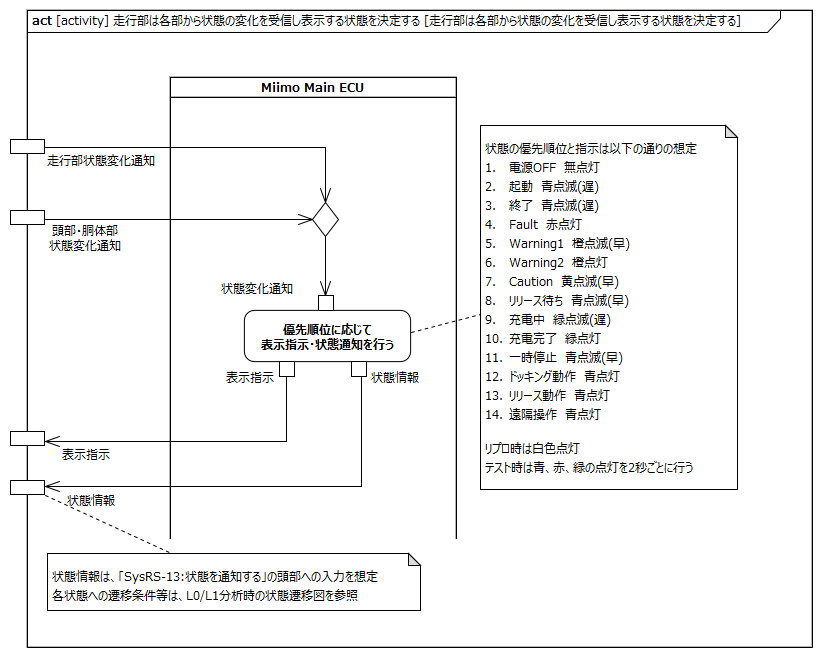

<!-- ↑表紙ページのための情報 -->

# はじめに

## 本書の目的

本書の目的は、USDMによる要求記述のため、テレプレゼンスロボット本体のL0要求「SysRS-12:状態を表示する」のL1要求分析結果に基づき、HGLCが担当するL1要求に対してL2要求を抽出することである。

## 適用

本要件の適用対象は、テレプレゼンスロボット とする。

## 用語の定義

|用語|説明|
|:---|:---|
|特に無し|---|

## 関連資料

|資料名|説明|
|:---|:---|
|テレプレゼンスロボット要求一覧&USDM.xlsx|本文書の要求分析結果をまとめ、USDMの形式で記述したファイル|
|機能干渉マトリクス.xlsx|本文書の要求分析および今後の仕様化を進める際に検討が必要な機能干渉についてマトリクス表で整理を行ったファイル|
|テレプレゼンスロボット要求分析_L0L1要求抽出.docx|テレプレゼンスロボット本体のL0/L1要求分析についての検討過程を記述したファイル|

# L2要求分析

「SysRS-12:状態を表示する」のアクティビティ図を以下に示す。

上記L0のアクティビティ図のアクション/デシジョン等から導出された胴体部・走行部のL1要求に対するL2要求分析を行う。  
※頭部に対してはavatarin側の責務のため、本書では対象外とする。

## 頭部は頭部または胴体部の状態の変化を検知したら走行部に状態情報を送信する

avatarin側の責務のため、対象外とする。

## 胴体部は状態の変化を検知したら頭部に状態情報を送信する

**L2要求抽出**

|要求|備考|
|:---|:---|
|垂直モータは状態の変化を検知し頭部に通知する|※1|
|水平モータは状態の変化を検知し頭部に通知する|※1|

※1:状態の変化は、垂直・水平モータの異常である想定。異常は頭部側で過電流・過電圧を検出する想定。

## 胴体部は状態を表示する

**L2要求抽出**

|要求|備考|
|:---|:---|
|表示（LED等）は走行部からの表示指示に従い表示制御する|表示指示はLED制御信号の想定。LEDには、白/赤/青/緑/黄/橙の点灯/点滅(早)/点滅(遅)を指示可能なこと|

## 走行部は状態の変化を検知したら、状態情報を送信する

**L2要求抽出**

|要求|備考|
|:---|:---|
|Miimo Main ECUは状態の変化を検知し通知する|※1|
※1:走行部で検知する状態変化は、以下を想定  

|状態変化|対応する要求|
|:---|:---|
|起動処理の開始/終了|SysRS-01:起動する|
|ドッキング/リリース動作の開始/終了|SysRS-03:遠隔で操作する|
|一時停止|SysRS-06:一時停止する|
|一時停止解除|SysRS-07:一時停止を解除する|
|バッテリ残量の閾値超え/回復|SysRS-10:バッテリ残量低下を検知し停止する SysRS-16:充電する|
|走行部内異常(Fault/Warning/Caution)発生|SysRS-11a:異常を検知し停止する|
|走行部内異常(Fault/Warning/Caution)復帰|SysRS-11b:異常状態から復帰する|
|終了処理の開始/終了|SysRS-15:シャットダウンする|
|充電ステーションON/OFF検知|SysRS-16:充電する|
|テスト中/リプロ中の開始/終了|SysRS-19～21およびSysRS-22|

## 走行部は各部から状態の変化を受信し表示する状態を決定する

**L2要求抽出**

|要求|備考|
|:---|:---|
|Miimo Main ECUは優先順位に応じて胴体部への表示指示を行う|※1|
|Miimo Main ECUは優先順位に応じて頭部への状態通知を行う|※1|
※1:優先順位はL0/L1分析資料のSysRS-12参照  

