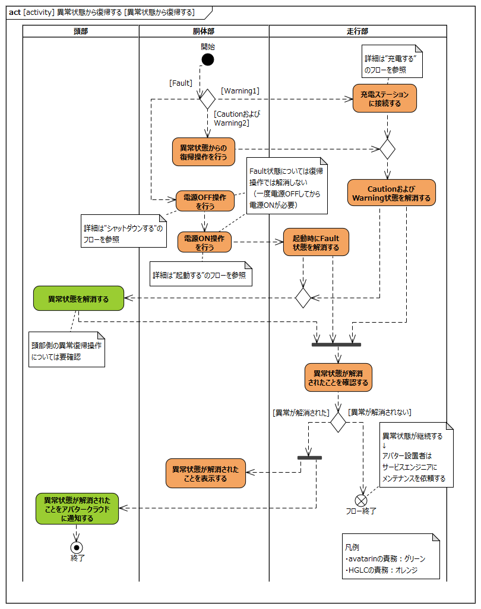
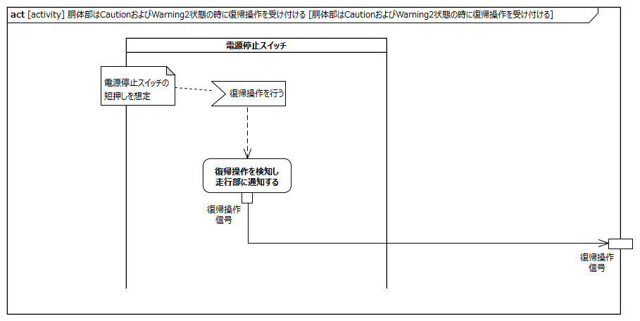
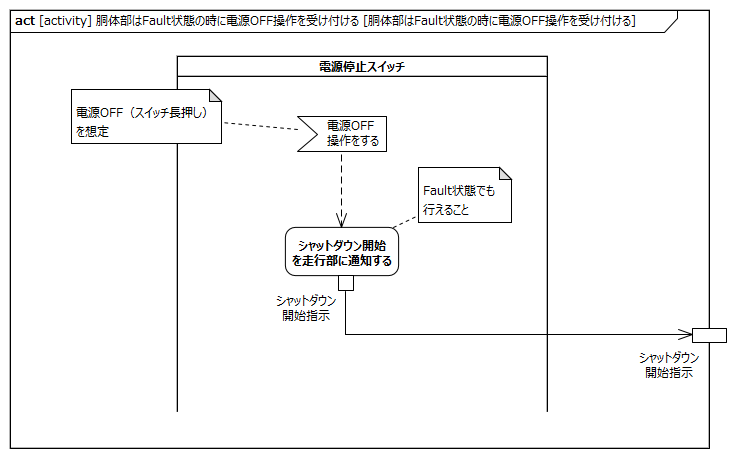
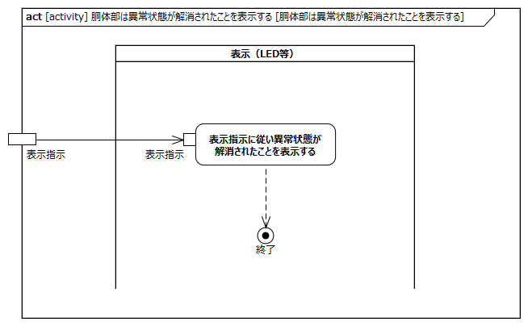
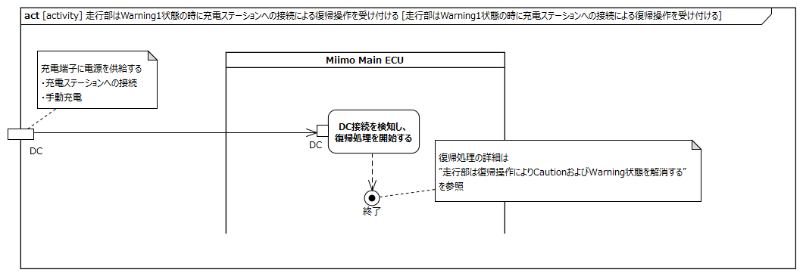
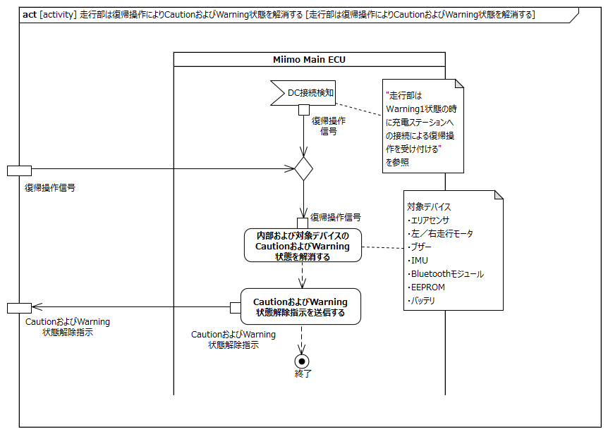
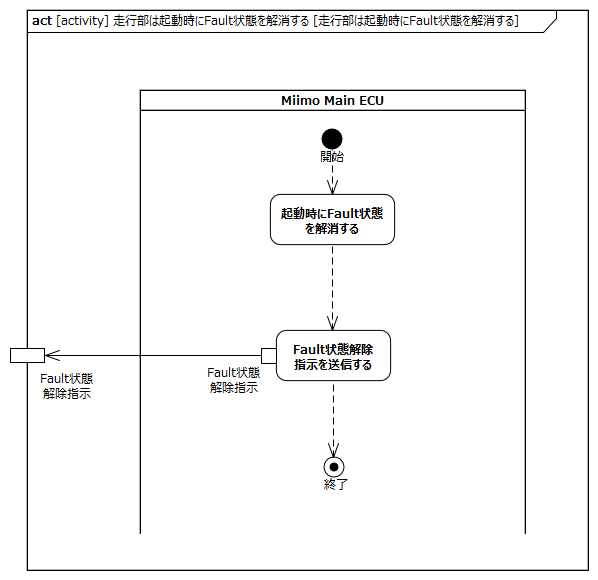

<!-- ↑表紙ページのための情報 -->

# はじめに

## 本書の目的

本書の目的は、USDMによる要求記述のため、テレプレゼンスロボット本体のL0要求「SysRS-11b:異常状態から復帰する」のL1要求分析結果に基づき、HGLCが担当するL1要求に対してL2要求を抽出することである。

## 適用

本要件の適用対象は、テレプレゼンスロボット とする。

## 用語の定義

|用語|説明|
|:---|:---|
|特に無し|---|

## 関連資料

|資料名|説明|
|:---|:---|
|テレプレゼンスロボット要求一覧&USDM.xlsx|本文書の要求分析結果をまとめ、USDMの形式で記述したファイル|
|機能干渉マトリクス.xlsx|本文書の要求分析および今後の仕様化を進める際に検討が必要な機能干渉についてマトリクス表で整理を行ったファイル|
|テレプレゼンスロボット要求分析_L0L1要求抽出.docx|テレプレゼンスロボット本体のL0/L1要求分析についての検討過程を記述したファイル|

# L2要求分析

「SysRS-11b:異常状態から復帰する」のアクティビティ図を以下に示す。

上記L0のアクティビティ図のアクション/デシジョン等から導出された胴体部・走行部のL1要求に対するL2要求分析を行う。  
※頭部に対してはavatarin側の責務のため、本書では対象外とする。

## 頭部は走行部からの指示により異常状態を解消する

avatarin側の責務のため、対象外とする。

## 頭部は異常状態が解消されたことをアバタークラウドに通知する

avatarin側の責務のため、対象外とする。

## 胴体部はCautionおよびWarning2状態の時に復帰操作を受け付ける

**L2要求抽出**

|要求|備考|
|:---|:---|
|電源停止スイッチは復帰操作を検知し走行部に通知する|電源停止スイッチの短押しを想定|

## 胴体部はFault状態の時に電源OFF操作を受け付ける

**L2要求抽出**

|要求|備考|
|:---|:---|
|電源停止スイッチは電源OFF操作を検知し走行部に通知する|Fault状態の時でも操作できること|

## 胴体部は電源ON操作を受け付ける

電源ONのフローについてはSysRS-01:起動するで詳細化を行っているため割愛

## 胴体部は異常状態が解消されたことを表示する

**L2要求抽出**

|要求|備考|
|:---|:---|
|表示（LED等）は走行部からの表示指示に従い異常状態が解消されたことを表示する|表示指示については「状態を表示する」参照|

## 走行部はWarning1状態の時に充電ステーションへの接続による復帰操作を受け付ける

**L2要求抽出**

|要求|備考|
|:---|:---|
|Miimo Main ECUはDC接続を検知し、復帰処理を開始する||

## 走行部は復帰操作によりCautionおよびWarning状態を解消する

**L2要求抽出**

|要求|備考|
|:---|:---|
|Miimo Main ECUは内部のCautionおよびWarning状態を解消する||
|Miimo Main ECUはエリアセンサのCautionおよびWarning状態を解消する||
|Miimo Main ECUは左走行モータのCautionおよびWarning状態を解消する||
|Miimo Main ECUは右走行モータのCautionおよびWarning状態を解消する||
|Miimo Main ECUはブザーのCautionおよびWarning状態を解消する||
|Miimo Main ECUはIMUのCautionおよびWarning状態を解消する||
|Miimo Main ECUはBluetoothモジュールのCautionおよびWarning状態を解消する||
|Miimo Main ECUはEEPROMのCautionおよびWarning状態を解消する||
|Miimo Main ECUはバッテリのCautionおよびWarning状態を解消する||
|Miimo Main ECUはCautionおよびWarning状態解除指示を送信する|頭部側の異常状態を解消するため|

## 走行部は起動中にFault状態を解消する

**L2要求抽出**

|要求|備考|
|:---|:---|
|Miimo Main ECUは起動時Fault状態を解消する||
|Miimo Main ECUはFault状態解除指示を送信する||

## 走行部は異常状態が解消されたことを確認する

**L2要求抽出**

|要求|備考|
|:---|:---|
|Miimo Main ECUはFault状態が解消されたことを確認する||
|Miimo Main ECUは内部のCautionおよびWarning状態が解消されたことを確認する||
|Miimo Main ECUはエリアセンサのCautionおよびWarning状態が解消されたことを確認する||
|Miimo Main ECUは左走行モータのCautionおよびWarning状態が解消されたことを確認する||
|Miimo Main ECUは右走行モータのCautionおよびWarning状態が解消されたことを確認する||
|Miimo Main ECUはブザーのCautionおよびWarning状態が解消されたことを確認する||
|Miimo Main ECUはIMUのCautionおよびWarning状態が解消されたことを確認する||
|Miimo Main ECUはBluetoothモジュールのCautionおよびWarning状態が解消されたことを確認する||
|Miimo Main ECUはEEPROMのCautionおよびWarning状態が解消されたことを確認する||
|Miimo Main ECUはバッテリのCautionおよびWarning状態が解消されたことを確認する||
|Miimo Main ECUは異常状態確認結果を送信する||