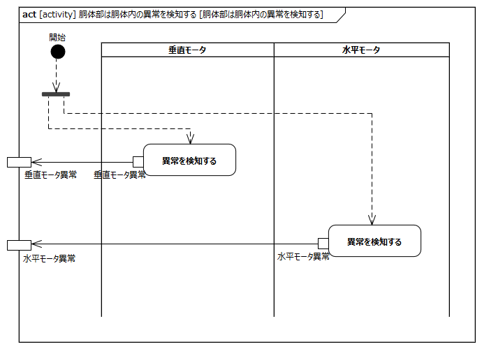
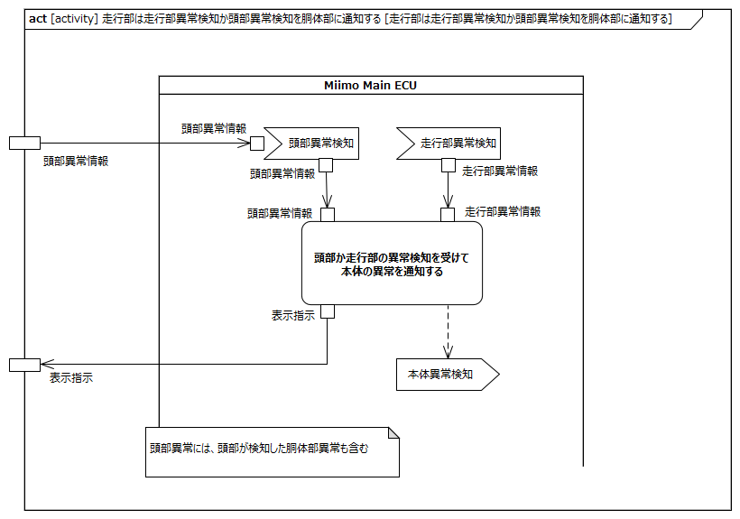

<!-- ↑表紙ページのための情報 -->

# はじめに

## 本書の目的

本書の目的は、USDMによる要求記述のため、テレプレゼンスロボット本体のL0要求「SysRS-11a:異常を検知し停止する」のL1要求分析結果に基づき、HGLCが担当するL1要求に対してL2要求を抽出することである。

## 適用

本要件の適用対象は、テレプレゼンスロボット とする。

## 用語の定義

|用語|説明|
|:---|:---|
|特に無し|---|

## 関連資料

|資料名|説明|
|:---|:---|
|テレプレゼンスロボット要求一覧&USDM.xlsx|本文書の要求分析結果をまとめ、USDMの形式で記述したファイル|
|機能干渉マトリクス.xlsx|本文書の要求分析および今後の仕様化を進める際に検討が必要な機能干渉についてマトリクス表で整理を行ったファイル|
|テレプレゼンスロボット要求分析_L0L1要求抽出.docx|テレプレゼンスロボット本体のL0/L1要求分析についての検討過程を記述したファイル|

# L2要求分析

「SysRS-11a:異常を検知し停止する」のアクティビティ図を以下に示す。

  
modelID:{SysRM-act11a}

上記L0のアクティビティ図のアクション/デシジョン等から導出された胴体部・走行部のL1要求に対するL2要求分析を行う。  
※頭部に対してはavatarin側の責務のため、本書では対象外とする。

## 頭部は頭部内の異常を検知する

avatarin側の責務のため、対象外とする。

## 頭部は頭部および胴体内の異常を走行部に通知する

avatarin側の責務のため、対象外とする。

## 頭部はクラウド接続異常以外の異常をアバタークラウドに通知する

avatarin側の責務のため、対象外とする。

## 頭部は本体の異常により遠隔操作による動作を停止する

avatarin側の責務のため、対象外とする。

## 頭部はクラウド接続異常およびバッテリ不足により映像・音声の送受信を停止する

avatarin側の責務のため、対象外とする。

## 胴体部は胴体内の異常を検知し、頭部に通知する

  
modelID:{SysRM-act11a-01}

**L2要求抽出**

|要求|備考|
|:---|:---|
|垂直モータは異常を検知し、頭部に通知する||
|水平モータは異常を検知し、頭部に通知する||

## 胴体部は胴体内の異常を検知したら保護機能を作動する

  
modelID:{SysRM-act11a-02}

**L2要求抽出**

|要求|備考|
|:---|:---|
|垂直モータは異常を検知したら、保護機能を作動する|※1|
|水平モータは異常を検知したら、保護機能を作動する|※1|
※1:保護機能によりモータ駆動を停止する想定

## 胴体部は本体の異常を本体に表示する

  
modelID:{SysRM-act11a-03}

**L2要求抽出**

|要求|備考|
|:---|:---|
|表示（LED等）は走行部から受信した表示指示に従い表示制御する|表示制御については「状態を表示する」参照|

## 胴体部は頭部からの指示を受けて首振り動作を停止する

  
modelID:{SysRM-act11a-04}

**L2要求抽出**

|要求|備考|
|:---|:---|
|垂直モータは頭部からの首操作指示を受けて、モータを駆動する|※1|
|水平モータは頭部からの首操作指示を受けて、モータを駆動する|※1|
※1:本アクティビティでは首操作指示が無い＝停止指示の想定

## 走行部は走行部内の異常を検知する

  
modelID:{SysRM-act11a-05}

**L2要求抽出**

|要求|備考|
|:---|:---|
|Miimo Main ECUは自身の内部異常を検知する||
|Miimo Main ECUはエリアセンサの異常通知を受信する|※1|
|Miimo Main ECUは左走行モータの異常通知を受信する|※1|
|Miimo Main ECUは右走行モータの異常通知を受信する|※1|
|Miimo Main ECUはブザーの異常通知を受信する|※1|
|Miimo Main ECUはIMUの異常通知を受信する|※1|
|Miimo Main ECUはBluetoothモジュールの異常通知を受信する|※1|
|Miimo Main ECUはEEPROMの異常通知を受信する|※1|
|Miimo Main ECUはバッテリの異常通知を受信する|※1|
※1:異常通知にはデバイス側から送信される値の異常/ECUからの定期診断NGも含む

## 走行部は走行部内の異常を頭部に通知する

  
modelID:{SysRM-act11a-06}

**L2要求抽出**

|要求|備考|
|:---|:---|
|Miimo Main ECUは走行部の異常検知を受けて頭部に異常情報を通知する|頭部に通知する形式は、CAN通信で送信するエラーコードを想定|

## 走行部は走行部異常検知か頭部異常検知を胴体部に通知する

  
modelID:{SysRM-act11a-07}

**L2要求抽出**

|要求|備考|
|:---|:---|
|Miimo Main ECUは頭部からまたは走行部の異常検知を受けて本体異常として胴体部に表示指示を送る||
|Miimo Main ECUは本体の異常検知を発出する|後述の「走行部は走行・旋回動作を停止する」を呼び出す|

## 走行部は走行・旋回動作を停止する

  
modelID:{SysRM-act11a-08}

**L2要求抽出**

|要求|備考|
|:---|:---|
|Miimo Main ECUは本体の異常検知を受けてモータ駆動を停止する|左右走行モータに駆動信号を送らないことで停止とする想定|

## 走行部は異常発生時の運転履歴を記録する

  
modelID:{SysRM-act11a-09}

**L2要求抽出**

|要求|備考|
|:---|:---|
|Miimo Main ECUは本体の異常発生時の運転履歴をEEPROMに書き込む||
|EEPROMは運転履歴を保存する||

