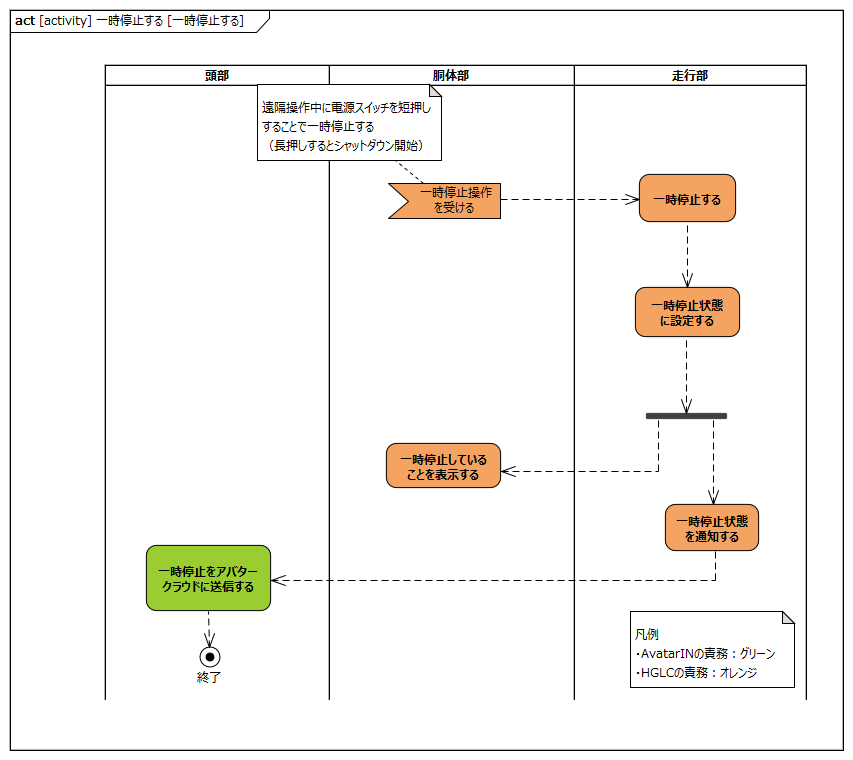

<!-- ↑表紙ページのための情報 -->

# はじめに

## 本書の目的

本書の目的は、USDMによる要求記述のため、テレプレゼンスロボット本体のL0要求「SysRS-06:一時停止する」のL1要求分析結果に基づき、HGLCが担当するL1要求に対してL2要求を抽出することである。

## 適用

本要件の適用対象は、テレプレゼンスロボット とする。

## 用語の定義

|用語|説明|
|:---|:---|
|特に無し|---|

## 関連資料

|資料名|説明|
|:---|:---|
|テレプレゼンスロボット要求一覧&USDM.xlsx|本文書の要求分析結果をまとめ、USDMの形式で記述したファイル|
|機能干渉マトリクス.xlsx|本文書の要求分析および今後の仕様化を進める際に検討が必要な機能干渉についてマトリクス表で整理を行ったファイル|
|テレプレゼンスロボット要求分析_L0L1要求抽出.docx|テレプレゼンスロボット本体のL0/L1要求分析についての検討過程を記述したファイル|

# L2要求分析

「SysRS-06:一時停止する」のアクティビティ図を以下に示す。

  
modelID:{SysRM-act06}

上記L0のアクティビティ図のアクション/デシジョン等から導出された胴体部・走行部のL1要求に対するL2要求分析を行う。  
※頭部に対してはavatarin側の責務のため、本書では対象外とする。

## 頭部は一時停止状態をアバタークラウドに送信する

avatarin側の責務のため、対象外とする。

## 胴体部は遠隔操作中に一時停止操作されたら走行部に一時停止を伝達する

  
modelID:{SysRM-act06-01}

**L2要求抽出**

|要求|備考|
|:---|:---|
|電源停止スイッチはスイッチ押下を検出する|※1|
|電源停止スイッチは走行部に電源停止スイッチ押下を伝達する|※1|

※1:「電源停止スイッチタイミングチャート」資料により、電源停止スイッチは押下を検出するのみとする。（スイッチ押下を電源ON/電源OFF/一時停止/一時停止解除のどの操作と解釈するかは走行部の責務）。

## 胴体部は一時停止状態であることを表示する

)  
modelID:{SysRM-act06-02}

**L2要求抽出**

|要求|備考|
|:---|:---|
|表示（LED等）は走行部から表示指示を受信する||
|表示（LED等）は表示指示に従い表示制御する|表示制御については「状態を表示する」参照|

## 走行部は一時停止信号を受信したら直ちに一時停止する

  
modelID:{SysRM-act06-03}

**L2要求抽出**

|要求|備考|
|:---|:---|
|Miimo Main ECUは現在の状態とスイッチ操作イベントから一時停止操作か判定する|※1|
|Miimo Main ECUはブザーにブザー制御信号を送る|※2|
|Miimo Main ECUは走行モータの駆動を停止する|※2|
|右走行モータはモータ駆動信号を受けてモータを停止する||
|左走行モータはモータ駆動信号を受けてモータを停止する||
|ブザーはブザー制御信号を受けてブザーを鳴らす||

※1:「電源停止スイッチタイミングチャート」資料により、スイッチ押下を電源ON/電源OFF/一時停止/一時停止解除のどの操作と解釈するかはMiimo Main ECUの責務とする。   
※2:「電源停止スイッチタイミングチャート」資料により、モータ停止とブザー鳴動は並行動作とする

## 走行部は一時停止した後に内部の状態を一時停止状態に設定する

  
modelID:{SysRM-act06-04}

**L2要求抽出**

|要求|備考|
|:---|:---|
|Miimo Main ECUは内部状態を一時停止状態に設定する||

## 走行部は一時停止状態であることを頭部に通知する

  
modelID:{SysRM-act06-05}

**L2要求抽出**

|要求|備考|
|:---|:---|
|Miimo Main ECUは頭部に一時停止を通知する||
|Miimo Main ECUは一時停止中の表示指示を胴体部に送信する|・L1分析時のフォーク要素から導出された要求 ・表示指示は「状態を表示する」参照|

