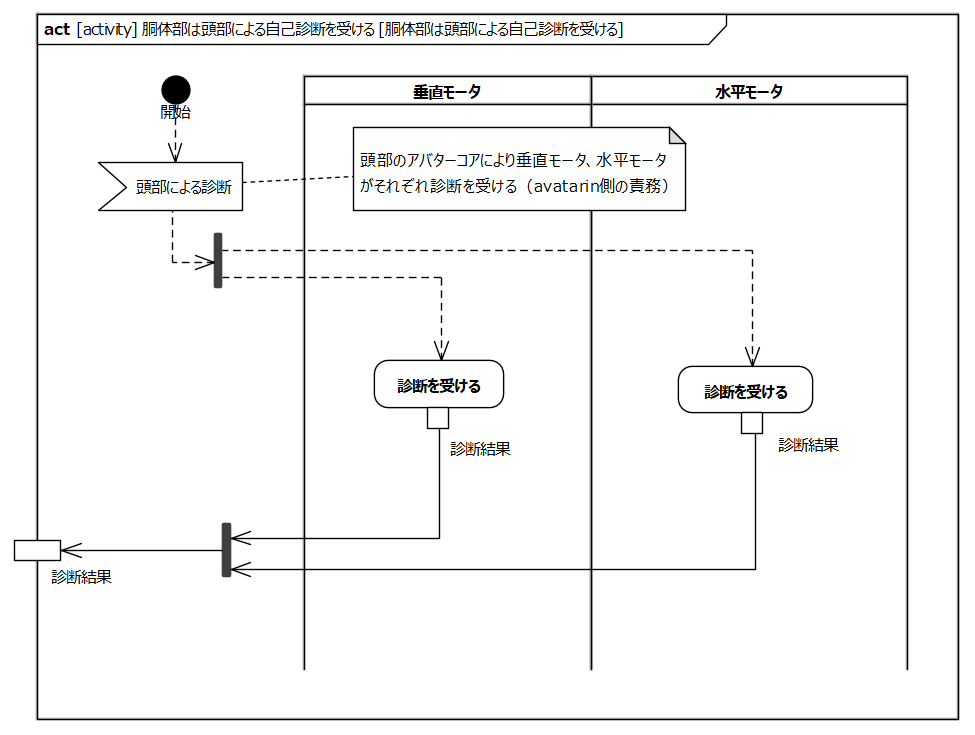
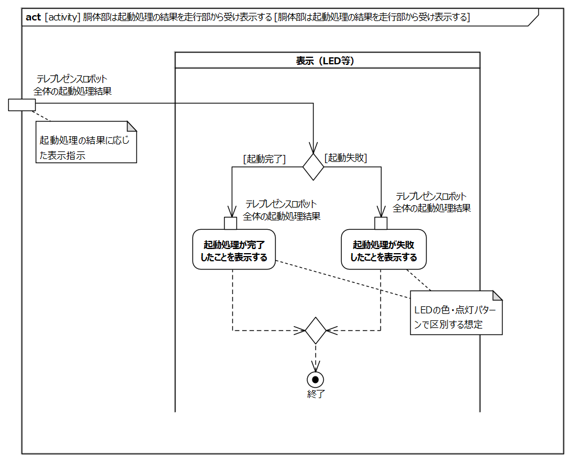
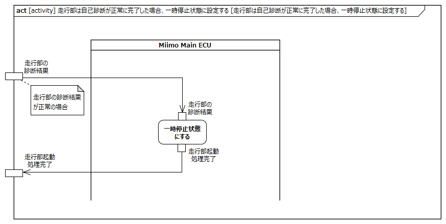
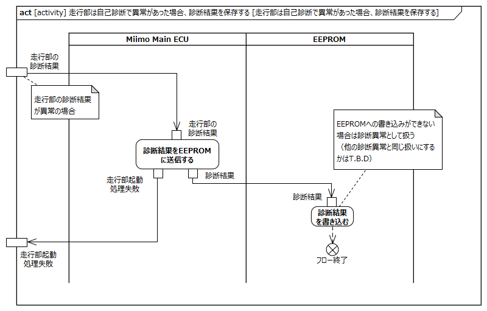
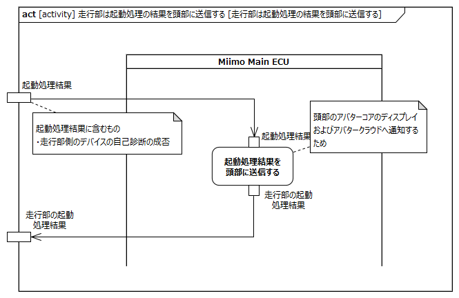
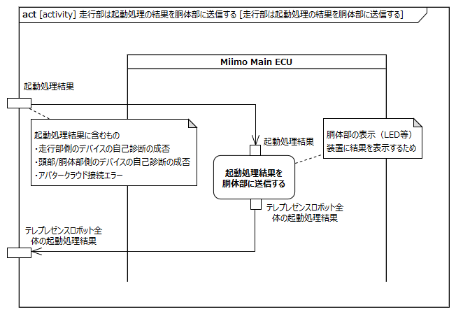

<!-- ↑表紙ページのための情報 -->

# はじめに

## 本書の目的

本書の目的は、USDMによる要求記述のため、テレプレゼンスロボット本体のL0要求「起動する」のL1要求分析結果に基づき、HGLCが担当するL1要求に対してL2要求を抽出することである。

## 適用

本要件の適用対象は、テレプレゼンスロボット とする。

## 用語の定義

|用語|説明|
|:---|:---|
|||

## 関連資料

|資料名|説明|
|:---|:---|
|テレプレゼンスロボット要求一覧&USDM.xlsx|本文書の要求分析結果をまとめ、USDMの形式で記述したファイル|
|機能干渉マトリクス.xlsx|本文書の要求分析および今後の仕様化を進める際に検討が必要な機能干渉についてマトリクス表で整理を行ったファイル|
|テレプレゼンスロボット要求分析.docx|テレプレゼンスロボット本体のL0/L1要求分析についての検討過程を記述したファイル|

# L2要求分析

「起動する」のアクティビティ図を以下に示す。

上記L0のアクティビティ図のアクション/デシジョン等から導出された胴体部・走行部のL1要求に対するL2要求分析を行う。  
※頭部に対してはavatarin側の責務のため、本書では対象外とする。

## 頭部は走行部からの電源供給により起動し、起動処理を開始する

avatarin側の責務のため、対象外とする。

## 頭部は自己診断を行う

avatarin側の責務のため、対象外とする。

## 頭部はアバタークラウドに接続する

avatarin側の責務のため、対象外とする。

## 頭部は自己診断で異常があった場合およびアバタークラウドへの接続に失敗した場合、その結果を走行部に通知する

avatarin側の責務のため、対象外とする。

## 頭部は起動処理の結果をアバタークラウドに通知する

avatarin側の責務のため、対象外とする。

## 頭部は起動処理の結果を表示する

avatarin側の責務のため、対象外とする。

## 胴体部は頭部による自己診断を受ける

**L2要求抽出**

|要求|備考|
|:---|:---|
|垂直モータは頭部（アバターコア）による診断を受ける||
|水平モータは頭部（アバターコア）による診断を受ける||

## 胴体部は起動処理の結果を走行部から受け表示する

**L2要求抽出**

|要求|備考|
|:---|:---|
|表示（LED等）は起動完了した場合、起動処理が完了したことを表示する|※1|
|表示（LED等）は起動失敗した場合、起動処理が失敗したことを表示する|※1|
※1:LEDの色・点灯パターンで区別する想定

## 走行部は胴体部の電源ON操作により起動し、起動処理を開始する

**L2要求抽出**

|要求|備考|
|:---|:---|
|Miimo Main ECUはバッテリから電源が供給されている状態で胴体部の電源ON操作により起動処理を開始する||
|Miimo Main ECUはエリアセンサに電源を供給する||
|Miimo Main ECUは左走行モータに電源を供給する||
|Miimo Main ECUは右走行モータに電源を供給する||
|Miimo Main ECUはブザーに電源を供給する||
|Miimo Main ECUはIMUに電源を供給する||
|Miimo Main ECUはBluetoothモジュールに電源を供給する||
|Miimo Main ECUはEEPROMに電源を供給する||
|Miimo Main ECUは電源基板に電源を供給する|オプション電源から給電する想定|

## 走行部は頭部に電源を供給する

**L2要求抽出**

|要求|備考|
|:---|:---|
|電源基板は頭部に電源を供給する||
|電源基板は胴体部に電源を供給する||

## 走行部は自己診断を行う

**L2要求抽出**

|要求|備考|
|:---|:---|
|Miimo Main ECUは自己診断を行う||
|Miimo Main ECUはエリアセンサの診断を行う|※1|
|Miimo Main ECUは左走行モータの診断を行う|※1|
|Miimo Main ECUは右走行モータの診断を行う|※1|
|Miimo Main ECUはブザーの診断を行う|※1|
|Miimo Main ECUはIMUの診断を行う|※1|
|Miimo Main ECUはBluetoothモジュールの診断を行う|※1|
|Miimo Main ECUはEEPROMの診断を行う|※1|
|Miimo Main ECUはバッテリの診断を行う|※1|
※1:起動時の診断は通電とCAN通信の疎通確認のみの簡易的なものを想定

## 走行部は自己診断が正常に完了した場合、一時停止状態に設定する

**L2要求抽出**

|要求|備考|
|:---|:---|
|Miimo Main ECUは自己診断が正常に完了した場合、一時停止状態に設定する||

## 走行部は自己診断で異常があった場合、診断結果を保存する

**L2要求抽出**

|要求|備考|
|:---|:---|
|Miimo Main ECUは自己診断で異常があった場合、診断結果をEEPROMに送信する||
|EEPROMは診断結果を書き込む|EEPROMへの書き込みができない場合も診断異常として扱う|

## 走行部は起動処理の結果を頭部に通知する

**L2要求抽出**

|要求|備考|
|:---|:---|
|Miimo Main ECUは起動処理結果を頭部に通知する|※1|
※1:頭部のアバターコアおよびアバタークラウドへの通知のため

## 走行部は起動処理の結果を胴体部に通知する

**L2要求抽出**

|要求|備考|
|:---|:---|
|Miimo Main ECUは起動処理結果を胴体部に通知する|※1※2|
※1:胴体部の表示（LED等）装置に結果を表示させるため
※2:起動処理結果には頭部/胴体部側の自己診断の成否、アバタークラウドへの接続エラーを含む