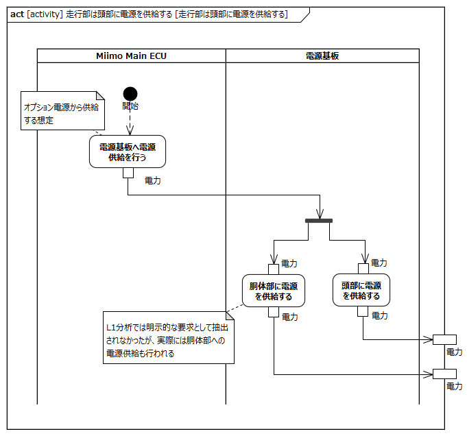
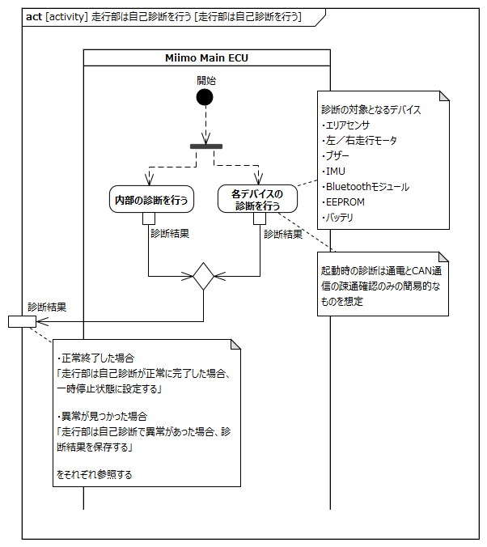

# はじめに

## 本書の目的

本書の目的は、USDMによる要求記述のため、テレプレゼンスロボット本体のL0要求「起動する」のL1要求分析結果に基づき、HGLCが担当するL1要求に対してL2要求を抽出することである。

## 適用

本要件の適用対象は、テレプレゼンスロボット とする。

## 用語の定義

|用語|説明|
|:---|:---|
|||

## 関連資料

|資料名|説明|
|:---|:---|
|テレプレゼンスロボット要求一覧&USDM.xlsx|本文書の要求分析結果をまとめ、USDMの形式で記述したファイル|
|機能干渉マトリクス.xlsx|本文書の要求分析および今後の仕様化を進める際に検討が必要な機能干渉についてマトリクス表で整理を行ったファイル|
|テレプレゼンスロボット要求分析.docx|テレプレゼンスロボット本体のL0/L1要求分析についての検討過程を記述したファイル|

# L2要求分析

「起動する」のアクティビティ図を以下に示す。

上記L0のアクティビティ図のアクション/デシジョン等から導出された胴体部・走行部のL1要求に対するL2要求分析を行う。  
※頭部に対してはavatarin側の責務のため、本書では対象外とする。

## 頭部は走行部からの電源供給により起動し、起動処理を開始する

avatarin側の責務のため、対象外とする。

## 頭部は自己診断を行う

avatarin側の責務のため、対象外とする。

## 頭部はアバタークラウドに接続する

avatarin側の責務のため、対象外とする。

## 頭部は自己診断で異常があった場合、走行部に通知する

avatarin側の責務のため、対象外とする。

## 頭部は起動処理の結果をアバタークラウドに通知する

avatarin側の責務のため、対象外とする。

## 頭部は起動処理の結果を表示する

avatarin側の責務のため、対象外とする。

## 胴体部は頭部による自己診断を受ける

**L2要求抽出**

|要求|備考|
|:---|:---|
|||

## 胴体部は起動処理の結果を走行部から受け表示する

**L2要求抽出**

|要求|備考|
|:---|:---|
|||

## 走行部は胴体部の電源on操作により起動し、起動処理を開始する

**L2要求抽出**

|要求|備考|
|:---|:---|
|||

## 走行部は頭部に電源を供給する

**L2要求抽出**

|要求|備考|
|:---|:---|
|||

## 走行部は自己診断を行う

**L2要求抽出**

|要求|備考|
|:---|:---|
|||

## 走行部は自己診断が正常に完了した場合、一時停止状態に設定する

**L2要求抽出**

|要求|備考|
|:---|:---|
|||

## 走行部は自己診断で異常があった場合、診断結果を保存する

**L2要求抽出**

|要求|備考|
|:---|:---|
|||

## 走行部は起動処理の結果を頭部に通知する

**L2要求抽出**

|要求|備考|
|:---|:---|
|||

## 走行部は起動処理の結果を胴体部に通知する

**L2要求抽出**

|要求|備考|
|:---|:---|
|||