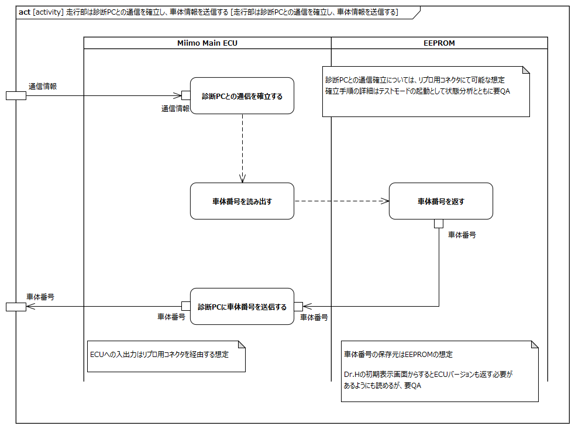
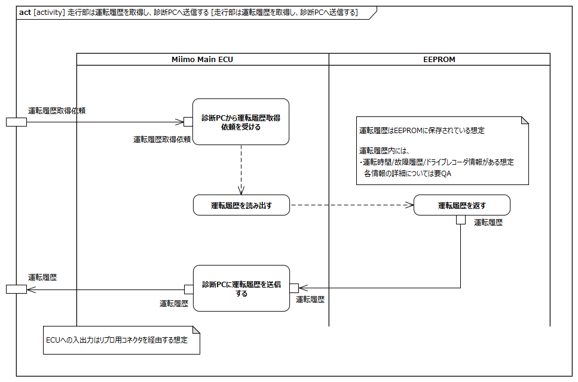

<!-- ↑表紙ページのための情報 -->

# はじめに

## 本書の目的

本書の目的は、USDMによる要求記述のため、テレプレゼンスロボット本体のL0要求「SysRS-19:運転履歴を読み出す」のL1要求分析結果に基づき、HGLCが担当するL1要求に対してL2要求を抽出することである。

## 適用

本要件の適用対象は、テレプレゼンスロボット とする。

## 用語の定義

|用語|説明|
|:---|:---|
|特に無し|---|

## 関連資料

|資料名|説明|
|:---|:---|
|テレプレゼンスロボット要求一覧&USDM.xlsx|本文書の要求分析結果をまとめ、USDMの形式で記述したファイル|
|機能干渉マトリクス.xlsx|本文書の要求分析および今後の仕様化を進める際に検討が必要な機能干渉についてマトリクス表で整理を行ったファイル|
|テレプレゼンスロボット要求分析_L0L1要求抽出.docx|テレプレゼンスロボット本体のL0/L1要求分析についての検討過程を記述したファイル|

# L2要求分析

「SysRS-19:運転履歴を読み出す」での運転履歴データ概要を以下に示す。  
運転履歴データは以下のデータを含む想定
 - 運転時間
 - 故障履歴
 - ドライブレコーダー  

  
modelID:{SysRM-con19}

「SysRS-19:運転履歴を読み出す」のアクティビティ図を以下に示す。

  
modelID:{SysRM-act19}

上記L0のアクティビティ図のアクション/デシジョン等から導出された胴体部・走行部のL1要求に対するL2要求分析を行う。  
※頭部に対してはavatarin側の責務のため、本書では対象外とする。

## 走行部は診断PCからのログインに応じて通信を確立し、車体情報を送信する

  
modelID:{SysRM-act19-01}

**L2要求抽出**

|要求|備考|
|:---|:---|
|Miimo Main ECUは診断PCとの通信を確立する|※1※2|
|Miimo Main ECUはEEPROMに車体番号の読み出しを依頼する||
|Miimo Main ECUはEEPROMから受けた車体番号を診断PCに送信する|※1|
|EEPROMはMiimo Main ECUの依頼を受けて車体番号を返す|※3|
※1:診断PCとの通信はリプロ用コネクタを経由する想定  
※2:テストモードの起動/通信確立手順の詳細は状態分析とともに要QA  
※3:車体番号の保存先をEEPROMと想定

## 走行部は運転履歴を取得し診断PCへ送信する

  
modelID:{SysRM-act19-02}

**L2要求抽出**

|要求|備考|
|:---|:---|
|Miimo Main ECUは診断PCから運転履歴取得依頼を受ける|※1|
|Miimo Main ECUはEEPROMに運転履歴の読み出し依頼する||
|Miimo Main ECUはEEPROMから読みだした運転履歴を診断PCに送信する|※1|
|EEPROMはMiimo Main ECUの依頼を受けて運転履歴を返す|※2※3|
※1:診断PCとの通信はリプロ用コネクタを経由する想定  
※2:運転履歴の保存先をEEPROMと想定  
※3:運転履歴データ内の「運転時間」「故障履歴」「ドライブレコーダー」に関する詳細は要QA