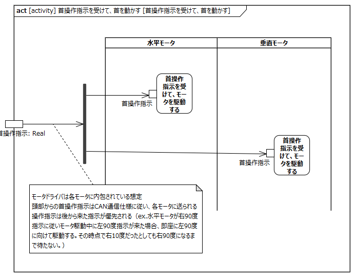
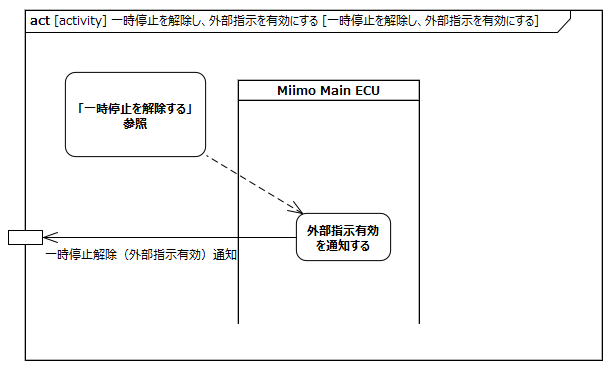
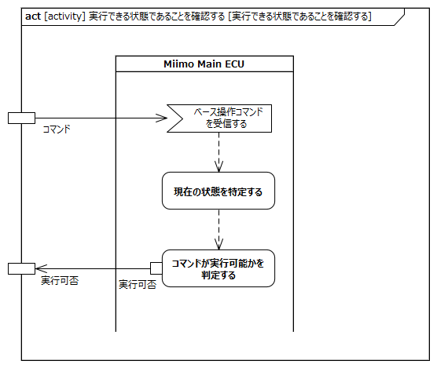
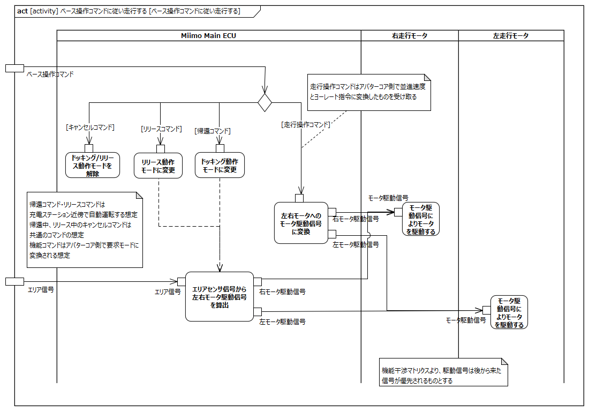

<!-- ↑表紙ページのための情報 -->

# はじめに

## 本書の目的

本書の目的は、USDMによる要求記述のため、テレプレゼンスロボット本体のL0要求「SysRS-03:遠隔で操作する」のL1要求分析結果に基づき、HGLCが担当するL1要求に対してL2要求を抽出することである。

## 適用

本要件の適用対象は、テレプレゼンスロボット とする。

## 用語の定義

|用語|説明|
|:---|:---|
|首操作指示|首操作指示コマンドを現在水平モータ角度、現在垂直モータ角度に展開したもの|

## 関連資料

|資料名|説明|
|:---|:---|
|テレプレゼンスロボット要求一覧&USDM.xlsx|本文書の要求分析結果をまとめ、USDMの形式で記述したファイル|
|機能干渉マトリクス.xlsx|本文書の要求分析および今後の仕様化を進める際に検討が必要な機能干渉についてマトリクス表で整理を行ったファイル|
|テレプレゼンスロボット要求分析_L0L1要求抽出.docx|テレプレゼンスロボット本体のL0/L1要求分析についての検討過程を記述したファイル|

# L2要求分析

「SysRS-03:遠隔で操作する」の操作コマンドの概念モデルおよびアクティビティ図を以下に示す。

コマンドの概念モデル
  
modelID:{SysRM-con03}

アクティビティ図
  
modelID:{SysRM-act03}

上記L0のアクティビティ図のアクション/デシジョン等から導出された胴体部・走行部のL1要求に対するL2要求分析を行う。  
本書内で記載している状態の詳細については「テレプレゼンスロボット要求分析_L0L1要求抽出.docx」内の「テレプレゼンスロボット本体の状態の整理」の章を参照のこと  
※頭部に対してはavatarin側の責務のため、本書では対象外とする。

## 頭部は外部指示が有効であることを確認する

avatarin側の責務のため、対象外とする。

## 頭部は操作コマンドにより送信先を選択する

avatarin側の責務のため、対象外とする。

## 頭部は外部指示が無効の場合はベース操作コマンドを破棄する

avatarin側の責務のため、対象外とする。

## 頭部は有効と判断したベース操作コマンドを走行部に送信する

avatarin側の責務のため、対象外とする。

## 頭部は首操作コマンドを実行できる状態であることを確認する

avatarin側の責務のため、対象外とする。

## 頭部は首操作コマンドを実行できる状態でなければ、首操作コマンドを破棄する

avatarin側の責務のため、対象外とする。

## 頭部は首操作コマンドを首操作指示に変換する

avatarin側の責務のため、対象外とする。

## 胴体部は首操作指示を受けて、首を動かす

  
modelID:{SysRM-act03-01}

**L2要求抽出**

|要求|備考|
|:---|:---|
|首水平モータは首操作指示を受け取り、動作する|機能干渉マトリクスより、首水平モータ駆動中に、別の首操作指示が入力された場合は、その指示に従って動作する|
|首垂直モータは首操作指示を受け取り、動作する|機能干渉マトリクスより、首垂直モータ駆動中に、別の首操作指示が入力された場合は、その指示に従って動作する|

## 走行部は一時停止を解除し外部指示を有効であることを頭部に通知する

  
modelID:{SysRM-act03-02}

**L2要求抽出**

|要求|備考|
|:---|:---|
|Miimo Main ECUは外部指示有効を頭部に通知する||

## 走行部はベース操作コマンドを実行できる状態であることを確認する

  
modelID:{SysRM-act03-03}

### コマンドが実行可能かを判定する

コマンドの受付可否は以下の表に従うものとする

||遠隔操作モード|リリース待ち無し|自律走行中 リリース待ち リリース動作準備|その他の状態|
|:---|:---:|:---:|:---:|:---:|
|走行操作コマンド|〇|×|×|×|
|帰還コマンド|〇※|×|×|×|
|リリースコマンド|×|〇|×|×|
|キャンセルコマンド|×|×|〇|×|

〇:コマンド受付可 / ×:コマンド受付不可  
※:帰還コマンドは速度0の時のみ受付可  

**L2要求抽出**

|要求|備考|
|:---|:---|
|Miimo Main ECUは現在の状態を特定する||
|Miimo Main ECUは遠隔操作モード状態において、走行操作コマンド/帰還コマンドを受け付ける|※1※2|
|Miimo Main ECUはリリース待ち無し状態において、リリースコマンドを受け付ける||
|Miimo Main ECUは自律走行中/リリース待ち/リリース動作準備状態において、キャンセルコマンドを受け付ける|※3|
|Miimo Main ECUは遠隔操作モード/リリース待ち無し/自律走行中/リリース待ち/リリース動作準備状態以外の状態では、ベース操作コマンドを受け付けない||

※1:エリア外を検出して前進・後進を抑制するのは頭部側の責務の想定  
※2:帰還コマンドは速度0の時のみ受け付け可能な想定  
※3:機能コマンドのキャンセルコマンドは１つの想定  

## 走行部はベース操作コマンドに従い走行する

  
modelID:{SysRM-act03-04}

**L2要求抽出**

|要求|備考|
|:---|:---|
|Miimo Main ECUは帰還コマンドを受け付けた場合、ドッキング移動中状態に遷移し、エリアセンサ信号から左右走行モータ駆動信号を算出する|※1※2※3|
|Miimo Main ECUはリリースコマンドを受け付けた場合、リリース待ち状態に遷移する|※1※4|
|Miimo Main ECUはリリース待ち状態で安全確認操作を受け付けた場合、左右走行モータへのモータ駆動信号に変換する|※2※4※5|
|Miimo Main ECUはキャンセルコマンドの受け付け/自動運転の完了/自動運転のタイムアウトにより、遠隔操作モード/リリース待ち無し状態に遷移する|※1※6|
|Miimo Main ECUは走行操作コマンドを受け付けた場合、左右走行モータへのモータ駆動信号に変換する|※7|
|右走行モータはモータ駆動信号を受け取り動作する|※8|
|左走行モータはモータ駆動信号を受け取り動作する|※8|

※1:機能コマンドは頭部側で要求モードに変換したものを受け取る想定  
※2:充電ステーション近傍での自動運転を想定（近傍以外の自動運転は頭部側に指示責務があるものと想定）  
※3:「エリアセンサ信号から左右走行モータ駆動信号を算出する」は自律走行中(ドッキング移動中)にて実施される想定  
※4:リリースの自動運転は、リリースコマンド受付→安全確認→自動運転開始となる想定。安全確認操作は電源スイッチ短押しの想定  
※5:「左右走行モータへのモータ駆動信号に変換する」は自動運転（リリース動作準備/リリース移動中）にて一定距離（20cmを想定）後進する駆動信号をモータに送る想定  
※6:自動運転の完了については、ドッキングはDC-ON検知、リリースはDC-OFF検知し一定距離（20cmを想定）後進することで自動運転完了となる想定。タイムアウトについては、自動運転開始から一定時間内に終了しなかった場合に発生する想定（タイムアウト時間はリリース自動運転とドッキング自動運転で異なる想定。具体的な時間はTBD）。キャンセルコマンドの受け付け/自動運転の完了/自動運転のタイムアウトの時点で、DC-ONであればリリース待ち無し状態、DC-ON以外であれば遠隔操作モード状態に遷移する想定  
※7:走行操作コマンドは頭部側で並進速度とヨーレート指令に変換したものを受け取る想定  
※8:機能干渉マトリクスより、走行モータ駆動中に別のモータ駆動信号が入力された場合、その信号に従って動作する  
