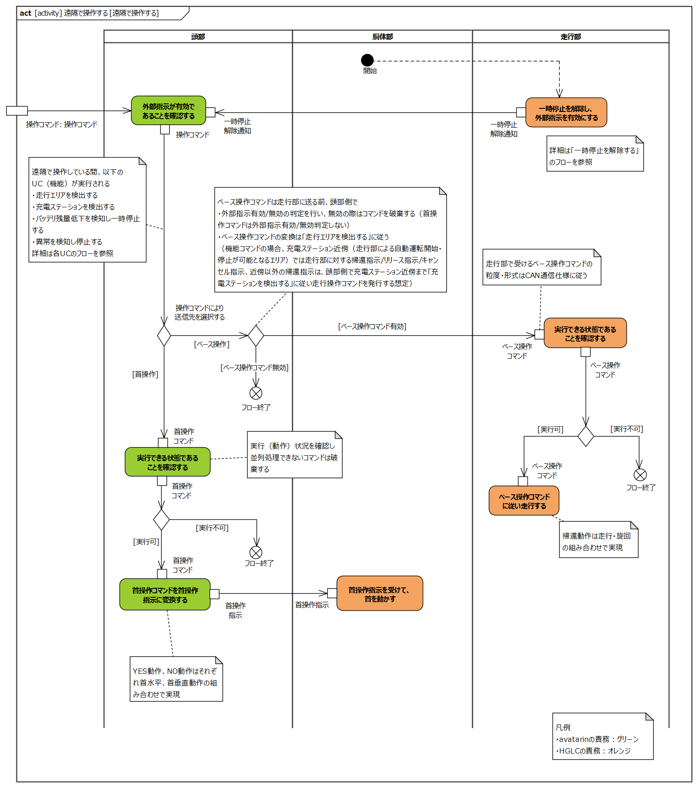

<!-- ↑表紙ページのための情報 -->

# はじめに

## 本書の目的

本書の目的は、USDMによる要求記述のため、テレプレゼンスロボット本体のL0要求「SysRS-03:遠隔で操作する」のL1要求分析結果に基づき、HGLCが担当するL1要求に対してL2要求を抽出することである。

## 適用

本要件の適用対象は、テレプレゼンスロボット とする。

## 用語の定義

|用語|説明|
|:---|:---|
|首操作指示|首操作指示コマンドを現在水平モータ角度、現在垂直モータ角度に展開したもの|

## 関連資料

|資料名|説明|
|:---|:---|
|テレプレゼンスロボット要求一覧&USDM.xlsx|本文書の要求分析結果をまとめ、USDMの形式で記述したファイル|
|機能干渉マトリクス.xlsx|本文書の要求分析および今後の仕様化を進める際に検討が必要な機能干渉についてマトリクス表で整理を行ったファイル|
|テレプレゼンスロボット要求分析_L0L1要求抽出.docx|テレプレゼンスロボット本体のL0/L1要求分析についての検討過程を記述したファイル|

# L2要求分析

「SysRS-03:遠隔で操作する」のアクティビティ図を以下に示す。

上記L0のアクティビティ図のアクション/デシジョン等から導出された胴体部・走行部のL1要求に対するL2要求分析を行う。  
※頭部に対してはavatarin側の責務のため、本書では対象外とする。

## 頭部は外部指示が有効であることを確認する

avatarin側の責務のため、対象外とする。

## 頭部は操作コマンドにより送信先を選択する

avatarin側の責務のため、対象外とする。

## 頭部は外部指示が無効の場合はベース操作コマンドを破棄する

avatarin側の責務のため、対象外とする。

## 頭部は有効と判断したベース操作コマンドを走行部に送信する

avatarin側の責務のため、対象外とする。

## 頭部は首操作コマンドを実行できる状態であることを確認する

avatarin側の責務のため、対象外とする。

## 頭部は首操作コマンドを実行できる状態でなければ、首操作コマンドを破棄する

avatarin側の責務のため、対象外とする。

## 頭部は首操作コマンドを首操作指示に変換する

avatarin側の責務のため、対象外とする。

## 胴体部は首操作指示を受けて、首を動かす

**L2要求抽出**

|要求|備考|
|:---|:---|
|首水平モータは首操作指示を受け取り、動作する|機能干渉マトリクスより、首水平モータ駆動中に、別の首操作指示が入力された場合は、その指示に従って動作する|
|首垂直モータは首操作指示を受け取り、動作する|機能干渉マトリクスより、首垂直モータ駆動中に、別の首操作指示が入力された場合は、その指示に従って動作する|

## 走行部は一時停止を解除し外部指示を有効であることを頭部に通知する

**L2要求抽出**

|要求|備考|
|:---|:---|
|Miimo Main ECUは外部指示有効をアバターコアに通知する||

## 走行部はベース操作コマンドを実行できる状態であることを確認する

### コマンドが実行可能かを判定する

**L2要求抽出**

|要求|備考|
|:---|:---|
|Miimo Main ECUは現在の状態を特定する||
|Miimo Main ECUはリリース待ち状態かどうかを判定し、リリース待ち状態の場合、リリースコマンドのみ受け付ける||
|Miimo Main ECUはリリース動作中かどうかを判定し、リリース動作中の場合、キャンセルコマンドのみ受け付ける|※1|
|Miimo Main ECUは動作中かどうかを判定し、動作中状態でない場合、コマンドを破棄する||
|Miimo Main ECUは一時停止中かどうかを判定し、一時停止中状態の場合、コマンドを破棄する||
|Miimo Main ECUはドッキング動作中かどうかを判定し、ドッキング動作中で無い場合、キャンセルコマンドを破棄し、ドッキング動作中の場合、キャンセルコマンドのみ受け付ける|※1|

※1:機能コマンドのキャンセルコマンドは１つの想定  
※2:エリア外を検出して前進・後進を抑制するのはアバターコア側の責務の想定

## 走行部はベース操作コマンドに従い走行する

**L2要求抽出**

|要求|備考|
|:---|:---|
|Miimo Main ECUは帰還コマンド受け取った場合、動作モードをドッキング動作モードに変更し、エリアセンサ信号から左右走行モータ駆動信号を算出する|※1※2|
|Miimo Main ECUはリリースコマンドを受け取った場合、動作モードをリリース動作モードに変更し、エリアセンサ信号から左右走行モータ駆動信号を算出する|※1※2|
|Miimo Main ECUはキャンセルコマンドを受け取った場合、動作モードをドッキング/リリース動作モードを解除する|※1|
|Miimo Main ECUは走行操作コマンドを受け付けた場合、左右走行モータへのモータ駆動信号に変換する|走行操作コマンドはアバターコア側で併進速度とヨーレート指令に変換したものを受け取る想定|
|右走行モータはモータ駆動信号を受け取り動作する|機能干渉マトリクスより、右走行モータ駆動中に別のモータ駆動信号が入力された場合、その信号に従って動作する|
|左走行モータはモータ駆動信号を受け取り動作する|機能干渉マトリクスより、左走行モータ駆動中に別のモータ駆動信号が入力された場合、その信号に従って動作する|

※1:機能コマンドはアバターコア側で要求モードに変換したものを受け取る想定  
※2:充電ステーション近傍での自動運転を想定（近傍以外の自動運転はアバターコア側に指示責務があるものと想定）  

