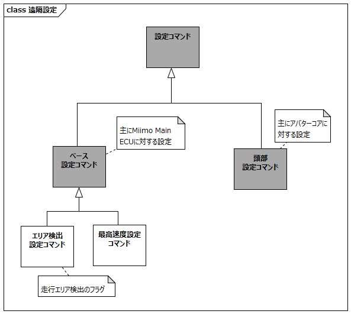

# はじめに

## 本書の目的

本書の目的は、USDMによる要求記述のため、テレプレゼンスロボット本体のL0要求「遠隔で設定する」のL1要求分析結果に基づき、HGLCが担当するL1要求に対してL2要求を抽出することである。

## 適用

本要件の適用対象は、テレプレゼンスロボット とする。

## 用語の定義

|用語|説明|
|:---|:---|
|特に無し|---|

## 関連資料

|資料名|説明|
|:---|:---|
|テレプレゼンスロボット要求一覧&USDM.xlsx|本文書の要求分析結果をまとめ、USDMの形式で記述したファイル|
|機能干渉マトリクス.xlsx|本文書の要求分析および今後の仕様化を進める際に検討が必要な機能干渉についてマトリクス表で整理を行ったファイル|
|テレプレゼンスロボット要求分析.docx|テレプレゼンスロボット本体のL0/L1要求分析についての検討過程を記述したファイル|

# L2要求分析

「遠隔で設定する」での設定コマンド概要を以下に示す。
走行部に対する設定としてベース設定コマンドがある。

「遠隔で設定する」のアクティビティ図を以下に示す。

上記L0のアクティビティ図のアクション/デシジョン等から導出された胴体部・走行部のL1要求に対するL2要求分析を行う。  
※頭部に対してはavatarin側の責務のため、本書では対象外とする。

## 走行部はベース設定コマンドで指定された設定をする

**L2要求抽出**

|要求|備考|
|:---|:---|
|Miimo Main ECUは受信したエリア検出設定の設定可否を判断し、avatarcoreに結果を送信する|エリア検出設定はavatarcoreのarea_settingを利用する想定|
|Miimo Main ECUは設定可能と判断した場合、エリア検出設定を保存する||
|Miimo Main ECUは最高速度設定の設定可否を判断し、avatarcoreに結果を送信する|最高速度設定はavatarcoreのspeed_dataを利用する設定|
|Miimo Main ECUは設定可能と判断した場合、最高速度設定を保存する||

## 走行部は設定に失敗した場合、その結果を頭部に通知する

**L2要求抽出**

|要求|備考|
|:---|:---|
|―――|　「ベース設定コマンドで指定された設定をする」内で実施|

