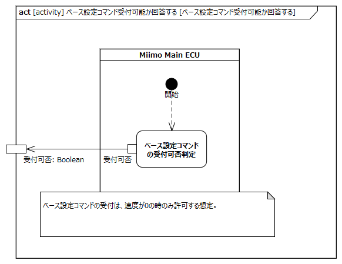

<!-- ↑表紙ページのための情報 -->

# はじめに

## 本書の目的

本書の目的は、USDMによる要求記述のため、テレプレゼンスロボット本体のL0要求「SysRS-05:遠隔で設定する」のL1要求分析結果に基づき、HGLCが担当するL1要求に対してL2要求を抽出することである。

## 適用

本要件の適用対象は、テレプレゼンスロボット とする。

## 用語の定義

|用語|説明|
|:---|:---|
|特に無し|---|

## 関連資料

|資料名|説明|
|:---|:---|
|テレプレゼンスロボット要求一覧&USDM.xlsx|本文書の要求分析結果をまとめ、USDMの形式で記述したファイル|
|機能干渉マトリクス.xlsx|本文書の要求分析および今後の仕様化を進める際に検討が必要な機能干渉についてマトリクス表で整理を行ったファイル|
|テレプレゼンスロボット要求分析.docx|テレプレゼンスロボット本体のL0/L1要求分析についての検討過程を記述したファイル|

# L2要求分析

「SysRS-05:遠隔で設定する」での設定コマンド概要を以下に示す。
走行部に対する設定としてベース設定コマンドがある。

「SysRS-05:遠隔で設定する」のアクティビティ図を以下に示す。

上記L0のアクティビティ図のアクション/デシジョン等から導出された胴体部・走行部のL1要求に対するL2要求分析を行う。  
※頭部に対してはavatarin側の責務のため、本書では対象外とする。

## 頭部は頭部設定コマンドを頭部に、ベース設定コマンドを走行部に送信する

avatarin側の責務のため、対象外とする。

## 頭部はベース設定コマンド受付可否を走行部に問い合わせる

avatarin側の責務のため、対象外とする。

## 頭部はベース設定コマンド受付可の場合、ベース設定コマンドを走行部に送信する。受付不可の場合、設定失敗とする

avatarin側の責務のため、対象外とする。

## 頭部は頭部設定コマンドで指定された設定をする

avatarin側の責務のため、対象外とする。

## 頭部は設定の結果をアバタークラウドに返す

avatarin側の責務のため、対象外とする。

## 走行部はベース設定コマンドを受付可能か回答する

**L2要求抽出**

|要求|備考|
|:---|:---|
|Miimo Main ECUはベース設定コマンドの受付可否を判定する|ベース設定コマンドは、走行中（速度≠0）の時は受け付けない想定|

## 走行部はベース設定コマンドで指定された設定をする

**L2要求抽出**

|要求|備考|
|:---|:---|
|Miimo Main ECUは受信したエリア検出設定を反映し、avatarcoreに結果を送信する|・エリア検出設定はavatarcoreのarea_settingを利用する想定 ※1|
|Miimo Main ECUは受信した最高速度設定を反映し、avatarcoreに結果を送信する|最高速度設定はavatarcoreのspeed_dataを利用する設定 ※1|

※1:頭部側で受付可否をチェックする想定ではあるが、設定失敗のケースを考慮

## 走行部は設定の結果を頭部に通知する

**L2要求抽出**

|要求|備考|
|:---|:---|
|→L2要求としては「ベース設定コマンドで指定された設定をする」内で実施||

