# はじめに
## 本書の目的

本書の目的は、テレプレゼンスロボットシステムにおけるテレプレゼンスロボット本体の要求を分析し、USDMによる要件記述におけるL0/L1要求を抽出することである。

## 適用

本要件の適用対象は、XXX とする。

## 用語の定義

|用語|説明|
|:---|:---|
|USDM|Universal Specification Describing Mannerの略で、要求を階層的に整理し仕様化するための方法論である|
|||

### 要求階層の定義

本書におけるUSDMの要求階層は以下の表にしたがう。

|階層|説明|
|:---|:---|
|L0|システム実現に必要なテレプレゼンスロボットへの要求|
|L1|L0要求達成に必要なテレプレゼンスロボット各部位（ブロック）への要求|
|L2|各ブロック内のデバイス構造レベルでの要求|
|L3|各デバイスに対する要求仕様|

# システムの構成

テレプレゼンスロボットシステムは、アバターアプリ（クライアント）、アバタークラウド（サーバー）、テレプレゼンスロボット本体および充電ステーションにより構成される。

ユーザ（遠隔操作者）およびアバター設置者はアバターアプリを介して、テレプレゼンスロボットの遠隔操作、テレプレゼンスロボットの先にいる接触者とのコミュニケーションを行うことができる。

テレプレゼンスロボットは頭部、胴体部、走行部の大きく3つのブロックから構成されており、頭部と胴体部を合わせてポール、走行部をベースと呼ぶ。

# ユースケース

テレプレゼンスロボットシステムにおけるユースケースを下記に記載する。

各ユースケースの概要を下記に記載する

|ユースケース名|概要|アクター|
|:---|:---|:---|
||||
|UC-005 遠隔で操作する|ユーザーがテレプレゼンスロボットを遠隔操作する|・ユーザー|
|UC-006 遠隔で音声会話する|ユーザーがテレプレゼンスロボットの先にいる接触者と音声会話をする|・ユーザー ・接触者|
|UC-007 遠隔で返事をする|ユーザーがテレプレゼンスロボットを介して接触者に返事をする|・ユーザー ・接触者|
||||
|UC-011 非常停止する|アバター設置者が非常停止ボタンによりテレプレゼンスロボットを停止させる|・アバター設置者|
|UC-013 手動で充電する|アバター設置者がテレプレゼンスロボットを充電する|・アバター設置者|
|UC-014 自動で充電する|ユーザーがテレプレゼンスロボットを充電ステーションの近くに移動させて、テレプレゼンスロボットを自動充電する|・ユーザー|
||||

以降の節で、各ユースケースごとにテレプレゼンスロボットシステム内のインタラクションを整理し、テレプレゼンスロボット本体に対する要求を**L0要求**として抽出する。

また抽出された**L0要求**を実現するために必要なアクティビティを分析し、テレプレゼンスロボット本体の各ブロック毎に必要なアクションを**L1要求**として抽出する

## UC-005：遠隔で操作する

ユースケース「遠隔で操作する」におけるブロック間のインタラクションを以下に示す

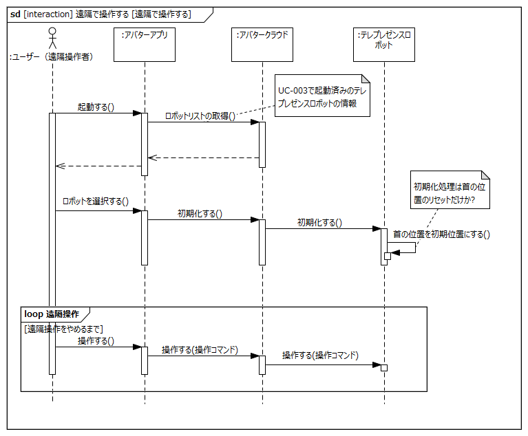

- 事前条件
	- 起動処理（アバタークラウドへの接続）が完了したテレプレゼンスロボットが存在すること
- 事後条件
	- アバターアプリからテレプレゼンスロボットを移動できること
	- アバターアプリからテレプレゼンスロボットの首の向きを操作できること
- 不変条件
	- なし
- 関連する要件
	- T.B.D

上記インタラクションを実現するためにテレプレゼンスロボットに要求される項目をL0要求として以下に抽出する

|L0要求|理由|備考|
|:---|:---|:---|
|テレプレゼンスロボットの首の位置を初期化する|||
|テレプレゼンスロボットを遠隔で操作する|||

次に上記L0要求の実現に必要な項目を以下に示し、項目ごとにテレプレゼンスロボット内部のアクティビティを分析する。

|アクティビティ|備考|
|:---|:---|
|初期化する||
|走行する|遠隔操作の1つ|
|旋回する|遠隔操作の1つ|
|首を動かす|遠隔操作の1つ|

### 初期化する

上記アクティビティから下記のL1要求を抽出する

|L1要求|備考|
|:---|:---|
|頭部は初期化コマンドを受け取り動作命令（首初期化）を取り出す||
|胴体部は動作命令（首初期化）をモータ駆動信号に変換する||
|胴体部はモータ駆動信号により首を初期値に移動する||

### 走行する

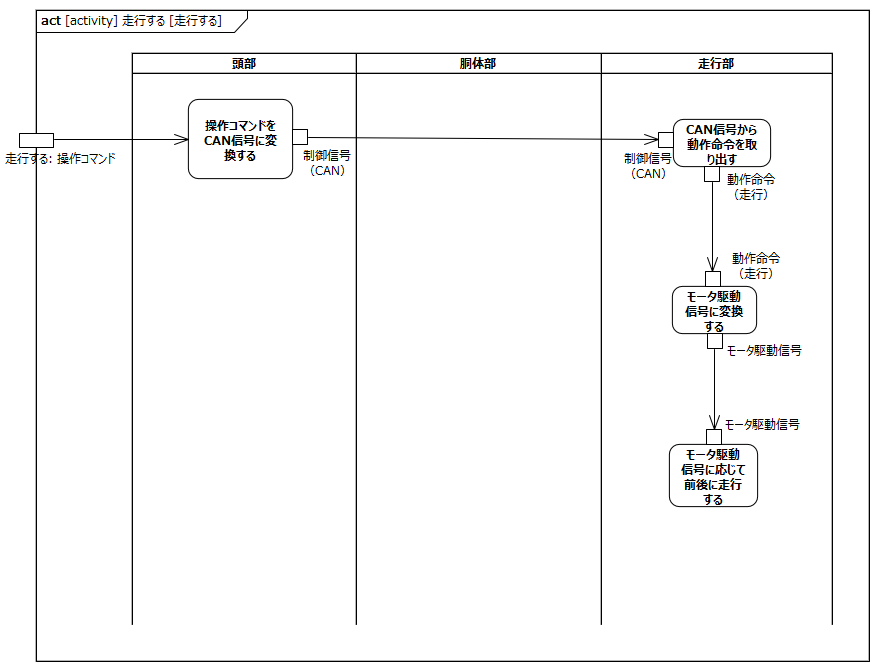

上記アクティビティから下記のL1要求を抽出する

|L1要求|概要|
|:---|:---|
|頭部は走行コマンドを受け取りCAN信号に変換する||
|走行部はCAN信号から動作命令（走行）を取り出す||
|走行部は動作命令（走行）をモータ駆動信号に変換する||
|走行部はモータ駆動信号に応じて前後に走行する||

### 旋回する

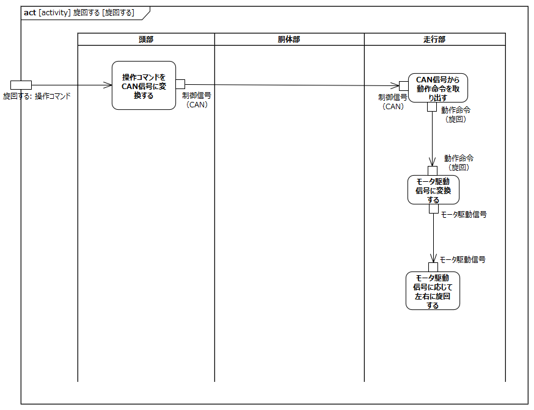

上記アクティビティから下記のL1要求を抽出する

|L1要求|概要|
|:---|:---|
|頭部は旋回コマンドを受け取りCAN信号に変換する||
|走行部はCAN信号から動作命令（旋回）を取り出す||
|走行部は動作命令（旋回）をモータ駆動信号に変換する||
|走行部はモータ駆動信号に応じて左右に旋回する||

### 首を動かす

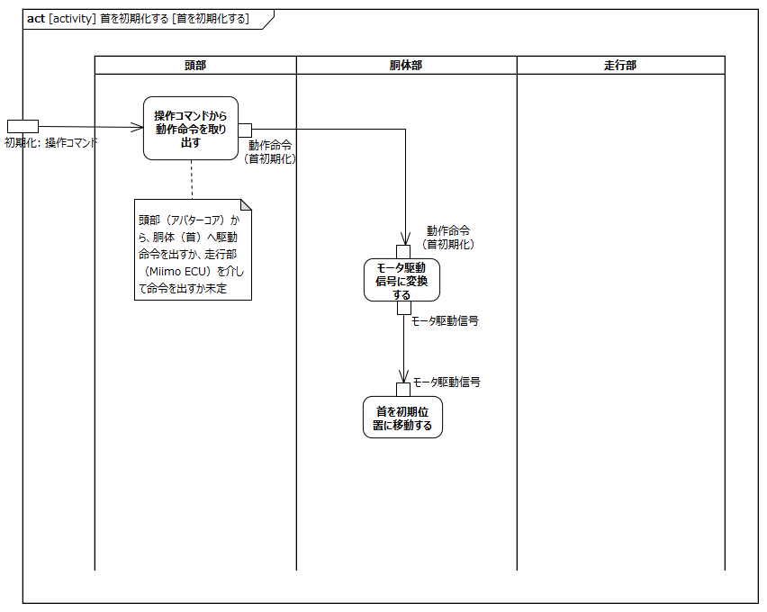

上記アクティビティから下記のL1要求を抽出する

|L1要求|概要|
|:---|:---|
|頭部は首動作コマンドから動作命令（首動作）を取り出す|走行部ECUを経由する可能性有|
|胴体部は動作命令（首動作）をモータ駆動信号に変換する||
|胴体部はモータ駆動信号に応じて首を上下左右に動かす||

## UC-006: 遠隔で音声会話をする

ユースケース「遠隔で音声会話をする」におけるブロック間のインタラクションを以下に示す

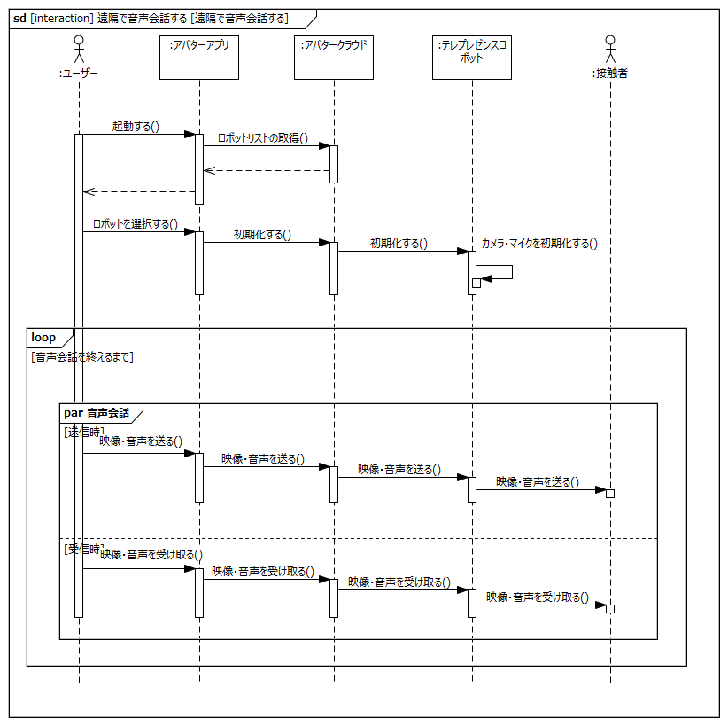

- 事前条件
	- 起動処理（アバタークラウドへの接続）が完了したテレプレゼンスロボットが存在すること
- 事後条件
	- テレプレゼンスロボットを介してユーザーと接触者が音声会話できること
- 不変条件
	- 音声会話中にテレプレゼンスロボットの首が動作できること
- 関連する要件
	- T.B.D

上記インタラクションを実現するためにテレプレゼンスロボットに要求される項目をL0要求として以下に抽出する

|L0要求|理由|備考|
|:---|:---|:---|
|テレプレゼンスロボットのカメラ・マイクを初期化する|||
|テレプレゼンスロボットを介して映像・音声を送受信する|||

次に上記L0要求の実現に必要な項目を以下に示し、項目ごとにテレプレゼンスロボット内部のアクティビティを分析する。

|アクティビティ|備考|
|:---|:---|
|カメラ・マイクを初期化する||
|映像・音声を送受信する||

### カメラ・マイクを初期化する

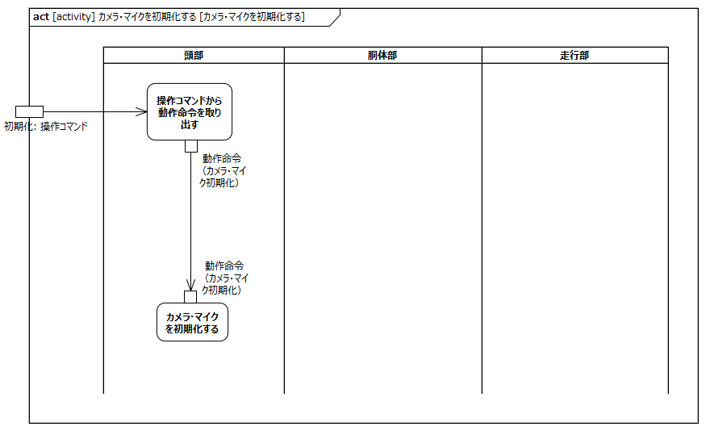

上記アクティビティから下記のL1要求を抽出する

|L1要求|備考|
|:---|:---|
|頭部は初期化コマンドを受け取り動作命令（カメラ・マイク初期化）を取り出す||
|頭部は動作命令（カメラ・マイク初期化）を受けカメラ・マイクを初期化する||

### 映像・音声を送受信する

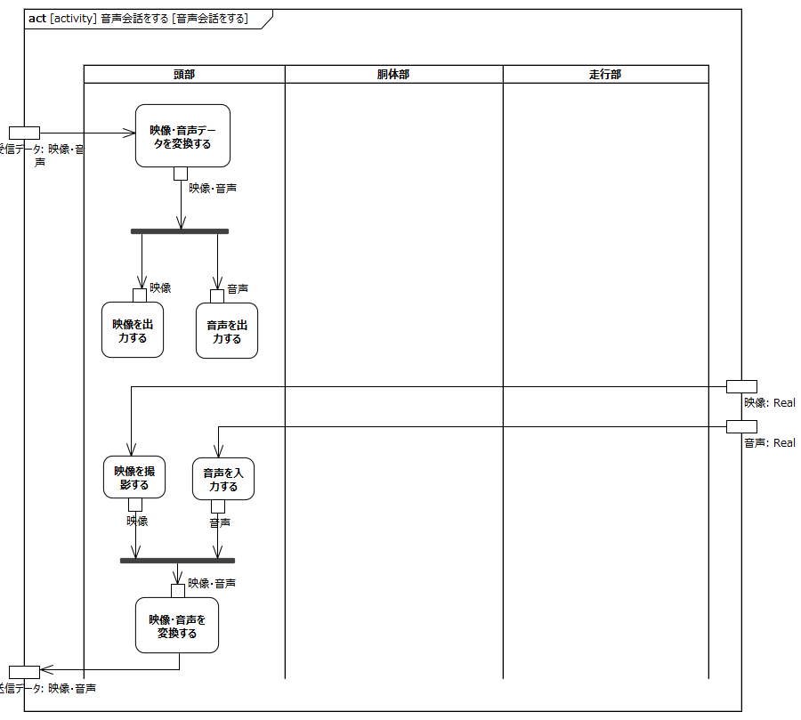

上記アクティビティから下記のL1要求を抽出する

|L1要求|備考|
|:---|:---|
|頭部は受信データを映像・音声に変換する||
|頭部は映像を出力する||
|頭部は音声を出力する||
|頭部は映像を撮影する||
|頭部は音声を入力する||
|頭部は入力された映像・音声を送信データに変換する||

## UC-007: 遠隔で返事をする

ユースケース「遠隔で返事をする」におけるブロック間のインタラクションを以下に示す

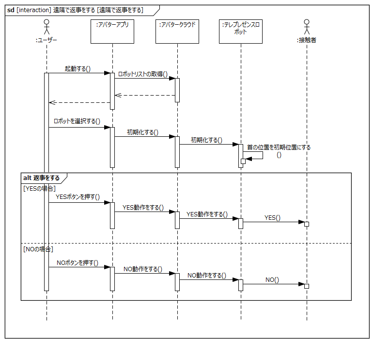

- 事前条件
	- 起動処理（アバタークラウドへの接続）が完了したテレプレゼンスロボットが存在すること
- 事後条件
	- テレプレゼンスロボットを介してユーザーに返事ができること
- 不変条件
	- なし
- 関連する要件
	- T.B.D

上記インタラクションを実現するためにテレプレゼンスロボットに要求される項目をL0要求として以下に抽出する

|L0要求|理由|備考|
|:---|:---|:---|
|テレプレゼンスロボットの首の位置を初期化する||UC-005と同一|
|テレプレゼンスロボットでYES動作（首の上下動作）をする|||
|テレプレゼンスロボットでNO動作（首の左右動作）をする|||

次に上記L0要求の実現に必要な項目を以下に示し、項目ごとにテレプレゼンスロボット内部のアクティビティを分析する。

|アクティビティ|備考|
|:---|:---|
|首を初期化する|UC-005と同一アクティビティのため割愛|
|YES動作をする||
|NO動作をする||

### YES動作をする

上記アクティビティから下記のL1要求を抽出する

|L1要求|備考|
|:---|:---|
|頭部はYES動作コマンドを受け取り動作命令（YES動作）を取り出す||
|胴体部は動作命令（YES動作）を受けモータ駆動信号に変換する||
|胴体部はモータ駆動信号に応じてYES動作を行う（首を上下に2回動かす）||

### NO動作をする

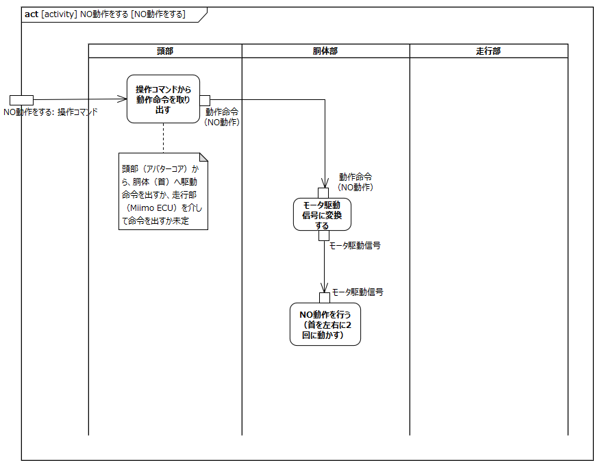

上記アクティビティから下記のL1要求を抽出する

|L1要求|備考|
|:---|:---|
|頭部はNO動作コマンドを受け取り動作命令（NO動作）を取り出す||
|胴体部は動作命令（NO動作）を受けモータ駆動信号に変換する||
|胴体部はモータ駆動信号に応じてNO動作を行う（首を左右に2回動かす）||

## UC-011: 非常停止する

ユースケース「非常停止する」におけるブロック間のインタラクションを以下に示す

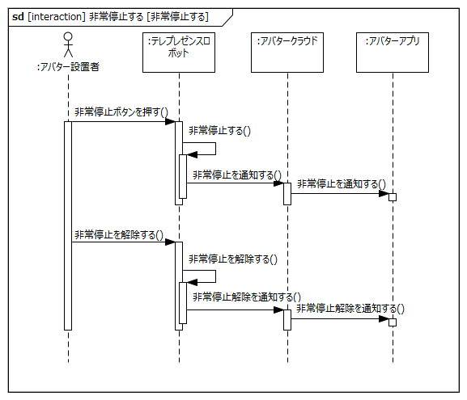

- 事前条件
	- なし
- 事後条件
	- テレプレゼンスロボットが停止していること
- 不変条件
	- なし
- 関連する要件
	- T.B.D

上記インタラクションを実現するためにテレプレゼンスロボットに要求される項目をL0要求として以下に抽出する

|L0要求|理由|備考|
|:---|:---|:---|
|テレプレゼンスロボットを非常停止ボタンにより停止する|||
|テレプレゼンスロボットの非常停止状態を解除する|||

次に上記L0要求の実現に必要な項目を以下に示し、項目ごとにテレプレゼンスロボット内部のアクティビティを分析する。

|アクティビティ|備考|
|:---|:---|
|非常停止する||
|非常停止を解除する||

### 非常停止する

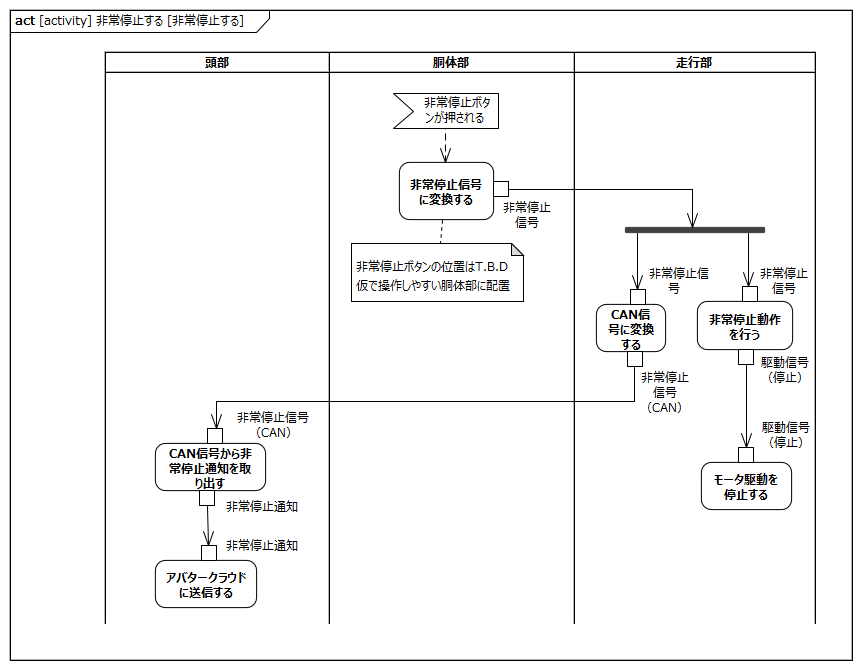

上記アクティビティから下記のL1要求を抽出する

|L1要求|備考|
|:---|:---|
|胴体部は非常停止ボタンが押されたことを検出し非常停止信号に変換する|胴体部に非常停止ボタンがあると仮定|
|走行部は非常停止信号を受けモータ駆動を停止する||
|走行部は非常停止信号をCAN信号に変換し頭部へ送信する||
|頭部はCAN信号から非常停止通知を取り出す||
|頭部は非常停止通知をアバタークラウドに送信する||

### 非常停止を解除する

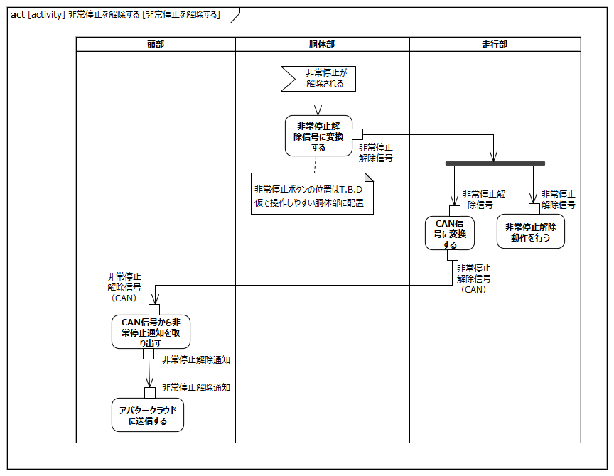

上記アクティビティから下記のL1要求を抽出する

|L1要求|備考|
|:---|:---|
|胴体部は非常停止ボタンが解除されたことを検出し非常停止解除信号に変換する|胴体部に非常停止ボタンがあると仮定|
|走行部は非常停止解除信号を受けを非常停止を解除する||
|走行部は非常停止解除信号をCAN信号に変換し頭部へ送信する||
|頭部はCAN信号から非常停止解除通知を取り出す||
|頭部は非常停止解除通知をアバタークラウドに送信する||

## UC-013: 手動で充電する

ユースケース「手動で充電する」におけるブロック間のインタラクションを以下に示す

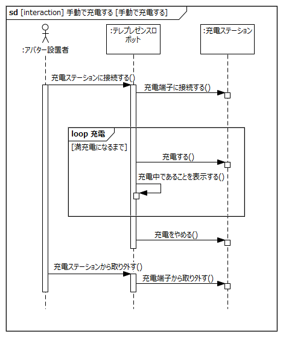

- 事前条件
	- 充電ステーションが利用可能な状態であること
	- テレプレゼンスロボットのロックが解除されていること（手押し可能な状態になっていること）
- 事後条件
	- 充電が完了していること
- 不変条件
	- なし
- 関連する要件
	- T.B.D

上記インタラクションを実現するためにテレプレゼンスロボットに要求される項目をL0要求として以下に抽出する

|L0要求|理由|備考|
|:---|:---|:---|
|テレプレゼンスロボットを充電ステーションに接続する|||
|テレプレゼンスロボットを充電する|||
|テレプレゼンスロボットを充電ステーションから取り外す|||

次に上記L0要求の実現に必要な項目を以下に示し、項目ごとにテレプレゼンスロボット内部のアクティビティを分析する。

|アクティビティ|備考|
|:---|:---|
|充電ステーションに接続する||
|充電する||
|充電ステーションから取り外す||

### 充電ステーションに接続する

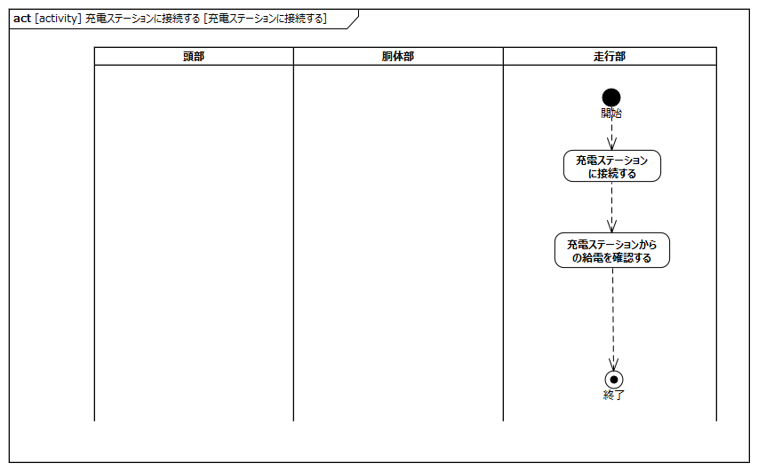

上記アクティビティから下記のL1要求を抽出する

|L1要求|備考|
|:---|:---|
|走行部を充電ステーションに接続する||
|走行部は充電ステーションからの給電を確認する||

### 充電する

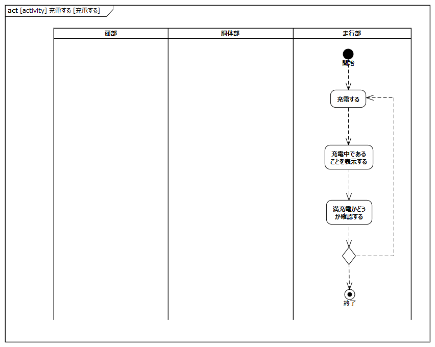

上記アクティビティから下記のL1要求を抽出する

|L1要求|備考|
|:---|:---|
|走行部は満充電になるまで充電する||
|走行部は充電中であることを表示する||

### 充電ステーションから取り外す

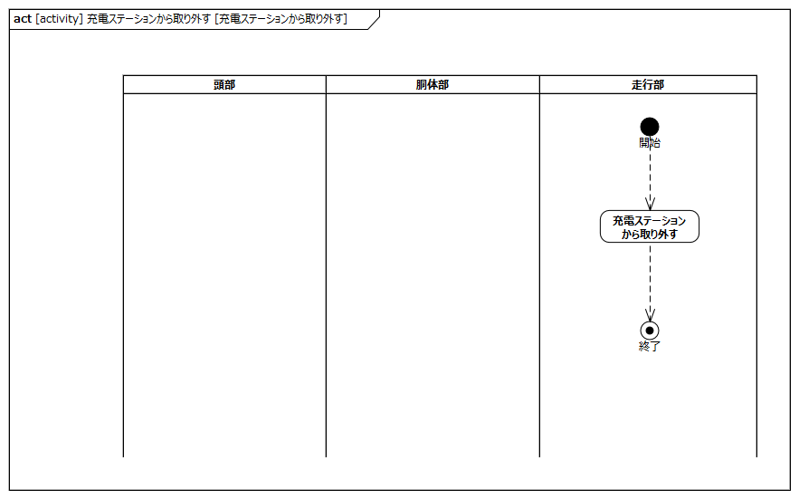

上記アクティビティから下記のL1要求を抽出する

|L1要求|備考|
|:---|:---|
|走行部を充電ステーションから取り外す||

## UC-014: 自動で充電する

ユースケース「自動で充電する」におけるブロック間のインタラクションを以下に示す

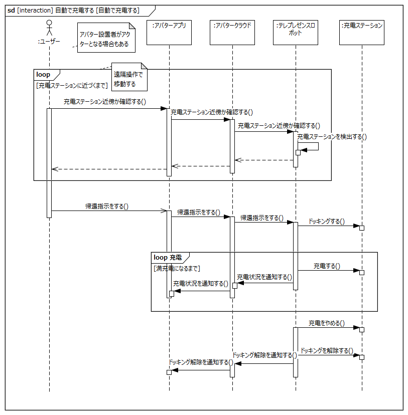

- 事前条件
	- 充電ステーションが利用可能な状態であること
	- 遠隔操作が可能な状態であること
- 事後条件
	- 充電が完了していること
- 不変条件
	- なし
- 関連する要件
	- T.B.D

上記インタラクションを実現するためにテレプレゼンスロボットに要求される項目をL0要求として以下に抽出する

|L0要求|理由|備考|
|:---|:---|:---|
|テレプレゼンスロボットは充電ステーションを検出し、検出状況をアバターアプリに通知する|||
|テレプレゼンスロボットは帰還指示により充電ステーションに自動でドッキングする|||
|テレプレゼンスロボットを充電し、充電状況をアバターアプリに通知する|||
|テレプレゼンスロボットは充電が終わったらドッキングを解除し、ドッキングを解除したことをアバターアプリに通知する|||

次に上記L0要求の実現に必要な項目を以下に示し、項目ごとにテレプレゼンスロボット内部のアクティビティを分析する。

|アクティビティ|備考|
|:---|:---|
|充電ステーションを検出する||
|自動でドッキングする||
|充電する||
|ドッキングを解除する||

### 充電ステーションを検出する

上記アクティビティから下記のL1要求を抽出する

|L1要求|備考|
|:---|:---|
|||

### 自動でドッキングする

上記アクティビティから下記のL1要求を抽出する

|L1要求|備考|
|:---|:---|
|||

### 充電する

上記アクティビティから下記のL1要求を抽出する

|L1要求|備考|
|:---|:---|
|||

### ドッキングを解除する

上記アクティビティから下記のL1要求を抽出する

|L1要求|備考|
|:---|:---|
|||