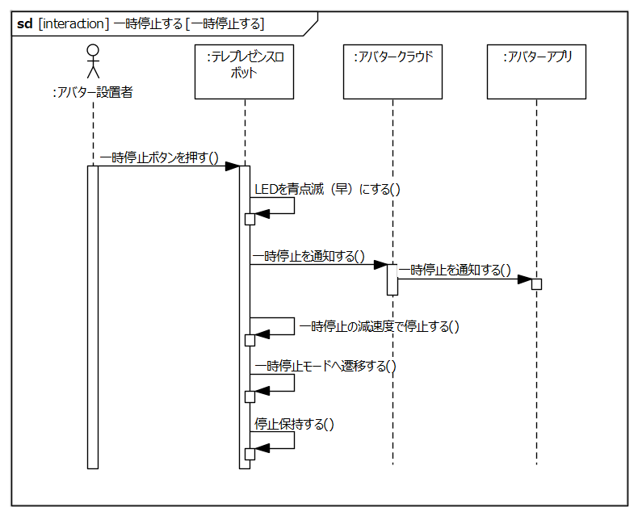
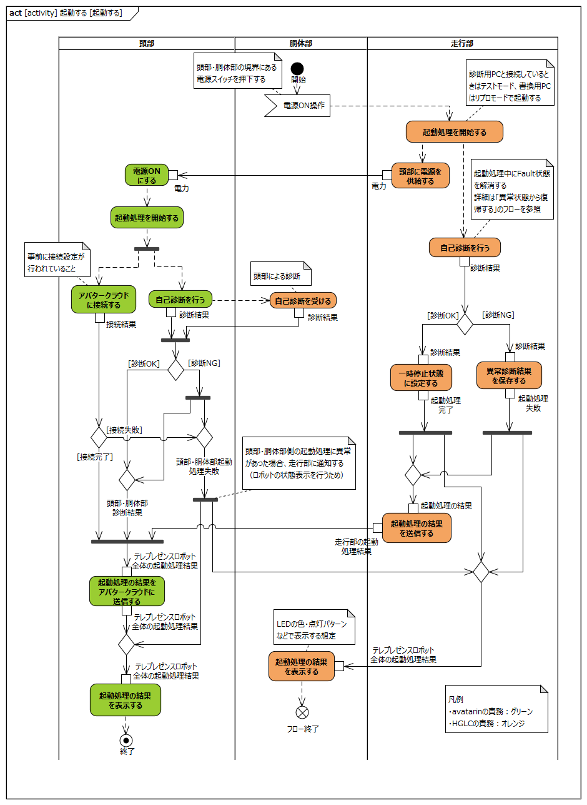
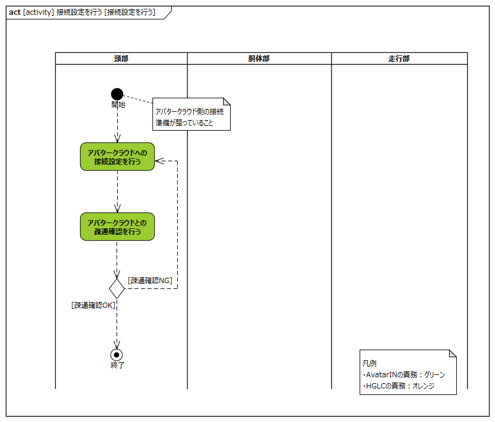

# はじめに
## 本書の目的

本書の目的は、テレプレゼンスロボットシステムにおけるテレプレゼンスロボット本体の要求を分析し、USDMによる要求記述のための要求を抽出することである。

## 適用

本要件の適用対象は、XXX とする。

## 用語の定義

|用語|説明|
|:---|:---|
|USDM|Universal Specification Describing Mannerの略で、要求を階層的に整理し仕様化するための方法論|
|インタラクション|相互作用|

# 要求

テレプレゼンスロボットシステムに関わる要求を以下に示す
<!-- TODO 図を分けて書く -->

# システムの構成

テレプレゼンスロボットシステムは、アバターアプリ（クライアント）、アバタークラウド（サーバー）、テレプレゼンスロボット本体および充電ステーションにより構成される。

ユーザ（遠隔操作者）およびアバター設置者はアバターアプリを介して、テレプレゼンスロボットの遠隔操作、テレプレゼンスロボットの先にいる接触者とのコミュニケーションを行うことができる。

テレプレゼンスロボットは頭部、胴体部、走行部の大きく3つのブロックから構成されており、頭部と胴体部を合わせてポール、走行部をベースと呼ぶ。

# ユースケース分析

テレプレゼンスロボットシステムにおけるユースケースを元にテレプレゼンスロボット本体に対する要求を整理する。

テレプレゼンスロボットシステムのユースケース一覧を下記に記載する。

<!-- TODO UC図を分けて書いたほうがよさそう -->

各ユースケースの概要を下記に記載する

|ユースケース名|概要|アクター|
|:---|:---|:---|
|UC-001 納品時の初期セットアップをする|アバター設置者がテレプレゼンスロボットを組み立て、セットアップを行う|・アバター設置者|
|UC-002 日常点検を行う|アバター設置者がテレプレゼンスロボットを使用する前に日常点検を行う|・アバター設置者|
|UC-003 起動する|アバター設置者がテレプレゼンスロボットを起動する|・アバター設置者|
|UC-004 手押しで移動する|アバター設置者が手押しでテレプレゼンスロボットを移動する|・アバター設置者|
|UC-005 遠隔で操作する|ユーザーがテレプレゼンスロボットを遠隔操作する|・ユーザー|
|UC-006 遠隔で音声会話する|ユーザーがテレプレゼンスロボットの先にいる接触者と音声会話をする|・ユーザー ・接触者|
|UC-007 遠隔で返事をする|ユーザーがテレプレゼンスロボットを介して接触者に返事をする|・ユーザー ・接触者|
|UC-008 障害物に接近すると減速・停止する|テレプレゼンスロボットが障害物に一定の距離まで接近すると減速・停止する|・ユーザー ・障害物|
|UC-009 ~~障害物に接近すると回避する~~（削除）|||
|UC-010 バッテリ低下時に停止し、通知する|バッテリ低下時に停止し、その旨をユーザーに通知する|・ユーザー|
|UC-011 一時停止する|アバター設置者が一時停止ボタンによりテレプレゼンスロボットを停止させる|・アバター設置者|
|UC-012 異常を検知して停止する|テレプレゼンスロボットが異常を検知して停止する|・アバター設置者|
|UC-013 手動で充電する|アバター設置者がテレプレゼンスロボットを充電する|・アバター設置者|
|UC-014 自動で充電する|ユーザーがテレプレゼンスロボットを充電ステーションの近くに移動させて、テレプレゼンスロボットを自動充電する|・ユーザー|
|UC-015 終了点検を行い、保管する|保管庫に移動し終了点検を行い、システムを終了する|・アバター設置者|
|UC-016 雨天時に操作する|屋外使用中に雨が降ってきた場合に屋内に移動する|・ユーザー ・アバター設置者|
|UC-017 夜間に操作する|夜間は街灯の明るさを頼りに移動する|・ユーザー ・アバター設置者|
|UC-018 手動操縦する|テレプレゼンスロボットが見える位置でロボットを操縦する|・アバター設置者|

以降の節で、各ユースケースごとにテレプレゼンスロボットシステム内のインタラクションを分析し、テレプレゼンスロボット本体に対する要求を抽出する

## UC-001: 納品時の初期セットアップをする

**ユースケース概要**

- アバター設置者は製品（テレプレゼンスロボット）をリースまたは購入し、設置場所に届いたら製品の初期セットアップをする。  
- 初期設定項目
  - アバターアプリに製品（テレプレゼンスロボット）を登録
  - テレプレゼンスロボットの初期動作確認

ユースケース「納品時の初期セットアップをする」におけるブロック間のインタラクションを以下に示す

- 事前条件
	- テレプレゼンスロボットは電源OFFしていること
- 事後条件
	- テレプレゼンスロボットの初期設定が完了していること
	- テレプレゼンスロボットは電源OFFしていること
- 不変条件
	- なし
- 代替フロー
    - なし
- 例外フロー
    - アバターアプリに接続できない
    - ポールとコーンの取り付けができない
- 備考
	- なし

上記インタラクションを実現するためにテレプレゼンスロボットに要求される項目を以下に抽出する

|要求|備考|
|:---|:---|
|テレプレゼンスロボットの電源をONする||
|テレプレゼンスロボットの電源をOFFする||
|テレプレゼンスロボットとアバタークラウドの設定を行う||

## UC-002: 日常点検を行う

**ユースケース概要**

- 始業時、予め決められた点検項目を確認する。
- 項目によって、頻度は毎日に限らず、毎週、毎月になることもあり得る
- 必要に応じて部品の一部を取り外して確認することもあり得る。
- 詳細な点検項目、内容、方法は、マニュアルで定義する。
- 必要に応じて、部品や消耗品を交換・補充することもあり得る。

**◆テレプレゼンスロボット電源OFFの点検項目例**

- 消耗品の状態（タイヤ、キャスター）
- 締結部のがたつき
- 外装の割れ

など

**◆テレプレゼンスロボット起動中の点検項目例**

- ディスプレイ
- 音声出力機能の確認
- 一時停止機能の確認
- カメラ、センサの機能確認
- 走行部の回転、異音、振動の確認

など

ユースケース「日常点検を行う」におけるブロック間のインタラクションを以下に示す

- 事前条件
	- テレプレゼンスロボットは電源OFFしていること
- 事後条件
	- 日常点検が完了していること
	- テレプレゼンスロボットは電源OFFしていること
- 不変条件
	- なし
- 代替フロー
    - なし
- 例外フロー
    - 部品が破損している
    - センサーが正常に動作しない
- 備考
	- なし

上記インタラクションを実現するためにテレプレゼンスロボットに要求される項目を以下に抽出する

|要求|備考|
|:---|:---|
|テレプレゼンスロボットはセンサー、バッテリーの状態を通知する||
|テレプレゼンスロボットに状態を表示する||

## UC-003: 起動する

**ユースケース概要**

- 電源OFFしている状態から電源が供給されテレプレゼンスロボットを起動する
- 起動は、管理者、または施設管理者が近くにいる状態で行う。無人では行わない。
- 起動時に自己診断を行う。
- 起動処理後は、一時停止に移行する。

ユースケース「起動する」におけるブロック間のインタラクションを以下に示す

- 事前条件
	- 日常点検の起動前項目に異常がないこと
- 事後条件
	- テレプレゼンスロボットが起動していること
	- 自己診断結果に異常がないこと
	- テレプレゼンスロボットが一時停止状態となっていること
- 不変条件
	- なし
- 代替フロー
    - なし
- 例外フロー
    - 自己診断で異常が発生した
- 備考
	- なし

上記インタラクションを実現するためにテレプレゼンスロボットに要求される項目を以下に抽出する

|要求|備考|
|:---|:---|
|テレプレゼンスロボットをスタンバイモード（停止保持状態）にする||
|テレプレゼンスロボットは自己診断を行う||
|テレプレゼンスロボットはアバタークラウドに接続する||
|テレプレゼンスロボットは起動処理の完了を通知する||

## UC-004: 手押しで移動する

**ユースケース概要**

- テレプレゼンスロボットを手動操縦で制御できないときに、手押しで移動する。
- テレプレゼンスロボットは電源OFF状態であることを想定する。
- 台車に載せることも想定する。その場合、二人以上で持ち上げること

ユースケース「手押しでテレプレゼンスロボットを移動する」におけるブロック間のインタラクションを以下に示す

- 事前条件
	- なし
- 事後条件
	- 手押しでの移動ができること
- 不変条件
	- テレプレゼンスロボットは電源OFFしていること
- 代替フロー
    - なし
- 例外フロー
    - TODO
- 備考
	- なし

上記インタラクションを実現するためにテレプレゼンスロボットに要求される項目を以下に抽出する

|要求|備考|
|:---|:---|
|テレプレゼンスロボットの電源をOFFする||

## UC-005: 遠隔で操作する

**ユースケース概要**

- アバターアプリからテレプレゼンスロボットを操作する
- キーボードの上、下、左、右を使って動かす
- マウスを使って、アプリ上の首振り操作をする

ユースケース「遠隔で操作する」におけるブロック間のインタラクションを以下に示す

- 事前条件
	- 起動処理（アバタークラウドへの接続）が完了したテレプレゼンスロボットが存在すること
- 事後条件
	- アバターアプリからテレプレゼンスロボットを操作できること
- 不変条件
	- なし
- 代替フロー
    - なし
- 例外フロー
    - アバターアプリからテレプレゼンスロボットの操作ができない
- 備考
	- なし

上記インタラクションを実現するためにテレプレゼンスロボットに要求される項目を以下に抽出する

|要求|備考|
|:---|:---|
|テレプレゼンスロボットの首の位置を初期化する||
|テレプレゼンスロボットを遠隔で操作する||

## UC-006: 遠隔で音声会話をする

**ユースケース概要**

- ユーザーと接触者がテレプレゼンスロボットを介して会話する
- 会話中もUC-005の遠隔操作が行える

ユースケース「遠隔で音声会話をする」におけるブロック間のインタラクションを以下に示す

- 事前条件
	- 起動処理（アバタークラウドへの接続）が完了したテレプレゼンスロボットが存在すること
- 事後条件
	- テレプレゼンスロボットを介してユーザーと接触者が音声会話できること
- 不変条件
	- 音声会話中にテレプレゼンスロボットの遠隔操作ができる
- 代替フロー
    - なし
- 例外フロー
    - テレプレゼンスロボットを介した音声会話ができない
    - 音声会話中にテレプレゼンスロボットの遠隔操作ができない
- 備考
	- なし

上記インタラクションを実現するためにテレプレゼンスロボットに要求される項目を以下に抽出する

|要求|備考|
|:---|:---|
|テレプレゼンスロボットのカメラ・マイクを初期化する||
|テレプレゼンスロボットを介して映像・音声を送受信する||

## UC-007: 遠隔で返事をする

**ユースケース概要**

- ユーザーがテレプレゼンスロボットの首を振り接触者にYes、Noを伝える。

ユースケース「遠隔で返事をする」におけるブロック間のインタラクションを以下に示す

- 事前条件
	- 起動処理（アバタークラウドへの接続）が完了したテレプレゼンスロボットが存在すること
- 事後条件
	- テレプレゼンスロボットを介してユーザーに返事ができること
- 不変条件
	- なし
- 代替フロー
    - なし
- 例外フロー
    - テレプレゼンスロボットを介してユーザーに返事ができない
- 備考
	- なし

上記インタラクションを実現するためにテレプレゼンスロボットに要求される項目を以下に抽出する

|要求|備考|
|:---|:---|
|テレプレゼンスロボットの首の位置を初期化する|UC-005と同一|
|テレプレゼンスロボットでYES動作（首の上下動作）をする||
|テレプレゼンスロボットでNO動作（首の左右動作）をする||

## UC-008: ワイヤに接近またはまたいだ場合、減速、停止する

**ユースケース概要**

- テレプレゼンスロボットの移動中に常時発生する
- テレプレゼンスロボットは、エリアワイヤの内側、外側を検出し、減速・停止する
- ワイヤ近傍の信号の大きさにより、減速する。
- ワイヤから離れる方向に旋回することで速度を回復する。

ユースケース「ワイヤに接近またはまたいだ場合、減速、停止する」におけるブロック間のインタラクションを以下に示す

- 事前条件
	- テレプレゼンスロボットが移動している。
- 事後条件
	- 減速エリアを検知し減速すること
	- 停止エリアを検知し停止すること
- 不変条件
	- 減速・停止エリアにおいても旋回動作は行えること
- 代替フロー
    - なし
- 例外フロー
    - 減速・停止エリアを検知しても減速・停止しない
    - 減速・停止エリア以外の場所で減速・停止する
- 備考
	- なし

上記インタラクションを実現するためにテレプレゼンスロボットに要求される項目を以下に抽出する

|要求|備考|
|:---|:---|
|テレプレゼンスロボットはエリア検出方式を設定する||
|テレプレゼンスロボットは減速エリアを検知し減速する|エリアワイヤの敷設が必要|
|テレプレゼンスロボットは停止エリアを検知し停止する|エリアワイヤの敷設が必要|

## UC-010: バッテリ低下時に停止し、通知する

**ユースケース概要**

- バッテリ容量が少ない時は停止する。
- バッテリが低下したら、帰還通知をアバターアプリに通知する
- バッテリの過放電を検知し、アバターアプリに通知する

ユースケース「バッテリ低下時に停止し、通知する」におけるブロック間のインタラクションを以下に示す

- 事前条件
	- 起動処理（アバタークラウドへの接続）が完了したテレプレゼンスロボットが存在すること
- 事後条件
	- テレプレゼンスロボットが停止し、アバターアプリに通知が送られていること
- 不変条件
	- なし
- 代替フロー
    - なし
- 例外フロー
    - アバターアプリに通知が送られない
- 備考
	- なし

上記インタラクションを実現するためにテレプレゼンスロボットに要求される項目を以下に抽出する

|要求|備考|
|:---|:---|
|テレプレゼンスロボットはバッテリ残量を通知する||
|テレプレゼンスロボットはバッテリ残量が低下したら、停止する||
|テレプレゼンスロボットはバッテリ残量低下により停止したことを通知する||

## UC-011-1: 一時停止する

**ユースケース概要**

- テレプレゼンスロボットの移動中に、アバター設置者が危険を察知し一時停止ボタンを操作をする。また、起動直後、自動充電開始直後、手動充電開始直後も一時停止状態となる。
- 停止したら、情報をアバターアプリに連絡する

ユースケース「一時停止する」におけるブロック間のインタラクションを以下に示す

- 事前条件
	- なし
- 事後条件
	- テレプレゼンスロボットが停止していること
	- テレプレゼンスロボットが一時停止となっていること
- 不変条件
	- なし
- 代替フロー
    - なし
- 例外フロー
    - 一時停止がアバターアプリに通知されない
    - 一時停止ボタンを押しても停止しない
- 備考
	- なし

上記インタラクションを実現するためにテレプレゼンスロボットに要求される項目を以下に抽出する

|要求|備考|
|:---|:---|
|テレプレゼンスロボットを一時停止ボタンにより一時停止する||
|テレプレゼンスロボットの一時停止を通知する||

## UC-011-2: 一時停止を解除する

**ユースケース概要**

- 一時停止状態の場合、停止ボタンを再度押下することにより一時停止を解除する。
- 一時停止解除したら、情報をアバターアプリに連絡する

ユースケース「一時停止を解除する」におけるブロック間のインタラクションを以下に示す

- 事前条件
	- なし
- 事後条件
	- テレプレゼンスロボットが停止していること
	- テレプレゼンスロボットが一時停止となっていること
- 不変条件
	- なし
- 代替フロー
    - なし
- 例外フロー
    - 一時停止がアバターアプリに通知されない
    - 一時停止ボタンを押しても停止しない
- 備考
	- なし

上記インタラクションを実現するためにテレプレゼンスロボットに要求される項目を以下に抽出する

|要求|備考|
|:---|:---|
|テレプレゼンスロボットを一時停止ボタンにより一時停止解除する||
|テレプレゼンスロボットの一時停止解除を通知する||
|テレプレゼンスロボットは速度0を受信する||

## UC-012: 異常を検知して停止する

**ユースケース概要**

- テレプレゼンスロボットが内部での異常を検知し、停止する。
- 停止したら、故障情報をアバターアプリに連絡する

**異常項目**

- 走行モータ回転異常
- 首モータ異常
- センサ異常
- CAN異常
- バッテリ異常
- 停止スイッチ異常
- アバターコア異常

ユースケース「異常を検知して停止する」におけるブロック間のインタラクションを以下に示す

- 事前条件
	- テレプレゼンスロボットは電源ONされていて、点検や手動操作している
- 事後条件
	- テレプレゼンスロボットが停止していること
	- テレプレゼンスロボットが異常停止中となっていること
- 不変条件
	- テレプレゼンスロボットは電源ONされていること
- 代替フロー
    - なし
- 例外フロー
    - 異常を検知しても停止しない
- 備考
	- なし

上記インタラクションを実現するためにテレプレゼンスロボットに要求される項目を以下に抽出する

|要求|備考|
|:---|:---|
|異常を検知する||
|異常停止状態を通知する||

## UC-013: 手動で充電する

**ユースケース概要**

- テレプレゼンスロボットのバッテリーを充電する
- テレプレゼンスロボットの充電は保管庫付近でおこなう

ユースケース「手動で充電する」におけるブロック間のインタラクションを以下に示す

- 事前条件
	- 充電ステーションが利用可能な状態であること
- 事後条件
	- 充電が完了していること
	- 一時停止状態となっていること
- 不変条件
	- なし
- 代替フロー
    - なし
- 例外フロー
    - 充電ステーションに接続できない
    - 充電ステーションに接続しても充電が開始されない
    - 満充電にならない
- 備考
	- なし

上記インタラクションを実現するためにテレプレゼンスロボットに要求される項目を以下に抽出する

|要求|備考|
|:---|:---|
|テレプレゼンスロボットの充電ステーションに接続する|接続後充電を開始する|
|テレプレゼンスロボットを充電中に充電ステーションから取り外すことができる||

## UC-014: 自動で充電する

**ユースケース概要**

- テレプレゼンスロボットのバッテリーを充電する
- アバターアプリからの帰還指示により、自動充電が行える

ユースケース「自動で充電する」におけるブロック間のインタラクションを以下に示す

- 事前条件
	- 充電ステーションが利用可能な状態であること
	- 遠隔操作が可能な状態であること
- 事後条件
	- 充電が完了していること
	- 一時停止状態となっていること
- 不変条件
	- なし
- 代替フロー
    - なし
- 例外フロー
    - アバターアプリにステーションの検出が反映されない
    - ドッキング動作が行えない
    - 充電が開始されない
    - 満充電にならない
- 備考
	- なし

上記インタラクションを実現するためにテレプレゼンスロボットに要求される項目を以下に抽出する

|要求|備考|
|:---|:---|
|テレプレゼンスロボットは充電ステーションを検出する||
|テレプレゼンスロボットは帰還指示により充電ステーションに自動でドッキングする||
|テレプレゼンスロボットは充電状況をアバターアプリに通知する||
|テレプレゼンスロボットは充電中に充電ステーションから離れることができる||

## UC-015: 終了点検を行い、保管する

**ユースケース概要**

- 充電したテレプレゼンスロボットを保管庫内まで移動し、停車する。
- 充電場所＝保管場所とは限らない。
- 充電場所は屋内が望ましいが、限定しない。

テレプレゼンスロボットを保管庫の所定の場所に停車する

ユースケース「終了点検を行い、保管する」におけるブロック間のインタラクションを以下に示す

  

- 事前条件
    - テレプレゼンスロボットが充電されている。
    - テレプレゼンスロボットが電源OFFしている。
- 事後条件
    - テレプレゼンスロボットが保管場所に停車している。
    - テレプレゼンスロボットが電源OFFしている。
- 不変条件
	- なし
- 代替フロー
    - 遠隔操作できな場合は手押しで移動する（UC-004）
- 例外フロー
    - 診断ができない
    - 診断データが保存できない
- 備考
	- なし

上記インタラクションを実現するためにテレプレゼンスロボットに要求される項目を以下に抽出する

|要求|備考|
|:---|:---|
|電源ONする||
|電源OFFする||
|診断データを保存する||

## UC-016: 雨天時に操作する

**ユースケース概要**

- 雨天での屋外使用は行わない
- 屋外から屋内にテレプレゼンスロボットを移動する
- 滑りやすい床（濡れた斜面など）では速度を維持・制限する

ユースケース「雨天時に操作する」におけるブロック間のインタラクションを以下に示す

- 事前条件
    - テレプレゼンスロボットが移動している
- 事後条件
    - テレプレゼンスロボットが屋内に移動されている
- 不変条件
	- なし
- 代替フロー
    - 雨量が多い場合にはカッパをかける
- 例外フロー
    - なし
- 備考
	- なし

上記インタラクションを実現するためにテレプレゼンスロボットに要求される項目を以下に抽出する

|要求|備考|
|:---|:---|
|テレプレゼンスロボットは少量の雨に対して防水できる|一定雨量を超えた場合はカッパが必要|

## UC-017: 夜間に操作する

**ユースケース概要**

- 街灯により歩行できる明るさの場所でのみで使用する

ユースケース「終了点検を行い、保管する」におけるブロック間のインタラクションを以下に示す

- 事前条件
    - テレプレゼンスロボットは移動している
- 事後条件
    - 屋内に移動している
- 不変条件
	- なし
- 代替フロー
    - なし
- 例外フロー
    - 街灯が消える
    - 周囲が暗すぎて移動できない
- 備考
	- なし

上記インタラクションを実現するためにテレプレゼンスロボットに要求される項目を以下に抽出する

|要求|備考|
|:---|:---|
|テレプレゼンスロボットは周囲の明るさを確認する||
|テレプレゼンスロボットは明るさの不足を通知する||

# テレプレゼンスロボット本体の要求項目

前章の各ユースケースの分析結果をテレプレゼンスロボット本体の要求項目として一覧に整理したものを以下に記載する。

|ID|要求項目|関連するUC|備考|
|:---|:---|:---|:---|
|REQ-001|テレプレゼンスロボットの電源をONする|UC-001, UC-015||
|REQ-002|テレプレゼンスロボットの電源をOFFする|UC-001, UC-004, UC-015||
|REQ-003|テレプレゼンスロボットとアバタークラウドの接続設定を行う|UC-001||
|REQ-004|テレプレゼンスロボットの各センサーの状態を通知する|UC-002||
|REQ-005|テレプレゼンスロボットの各センサーの状態を表示する|UC-002|ステータスランプのイメージ|
|REQ-006|テレプレゼンスロボットをスタンバイモード（停止保持状態）にする|UC-003||
|REQ-007|テレプレゼンスロボットは自己診断を行う|UC-003, UC-015||
|REQ-008|テレプレゼンスロボットはアバタークラウドに接続する|UC-003||
|REQ-009|テレプレゼンスロボットは起動処理の完了を通知する|UC-003||
|REQ-010|テレプレゼンスロボットの首の位置を初期化する|UC-005, UC-007||
|REQ-011|テレプレゼンスロボットを遠隔で操作する|UC-005||
|REQ-012|テレプレゼンスロボットのカメラ・マイクを初期化する|UC-006||
|REQ-013|テレプレゼンスロボットを介して映像・音声を送受信する|UC-006||
|REQ-014|テレプレゼンスロボットでYES動作（首の上下動作）をする|UC-007||
|REQ-015|テレプレゼンスロボットでNO動作（首の左右動作）をする|UC-007||
|REQ-016|テレプレゼンスロボットのエリア検出方式を設定する|UC-008||
|REQ-017|テレプレゼンスロボットは減速エリアを検知し減速する|UC-008|エリアワイヤの敷設が必要|
|REQ-018|テレプレゼンスロボットは停止エリアを検知し停止する|UC-008|エリアワイヤの敷設が必要|
|REQ-019|テレプレゼンスロボットはバッテリ残量を通知する|UC-002, UC-010||
|REQ-020|テレプレゼンスロボットはバッテリ残量が低下したら、停止する|UC-010||
|REQ-021|テレプレゼンスロボットはバッテリ残量低下により停止したことを通知する|UC-010||
|REQ-022|テレプレゼンスロボットを一時停止ボタンにより停止する|UC-011, UC-012||
|REQ-023|テレプレゼンスロボットを一時停止を通知する|UC-011, UC-012||
|REQ-024|テレプレゼンスロボットの一時停止状態を解除する|UC-011, UC-012||
|REQ-025|テレプレゼンスロボットを一時停止解除を通知する|UC-011, UC-012||
|REQ-026|テレプレゼンスロボットは内部の異常を検知する|UC-012||
|REQ-027|テレプレゼンスロボットを充電ステーションに接続する（充電を開始する）|UC-013||
|REQ-028|テレプレゼンスロボットを充電中に充電ステーションから取り外す|UC-013, UC-014|遠隔操作でも外せる|
|REQ-029|テレプレゼンスロボットは充電ステーションを検出する|UC-014||
|REQ-030|テレプレゼンスロボットは帰還指示により充電ステーションに自動でドッキングする（充電を開始する）|UC-014||
|REQ-031|テレプレゼンスロボットは充電状況を通知する|UC-014||
|REQ-032|テレプレゼンスロボットは自己診断結果を保存する|UC-015|UC-003も保存必要?|
|REQ-033|テレプレゼンスロボットは少量の雨に対して防水できる|UC-016|一定雨量を超えた場合はカッパが必要|
|REQ-034|テレプレゼンスロボットは周囲の明るさを確認する|UC-017||
|REQ-035|テレプレゼンスロボットは明るさの不足を通知する|UC-017||

# テレプレゼンスロボット本体のユースケース

前述の要求一覧を**テレプレゼンスロボット本体のユースケース**として整理（分類・統合）したものを以下に記載する。

|ユースケース名|概要|アクター|関連要求|
|:---|:---|:---|:---|
|起動する|テレプレゼンスロボットを起動し、各種操作が行えるようにする|・アバタークラウド ・アバター設置者|REQ-001, REQ-006, REQ-007, REQ-008, REQ-032|
|接続設定を行う|テレプレゼンスロボットをアバタークラウドに接続できるように設定する|・アバタークラウド|REQ-003|
|遠隔で操作する|指定した操作コマンドによりテレプレゼンスロボットを遠隔操作する|・アバタークラウド|REQ-010, REQ-011,  REQ-014, REQ-015, REQ-030|
|遠隔で会話する|ユーザーがテレプレゼンスロボットを介して接触者と会話する|・アバタークラウド ・接触者|REQ-012, REQ-013|
|遠隔で設定する|遠隔でテレプレゼンスロボットのエリア検出方式などの設定を行う|・アバタークラウド|REQ-016|
|一時停止する|ボタン操作によりテレプレゼンスロボットを一時停止する|・アバター設置者|REQ-022|
|一時停止を解除する|ボタン操作によりテレプレゼンスロボットを一時停止を解除する|・アバター設置者|REQ-024|
|走行エリアを検知する|エリア信号を受信し走行エリアおよび充電ステーションを検出する|・充電ステーション|REQ-017, REQ-018, REQ-029|
|バッテリ残量低下を検知し停止する|テレプレゼンスロボットのバッテリ残量低下を検知し停止する|・アバタークラウド|REQ-020|
|異常を検知し停止する|テレプレゼンスロボット内部の異常を検知し停止する|・アバタークラウド|REQ-026|
|状態を表示する|テレプレゼンスロボットの状態を本体のステータスランプに表示する|・アバター設置者|REQ-005, REQ-023, REQ-025|
|状態を通知する|テレプレゼンスロボットの状態をアバタークラウドに通知する|・アバタークラウド|REQ-004, REQ-009, REQ-021, REQ-023, REQ-025, REQ-031, REQ-035|
|データを送信する|バッテリ残量などのデータをアバタークラウドに送信する|・アバタークラウド|REQ-019|
|シャットダウンする|テレプレゼンスロボットの使用を終了し電源を切る|・アバター設置者|REQ-002, REQ-007, REQ-032|
|充電する|テレプレゼンスロボットを充電する|・充電ステーション|REQ-027, REQ-028|
|周囲の明るさを確認する|テレプレゼンスロボットの周囲の明るさを確認する||REQ-034|

この一覧について、ユースケースごとにテレプレゼンスロボット本体を頭部、胴体部、走行部の3ブロックに分割し、各ブロックレベルで詳細化を行う。

尚、この一覧に記載されていないREQ-033は機能的な振る舞いとは異なる要求となるため、この一覧とは別に扱う

## 起動する

**ユースケース概要**

テレプレゼンスロボットを起動し、各種操作が行えるようにする。

電源スイッチの押下により、まず走行部に起動し、走行部から頭部に電源を供給する。起動時にシステムの自己診断を行い異常がないことを確認する。

**テレプレゼンスロボットロボット内部の処理**

- 事前条件
    - アバタークラウドへの接続設定が完了していること
- 事後条件
    - 一時停止状態になること
    - アバタークラウドに接続されていること（アバターアプリとの通信ができること）
- 不変条件
	- なし
- 代替フロー
    - todo
- 例外フロー
    - 自己診断結果がNGの場合、起動処理の異常をLEDなどに表示する
- 備考
	- 一時停止状態が解除される外部指示状態になるまで遠隔操作指示は受け付けない

**要求抽出**

上記の内部の処理を元に要求を抽出する。

|要求|備考|
|:---|:---|
|頭部は走行部からの電源供給により起動し、起動処理を開始する||
|頭部はアバタークラウドに接続する||
|頭部はアバタークラウドへの接続に失敗した場合、その結果を走行部に通知する||
|頭部は起動処理の完了をアバタークラウドに通知する||
|頭部は起動処理の結果をモニタに表示する||
|走行部は胴体部の電源スイッチの押下により起動し、起動処理を開始する||
|走行部は頭部に電源を供給する||
|走行部はシステムの自己診断を行う||
|走行部は自己診断が正常に完了した場合、一時停止状態に設定する||
|走行部は自己診断で異常があった場合、診断結果を保存する||
|走行部は起動処理の完了を頭部に伝える||
|走行部は起動処理の失敗（アバタークラウドへの接続失敗も含む）を本体に表示する|ステータスLEDなど|
|走行部は起動処理の失敗を頭部に通知する||

## 接続設定を行う

**ユースケース概要**

テレプレゼンスロボットをアバタークラウドに接続できるように設定する

**テレプレゼンスロボットロボット内部の処理**

- 事前条件
    - アバタークラウド側の接続準備が整っていること
- 事後条件
    - アバタークラウドに接続し、アバターアプリとの通信ができる
- 不変条件
	- なし
- 代替フロー
    - todo
- 例外フロー
    - todo
- 備考
	- todo

**要求抽出**

上記の内部の処理を元に要求を抽出する。

|要求|備考|
|:---|:---|
|頭部はアバタークラウドへの接続設定を行う||
|頭部はアバタークラウドとの疎通確認を行う||

## 遠隔で操作する

**ユースケース概要**

指定した操作コマンドによりテレプレゼンスロボットを遠隔操作する。

操作コマンドの概念モデルを以下に記載する。操作コマンドにはロボットのベースを制御するためのコマンドと首を制御するためのコマンドがある。

ベース操作コマンドには走行コマンドと旋回コマンド、帰還指示コマンドがある。帰還指示コマンドは走行、旋回のコマンドに依存する。
首操作コマンドには首位置初期化コマンドと首水平動作コマンド、首垂直動作コマンドがある、YES動作コマンド、NO動作コマンドがある。
YES動作コマンドは首垂直動作に依存し、NO動作コマンドは首水平動作に依存する。

**テレプレゼンスロボットロボット内部の処理**

遠隔で操作が行われた際の、テレプレゼンスロボット内部の処理の流れをアクティビティ図で整理したものを記載する

- 事前条件
    - todo
- 事後条件
    - todo
- 不変条件
	- なし
- 代替フロー
    - todo
- 例外フロー
    - todo
- 備考
	- todo

**要求抽出**

上記の内部の処理を元に要求を抽出する。

|要求|備考|
|:---|:---|
|頭部は外部指示が有効であることを確認する||
|頭部は外部指示が無効の場合は操作コマンドを破棄する||
|頭部は首操作コマンドを胴体部に、ベース操作コマンドを走行部に送信する||
|頭部は首操作コマンドを実行できる状態であることを確認する||
|胴体部は首操作コマンドをモータ駆動信号に変換する||
|胴体部はモータ駆動信号（初期化）により首位置をリセットする||
|胴体部はモータ駆動信号（水平動作）により首を指定された角度で水平に動かす||
|胴体部はモータ駆動信号（垂直動作）により首を指定された角度で垂直に動かす||
|胴体部はYES動作コマンドをモータ駆動信号に変換し首を上下に2回動かす||
|胴体部はNO動作コマンドをモータ駆動信号に変換し首を左右に2回動かす||
|走行部は一時停止を解除し外部指示を有効であることを頭部に通知する||
|走行部はベース操作コマンドを実行できる状態であることを確認する||
|走行部はベース操作コマンド（走行、旋回）をモータ駆動信号に変換する||
|走行部はモータ駆動信号（走行）により前後に走行する||
|走行部はモータ駆動信号（旋回）により左右に旋回する||
|走行部は帰還指示コマンドにより、走行動作、旋回動作を組み合わせ充電ステーションにドッキングする||

## 遠隔で会話する

**ユースケース概要**

ユーザーがテレプレゼンスロボットを介して接触者と会話する

**テレプレゼンスロボットロボット内部の処理**

- 事前条件
    - テレプレゼンスロボットが起動していること
- 事後条件
    - ユーザーと接触者が会話できること
- 不変条件
	- なし
- 代替フロー
    - todo
- 例外フロー
    - todo
- 備考
	- todo

**要求抽出**

上記の内部の処理を元に要求を抽出する。

|要求|備考|
|:---|:---|
|頭部は映像・音声デバイスを初期化する||
|頭部は受信したデータを変換し出力する||
|頭部は入力された映像・音声をデータに変換し送信する||

## 遠隔で設定する

**ユースケース概要**

遠隔でテレプレゼンスロボットの設定を行う

設定コマンドには頭部に対して設定を行う頭部設定コマンドと、走行部に対して設定を行うベース設定コマンドの2つがある。

**テレプレゼンスロボットロボット内部の処理**

- 事前条件
    - アバタークラウドへの接続が完了していること
- 事後条件
    - 指示通りに設定が変更されていること
- 不変条件
	- なし
- 代替フロー
    - todo
- 例外フロー
    - todo
- 備考
	- todo

**要求抽出**

上記の内部の処理を元に要求を抽出する。

|要求|備考|
|:---|:---|
|頭部は頭部設定コマンドを頭部に、ベース設定コマンドに走行部に送信する||
|頭部は頭部設定コマンドで指定された設定をする||
|頭部は設定に失敗した場合、その結果をアバタークラウドに返す|
|走行部はベース設定コマンドで指定された設定をする||
|走行部は設定に失敗した場合、その結果を頭部に通知する||

<!-- ## (ACT xx)

|要求|備考|
|:---|:---|
||| -->

