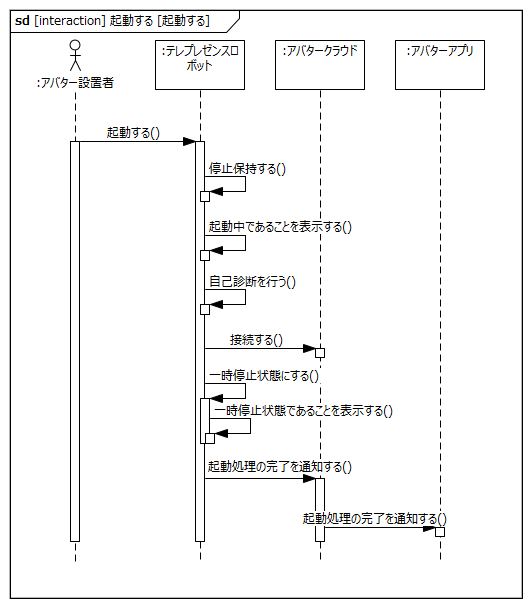
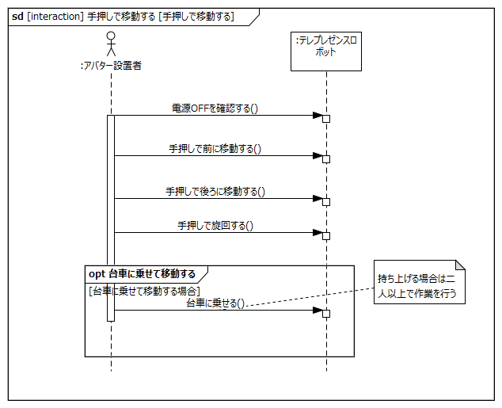

# はじめに
## 本書の目的

本書の目的は、テレプレゼンスロボットシステムにおけるテレプレゼンスロボット本体の要求を分析し、USDMによる要求記述のための要求を抽出することである。

## 適用

本要件の適用対象は、XXX とする。

## 用語の定義

|用語|説明|
|:---|:---|
|USDM|Universal Specification Describing Mannerの略で、要求を階層的に整理し仕様化するための方法論|
|インタラクション|相互作用|

# システムの構成

テレプレゼンスロボットシステムは、アバターアプリ（クライアント）、アバタークラウド（サーバー）、テレプレゼンスロボット本体および充電ステーションにより構成される。

ユーザ（遠隔操作者）およびアバター設置者はアバターアプリを介して、テレプレゼンスロボットの遠隔操作、テレプレゼンスロボットの先にいる接触者とのコミュニケーションを行うことができる。

テレプレゼンスロボットは頭部、胴体部、走行部の大きく3つのブロックから構成されており、頭部と胴体部を合わせてポール、走行部をベースと呼ぶ。

# ユースケース分析

テレプレゼンスロボットシステムにおけるユースケースを元にテレプレゼンスロボット本体に対する要求を整理する。

テレプレゼンスロボットシステムのユースケース一覧を下記に記載する。

<!-- TODO UC図を分けて書いたほうがよさそう -->

各ユースケースの概要を下記に記載する

|ユースケース名|概要|アクター|
|:---|:---|:---|
|UC-001 納品時の初期セットアップをする|アバター設置者がテレプレゼンスロボットを組み立て、セットアップを行う|・アバター設置者|
|UC-002 日常点検を行う|アバター設置者がテレプレゼンスロボットを使用する前に日常点検を行う|・アバター設置者|
|UC-003 起動する|アバター設置者がテレプレゼンスロボットを起動する|・アバター設置者|
|UC-004 手押しで移動する|アバター設置者が手押しでテレプレゼンスロボットを移動する|・アバター設置者|
|UC-005 遠隔で操作する|ユーザーがテレプレゼンスロボットを遠隔操作する|・ユーザー|
|UC-006 遠隔で音声会話する|ユーザーがテレプレゼンスロボットの先にいる接触者と音声会話をする|・ユーザー ・接触者|
|UC-007 遠隔で返事をする|ユーザーがテレプレゼンスロボットを介して接触者に返事をする|・ユーザー ・接触者|
|UC-008 障害物に接近すると減速・停止する|テレプレゼンスロボットが障害物に一定の距離まで接近すると減速・停止する|・ユーザー ・障害物|
|UC-009 ~~障害物に接近すると回避する~~（削除）|||
|UC-010 バッテリ低下時に停止し、通知する|バッテリ低下時に停止し、その旨をユーザーに通知する|・ユーザー|
|UC-011 非常停止する|アバター設置者が非常停止ボタンによりテレプレゼンスロボットを停止させる|・アバター設置者|
|UC-012 異常を検知して停止する|テレプレゼンスロボットが異常を検知して停止する|・アバター設置者|
|UC-013 手動で充電する|アバター設置者がテレプレゼンスロボットを充電する|・アバター設置者|
|UC-014 自動で充電する|ユーザーがテレプレゼンスロボットを充電ステーションの近くに移動させて、テレプレゼンスロボットを自動充電する|・ユーザー|
|UC-015 終了点検を行い、保管する|保管庫に移動し終了点検を行い、システムを終了する|・アバター設置者|
|UC-016 雨天時に操作する|屋外使用中に雨が降ってきた場合に屋内に移動する|・ユーザー ・アバター設置者|
|UC-017 夜間に操作する|夜間は街灯の明るさを頼りに移動する|・ユーザー ・アバター設置者|
|UC-018 手動操縦する|テレプレゼンスロボットが見える位置でロボットを操縦する|・アバター設置者|

以降の節で、各ユースケースごとにテレプレゼンスロボットシステム内のインタラクションを分析し、テレプレゼンスロボット本体に対する要求を抽出する

## UC-001: 納品時の初期セットアップをする

**ユースケース概要**

- アバター設置者は製品（テレプレゼンスロボット）をリースまたは購入し、設置場所に届いたら製品の初期セットアップをする。  
- 初期設定項目
  - アバターアプリに製品（テレプレゼンスロボット）を登録
  - テレプレゼンスロボットの初期動作確認

ユースケース「納品時の初期セットアップをする」におけるブロック間のインタラクションを以下に示す

- 事前条件
	- テレプレゼンスロボットは電源OFFしていること
- 事後条件
	- テレプレゼンスロボットの初期設定が完了していること
	- テレプレゼンスロボットは電源OFFしていること
- 不変条件
	- なし
- 代替フロー
    - なし
- 例外フロー
    - アバターアプリに接続できない
    - ポールとコーンの取り付けができない
- 関連する要件
	- T.B.D

上記インタラクションを実現するためにテレプレゼンスロボットに要求される項目を以下に抽出する

|要求|備考|
|:---|:---|
|テレプレゼンスロボットの電源をONする||
|テレプレゼンスロボットの電源をOFFする||
|テレプレゼンスロボットとアバタークラウドの設定を行う||

## UC-002: 日常点検を行う

**ユースケース概要**

- 始業時、予め決められた点検項目を確認する。
- 項目によって、頻度は毎日に限らず、毎週、毎月になることもあり得る
- 必要に応じて部品の一部を取り外して確認することもあり得る。
- 詳細な点検項目、内容、方法は、マニュアルで定義する。
- 必要に応じて、部品や消耗品を交換・補充することもあり得る。

**◆テレプレゼンスロボット電源OFFの点検項目例**

- 消耗品の状態（タイヤ、キャスター）
- 締結部のがたつき
- 外装の割れ

など

**◆テレプレゼンスロボット起動中の点検項目例**

- ディスプレイ
- 音声出力機能の確認
- 非常停止機能の確認
- カメラ、センサの機能確認
- 走行部の回転、異音、振動の確認

など

ユースケース「日常点検を行う」におけるブロック間のインタラクションを以下に示す

- 事前条件
	- テレプレゼンスロボットは電源OFFしていること
- 事後条件
	- 日常点検が完了していること
	- テレプレゼンスロボットは電源OFFしていること
- 不変条件
	- なし
- 代替フロー
    - なし
- 例外フロー
    - 部品が破損している
    - センサーが正常に動作しない
- 関連する要件
	- T.B.D

上記インタラクションを実現するためにテレプレゼンスロボットに要求される項目を以下に抽出する

|要求|備考|
|:---|:---|
|テレプレゼンスロボットはセンサー、バッテリーの状態を通知する||
|テレプレゼンスロボットに状態を表示する||

## UC-003: 起動する

**ユースケース概要**

- 電源OFFしている状態から電源が供給されテレプレゼンスロボットを起動する
- 起動は、管理者、または施設管理者が近くにいる状態で行う。無人では行わない。
- 起動時に自己診断を行う。
- 起動処理後は、スタンバイモード(停止保持)に移行する。

ユースケース「起動する」におけるブロック間のインタラクションを以下に示す

- 事前条件
	- 日常点検の起動前項目に異常がないこと
- 事後条件
	- テレプレゼンスロボットが起動していること
	- 自己診断結果に異常がないこと
	- テレプレゼンスロボットがスタンバイモードに移行していること
- 不変条件
	- なし
- 代替フロー
    - なし
- 例外フロー
    - 自己診断で異常が発生した
- 関連する要件
	- T.B.D

上記インタラクションを実現するためにテレプレゼンスロボットに要求される項目を以下に抽出する

|要求|備考|
|:---|:---|
|テレプレゼンスロボットをスタンバイモード（停止保持状態）にする||
|テレプレゼンスロボットは自己診断を行う||
|テレプレゼンスロボットはアバタークラウドに接続する||
|テレプレゼンスロボットは起動処理の完了を通知する||

## UC-004: 手押しで移動する

**ユースケース概要**

- テレプレゼンスロボットを手動操縦で制御できないときに、手押しで移動する。
- テレプレゼンスロボットは電源OFF状態であることを想定する。
- 台車に載せることも想定する。その場合、二人以上で持ち上げること

ユースケース「手押しでテレプレゼンスロボットを移動する」におけるブロック間のインタラクションを以下に示す

- 事前条件
	- なし
- 事後条件
	- 手押しでの移動ができること
- 不変条件
	- テレプレゼンスロボットは電源OFFしていること
- 代替フロー
    - なし
- 例外フロー
    - TODO
- 関連する要件
	- T.B.D

上記インタラクションを実現するためにテレプレゼンスロボットに要求される項目を以下に抽出する

|要求|備考|
|:---|:---|
|テレプレゼンスロボットの電源をOFFする||

## UC-005: 遠隔で操作する

**ユースケース概要**

- アバターアプリからテレプレゼンスロボットを操作する
- キーボードの上、下、左、右を使って動かす
- マウスを使って、アプリ上の首振り操作をする

ユースケース「遠隔で操作する」におけるブロック間のインタラクションを以下に示す

- 事前条件
	- 起動処理（アバタークラウドへの接続）が完了したテレプレゼンスロボットが存在すること
- 事後条件
	- アバターアプリからテレプレゼンスロボットを操作できること
- 不変条件
	- なし
- 代替フロー
    - なし
- 例外フロー
    - アバターアプリからテレプレゼンスロボットの操作ができない
- 関連する要件
	- T.B.D

上記インタラクションを実現するためにテレプレゼンスロボットに要求される項目を以下に抽出する

|要求|備考|
|:---|:---|
|テレプレゼンスロボットの首の位置を初期化する||
|テレプレゼンスロボットを遠隔で操作する||

## UC-006: 遠隔で音声会話をする

**ユースケース概要**

- ユーザーと接触者がテレプレゼンスロボットを介して会話する
- 会話中もUC-005の遠隔操作が行える

ユースケース「遠隔で音声会話をする」におけるブロック間のインタラクションを以下に示す

- 事前条件
	- 起動処理（アバタークラウドへの接続）が完了したテレプレゼンスロボットが存在すること
- 事後条件
	- テレプレゼンスロボットを介してユーザーと接触者が音声会話できること
- 不変条件
	- 音声会話中にテレプレゼンスロボットの遠隔操作ができる
- 代替フロー
    - なし
- 例外フロー
    - テレプレゼンスロボットを介した音声会話ができない
    - 音声会話中にテレプレゼンスロボットの遠隔操作ができない
- 関連する要件
	- T.B.D

上記インタラクションを実現するためにテレプレゼンスロボットに要求される項目を以下に抽出する

|要求|備考|
|:---|:---|
|テレプレゼンスロボットのカメラ・マイクを初期化する||
|テレプレゼンスロボットを介して映像・音声を送受信する||

## UC-007: 遠隔で返事をする

**ユースケース概要**

- ユーザーがテレプレゼンスロボットの首を振り接触者にYes、Noを伝える。

ユースケース「遠隔で返事をする」におけるブロック間のインタラクションを以下に示す

- 事前条件
	- 起動処理（アバタークラウドへの接続）が完了したテレプレゼンスロボットが存在すること
- 事後条件
	- テレプレゼンスロボットを介してユーザーに返事ができること
- 不変条件
	- なし
- 代替フロー
    - なし
- 例外フロー
    - テレプレゼンスロボットを介してユーザーに返事ができない
- 関連する要件
	- T.B.D

上記インタラクションを実現するためにテレプレゼンスロボットに要求される項目を以下に抽出する

|要求|備考|
|:---|:---|
|テレプレゼンスロボットの首の位置を初期化する|UC-005と同一|
|テレプレゼンスロボットでYES動作（首の上下動作）をする||
|テレプレゼンスロボットでNO動作（首の左右動作）をする||

## UC-008: 障害物に接近すると減速・停止する

**ユースケース概要**

- テレプレゼンスロボットの移動中に常時発生する
- テレプレゼンスロボットは、エリアワイヤの内側、外側を検出し、減速・停止する
- ワイヤ近傍の信号の大きさにより、減速する。
- ワイヤから離れる方向に旋回することで速度を回復する。

ユースケース「障害物に接近すると減速・停止する」におけるブロック間のインタラクションを以下に示す

- 事前条件
	- テレプレゼンスロボットが移動している。
- 事後条件
	- 減速エリアを検知し減速すること
	- 停止エリアを検知し停止すること
- 不変条件
	- 減速・停止エリアにおいても旋回動作は行えること
- 代替フロー
    - なし
- 例外フロー
    - 減速・停止エリアを検知しても減速・停止しない
    - 減速・停止エリア以外の場所で減速・停止する
- 関連する要件
	- T.B.D

上記インタラクションを実現するためにテレプレゼンスロボットに要求される項目を以下に抽出する

|要求|備考|
|:---|:---|
|テレプレゼンスロボットはエリア検出方式を設定する||
|テレプレゼンスロボットは減速エリアを検知し減速する|エリアワイヤの敷設が必要|
|テレプレゼンスロボットは停止エリアを検知し停止する|エリアワイヤの敷設が必要|

## UC-010: バッテリ低下時に停止し、通知する

**ユースケース概要**

- バッテリ容量が少ない時は停止する。
- バッテリが低下したら、帰還通知をアバターアプリに通知する
- バッテリの過放電を検知し、アバターアプリに通知する

ユースケース「バッテリ低下時に停止し、通知する」におけるブロック間のインタラクションを以下に示す

- 事前条件
	- 起動処理（アバタークラウドへの接続）が完了したテレプレゼンスロボットが存在すること
- 事後条件
	- テレプレゼンスロボットが停止し、アバターアプリに通知が送られていること
- 不変条件
	- なし
- 代替フロー
    - なし
- 例外フロー
    - アバターアプリに通知が送られない
- 関連する要件
	- T.B.D

上記インタラクションを実現するためにテレプレゼンスロボットに要求される項目を以下に抽出する

|要求|備考|
|:---|:---|
|テレプレゼンスロボットはバッテリ残量を通知する||
|テレプレゼンスロボットはバッテリ残量が低下したら、停止する||
|テレプレゼンスロボットはバッテリ残量低下により停止したことを通知する||

## UC-011: 非常停止する

**ユースケース概要**

- テレプレゼンスロボットの移動中に、アバター設置者が危険を察知し非常停止操作をする
- 停止したら、情報をアバターアプリに連絡する

ユースケース「非常停止する」におけるブロック間のインタラクションを以下に示す

- 事前条件
	- なし
- 事後条件
	- テレプレゼンスロボットが停止していること
- 不変条件
	- なし
- 代替フロー
    - なし
- 例外フロー
    - 非常停止がアバターアプリに通知されない
    - 非常停止ボタンを押しても停止しない
- 関連する要件
	- T.B.D

上記インタラクションを実現するためにテレプレゼンスロボットに要求される項目を以下に抽出する

|要求|備考|
|:---|:---|
|テレプレゼンスロボットを非常停止ボタンにより停止する||
|テレプレゼンスロボットの非常停止状態を解除する||

## UC-012: 異常を検知して停止する

**ユースケース概要**

- テレプレゼンスロボットが内部での異常を検知し、停止する。
- 停止したら、故障情報をアバターアプリに連絡する

**異常項目**

- 走行モータ回転異常
- 首モータ異常
- センサ異常
- CAN異常
- バッテリ異常
- 停止スイッチ異常
- アバターコア異常

ユースケース「異常を検知して停止する」におけるブロック間のインタラクションを以下に示す

- 事前条件
	- テレプレゼンスロボットは電源ONされていて、点検や手動操作している
- 事後条件
	- テレプレゼンスロボットが停止していること
- 不変条件
	- テレプレゼンスロボットは電源ONされていること
- 代替フロー
    - なし
- 例外フロー
    - 異常を検知しても停止しない
- 関連する要件
	- T.B.D

上記インタラクションを実現するためにテレプレゼンスロボットに要求される項目を以下に抽出する

|要求|備考|
|:---|:---|
|異常を検知する||
|非常停止状態を通知する||
|非常停止解除状態を通知する||
|非常停止状態を解除する||

## UC-013: 手動で充電する

**ユースケース概要**

- テレプレゼンスロボットのバッテリーを充電する
- テレプレゼンスロボットの充電は保管庫付近でおこなう

ユースケース「手動で充電する」におけるブロック間のインタラクションを以下に示す

- 事前条件
	- 充電ステーションが利用可能な状態であること
	- テレプレゼンスロボットのロックが解除されていること（手押し可能な状態になっていること）
- 事後条件
	- 充電が完了していること
- 不変条件
	- なし
- 代替フロー
    - なし
- 例外フロー
    - 充電ステーションに接続できない
    - 充電ステーションに接続しても充電が開始されない
    - 満充電にならない
- 関連する要件
	- T.B.D

上記インタラクションを実現するためにテレプレゼンスロボットに要求される項目を以下に抽出する

|要求|備考|
|:---|:---|
|テレプレゼンスロボットの充電ステーションに接続する|接続後充電を開始する|
|テレプレゼンスロボットを充電中に充電ステーションから取り外すことができる||

## UC-014: 自動で充電する

**ユースケース概要**

- テレプレゼンスロボットのバッテリーを充電する
- アバターアプリからの帰還指示により、自動充電が行える

ユースケース「自動で充電する」におけるブロック間のインタラクションを以下に示す

- 事前条件
	- 充電ステーションが利用可能な状態であること
	- 遠隔操作が可能な状態であること
- 事後条件
	- 充電が完了していること
- 不変条件
	- なし
- 代替フロー
    - なし
- 例外フロー
    - アバターアプリにステーションの検出が反映されない
    - ドッキング動作が行えない
    - 充電が開始されない
    - 満充電にならない
- 関連する要件
	- T.B.D

上記インタラクションを実現するためにテレプレゼンスロボットに要求される項目を以下に抽出する

|要求|備考|
|:---|:---|
|テレプレゼンスロボットは充電ステーションを検出する||
|テレプレゼンスロボットは帰還指示により充電ステーションに自動でドッキングする||
|テレプレゼンスロボットは充電状況をアバターアプリに通知する||
|テレプレゼンスロボットは充電中に充電ステーションから離れることができる||

## UC-015: 終了点検を行い、保管する

**ユースケース概要**

- 充電したテレプレゼンスロボットを保管庫内まで移動し、停車する。
- 充電場所＝保管場所とは限らない。
- 充電場所は屋内が望ましいが、限定しない。

テレプレゼンスロボットを保管庫の所定の場所に停車する

ユースケース「終了点検を行い、保管する」におけるブロック間のインタラクションを以下に示す

- 事前条件
    - テレプレゼンスロボットが充電されている。
    - テレプレゼンスロボットが電源OFFしている。
- 事後条件
    - テレプレゼンスロボットが保管場所に停車している。
    - テレプレゼンスロボットが電源OFFしている。
- 不変条件
	- なし
- 代替フロー
    - なし
- 例外フロー
    - 診断ができない
    - 診断データが保存できない
- 関連する要件
	- T.B.D

上記インタラクションを実現するためにテレプレゼンスロボットに要求される項目を以下に抽出する

|要求|備考|
|:---|:---|
|電源ONする||
|電源OFFする||
|診断データを保存する||

## UC-016: 雨天時に操作する

**ユースケース概要**

- 雨天での屋外使用は行わない
- 屋外から屋内にテレプレゼンスロボットを移動する
- 滑りやすい床（濡れた斜面など）では速度を維持・制限する

ユースケース「雨天時に操作する」におけるブロック間のインタラクションを以下に示す

- 事前条件
    - テレプレゼンスロボットが移動している
- 事後条件
    - テレプレゼンスロボットが屋内に移動されている
- 不変条件
	- なし
- 代替フロー
    - 雨量が多い場合にはカッパをかける
- 例外フロー
    - なし
- 関連する要件
	- T.B.D

上記インタラクションを実現するためにテレプレゼンスロボットに要求される項目を以下に抽出する

|要求|備考|
|:---|:---|
|テレプレゼンスロボットは少量の雨に対して防水できる|一定雨量を超えた場合はカッパが必要|

## UC-017: 夜間に操作する

**ユースケース概要**

- 街灯により歩行できる明るさの場所でのみで使用する

ユースケース「終了点検を行い、保管する」におけるブロック間のインタラクションを以下に示す

- 事前条件
    - テレプレゼンスロボットは移動している
- 事後条件
    - 屋内に移動している
- 不変条件
	- なし
- 代替フロー
    - なし
- 例外フロー
    - 街灯が消える
    - 周囲が暗すぎて移動できない
- 関連する要件
	- T.B.D

上記インタラクションを実現するためにテレプレゼンスロボットに要求される項目を以下に抽出する

|要求|備考|
|:---|:---|
|テレプレゼンスロボットは周囲の明るさを確認する||
|テレプレゼンスロボットは明るさの不足を通知する||

## UC-018: 手動操縦する（pending）

# テレプレゼンスロボット本体の要求項目

前章の各ユースケースの分析結果をテレプレゼンスロボット本体の要求項目として整理したものを以下に記載する。

|要求項目|関連するUC|備考|
|:---|:---|:---|
|テレプレゼンスロボットの電源をONする|UC-001, UC-015||
|テレプレゼンスロボットの電源をOFFする|UC-001, UC-004, UC-015||
|テレプレゼンスロボットとアバタークラウドの接続設定を行う|UC-001||
|テレプレゼンスロボットの各センサーの状態を通知する|UC-002||
|テレプレゼンスロボットの各センサーの状態を表示する|UC-002|ステータスランプのイメージ|
|テレプレゼンスロボットをスタンバイモード（停止保持状態）にする|UC-003||
|テレプレゼンスロボットは自己診断を行う|UC-003, UC-015||
|テレプレゼンスロボットはアバタークラウドに接続する|UC-003||
|テレプレゼンスロボットは起動処理の完了を通知する|UC-003||
|テレプレゼンスロボットの首の位置を初期化する|UC-005, UC-007||
|テレプレゼンスロボットを遠隔で操作する|UC-005||
|テレプレゼンスロボットのカメラ・マイクを初期化する|UC-006||
|テレプレゼンスロボットを介して映像・音声を送受信する|UC-006||
|テレプレゼンスロボットでYES動作（首の上下動作）をする|UC-007||
|テレプレゼンスロボットでNO動作（首の左右動作）をする|UC-007||
|テレプレゼンスロボットのエリア検出方式を設定する|UC-008||
|テレプレゼンスロボットは減速エリアを検知し減速する|UC-008|エリアワイヤの敷設が必要|
|テレプレゼンスロボットは停止エリアを検知し停止する|UC-008|エリアワイヤの敷設が必要|
|テレプレゼンスロボットはバッテリ残量を通知する|UC-002, UC-010||
|テレプレゼンスロボットはバッテリ残量が低下したら、停止する|UC-010||
|テレプレゼンスロボットはバッテリ残量低下により停止したことを通知する|UC-010||
|テレプレゼンスロボットを非常停止ボタンにより停止する|UC-011, UC-012||
|テレプレゼンスロボットを非常停止を通知する|UC-011, UC-012||
|テレプレゼンスロボットの非常停止状態を解除する|UC-011, UC-012||
|テレプレゼンスロボットを非常停止解除を通知する|UC-011, UC-012||
|テレプレゼンスロボットは内部の異常を検知する|UC-012||
|テレプレゼンスロボットを充電ステーションに接続する（充電を開始する）|UC-013||
|テレプレゼンスロボットを充電中に充電ステーションから取り外す|UC-013, UC-014|遠隔操作でも外せる|
|テレプレゼンスロボットは充電ステーションを検出する|UC-014||
|テレプレゼンスロボットは帰還指示により充電ステーションに自動でドッキングする（充電を開始する）|UC-014||
|テレプレゼンスロボットは充電状況を通知する|UC-014||
|テレプレゼンスロボットは自己診断結果を保存する|UC-015|UC-003も保存必要?|
|テレプレゼンスロボットは少量の雨に対して防水できる|UC-016|一定雨量を超えた場合はカッパが必要|
|テレプレゼンスロボットは周囲の明るさを確認する|UC-017||
|テレプレゼンスロボットは明るさの不足を通知する|UC-017||

以降の節でテレプレゼンスロボット本体の要求項目毎に頭部、胴体部、走行部の各ブロック毎に詳細化を行う。

## (ACT xx)

## テレプレゼンスロボットの首の位置を初期化する

|要求|備考|
|:---|:---|
|頭部は初期化コマンドを受け取り動作命令（首初期化）を取り出す||
|胴体部は動作命令（首初期化）をモータ駆動信号に変換する||
|胴体部はモータ駆動信号により首を初期位置に移動する||

## テレプレゼンスロボットを遠隔で操作する

<!-- (TODO) アクティビティ図見直し -->

## テレプレゼンスロボットのカメラ・マイクを初期化する

|要求|備考|
|:---|:---|
|頭部は初期化コマンドを受け取り動作命令（カメラ・マイク初期化）を取り出す||
|頭部は動作命令（カメラ・マイク初期化）を受けカメラ・マイクを初期化する||

## テレプレゼンスロボットを介して映像・音声を送受信する

<!-- (TODO) アクティビティ図見直し -->

|要求|備考|
|:---|:---|
|頭部は受信データを映像・音声に変換する||
|頭部は映像を出力する||
|頭部は音声を出力する||
|頭部は映像を撮影する||
|頭部は音声を入力する||
|頭部は入力された映像・音声を送信データに変換する||

## テレプレゼンスロボットでYES動作（首の上下動作）をする

|要求|備考|
|:---|:---|
|頭部はYES動作コマンドを受け取り動作命令（YES動作）を取り出す||
|胴体部は動作命令（YES動作）を受けモータ駆動信号に変換する||
|胴体部はモータ駆動信号に応じてYES動作を行う（首を上下に2回動かす）||

## テレプレゼンスロボットでNO動作（首の左右動作）をする

|要求|備考|
|:---|:---|
|頭部はNO動作コマンドを受け取り動作命令（NO動作）を取り出す||
|胴体部は動作命令（NO動作）を受けモータ駆動信号に変換する||
|胴体部はモータ駆動信号に応じてNO動作を行う（首を左右に2回動かす）||

## テレプレゼンスロボットを非常停止ボタンにより停止する

|要求|備考|
|:---|:---|
|胴体部は非常停止ボタンが押されたことを検出し非常停止信号に変換する|胴体部に非常停止ボタンがあると仮定|
|走行部は非常停止信号を受けモータ駆動を停止する||
|走行部は非常停止信号をCAN信号に変換し頭部へ送信する||
|頭部はCAN信号から非常停止通知を取り出す||
|頭部は非常停止通知をアバタークラウドに送信する||

## テレプレゼンスロボットの非常停止状態を解除する

|要求|備考|
|:---|:---|
|胴体部は非常停止ボタンが解除されたことを検出し非常停止解除信号に変換する|胴体部に非常停止ボタンがあると仮定|
|走行部は非常停止解除信号を受けを非常停止を解除する||
|走行部は非常停止解除信号をCAN信号に変換し頭部へ送信する||
|頭部はCAN信号から非常停止解除通知を取り出す||
|頭部は非常停止解除通知をアバタークラウドに送信する||

## テレプレゼンスロボットを充電ステーションに接続する（充電を開始する）

<!-- (TODO) アクティビティ図見直し -->

|要求|備考|
|:---|:---|
|走行部を充電ステーションに接続する||
|走行部は充電ステーションからの給電を確認する||
|走行部は満充電になるまで充電する||
|走行部は充電中であることを表示する||

## テレプレゼンスロボットを充電ステーションから取り外す

<!-- (TODO) アクティビティ図見直し -->

|要求|備考|
|:---|:---|
|走行部を充電ステーションから取り外す||

## テレプレゼンスロボットは充電ステーションを検出する

|要求|備考|
|:---|:---|
|||

## テレプレゼンスロボットは帰還指示により充電ステーションに自動でドッキングする（充電を開始する）

|要求|備考|
|:---|:---|
|||

## テレプレゼンスロボットは充電状況をアバターアプリに通知する

|要求|備考|
|:---|:---|
|||

## テレプレゼンスロボットはドッキング解除をアバターアプリに通知する

|要求|備考|
|:---|:---|
|||