<!-- ↑表紙ページのための情報 -->

# はじめに

## 本書の目的

本書の目的は、テレプレゼンスロボットシステムにおけるテレプレゼンスロボット本体の要求を分析し、USDMによる要求記述のためのL0/L1要求を抽出することである。

## 適用

本要件の適用対象は、テレプレゼンスロボット とする。

## 用語の定義

|用語|説明|
|:---|:---|
|アバター テレプレゼンスロボット|遠隔から操作されるロボット|
|プラットフォーマー|ユーザーがアバターを遠隔操作する際、利用するサービスを提供する事業者|
|インタラクション|相互作用|

## 関連資料

|資料名|説明|
|:---|:---|
|テレプレゼンスロボット要求一覧&USDM.xlsx|本文書の要求分析結果をまとめ、USDMの形式で記述したファイル|
|機能干渉マトリクス.xlsx|本文書の要求分析および今後の仕様化を進める際に検討が必要な機能干渉についてマトリクス表で整理を行ったファイル|

# 要求

テレプレゼンスロボットシステムに関わる要求について次の三つの階層に分けて整理する。

|要求階層|説明|
|:---|:---|
|ビジネス要求|企業（事業）の目的、目標またはニーズについて表現した要求|
|ステークホルダー要求|特定のステークホルダーのニーズについて表現した要求|
|ソリューション要求|ビジネス要求およびステークホルダー要求に適合するソリューションの特徴について表現した要求|

 

ソリューション要求のうち、テレプレゼンスロボットシステムの機能に関連するものについてはユースケースとして定義し、ユースケース分析の章で詳細化を行う

## アバターインのサービスに関する要求

### 要求図

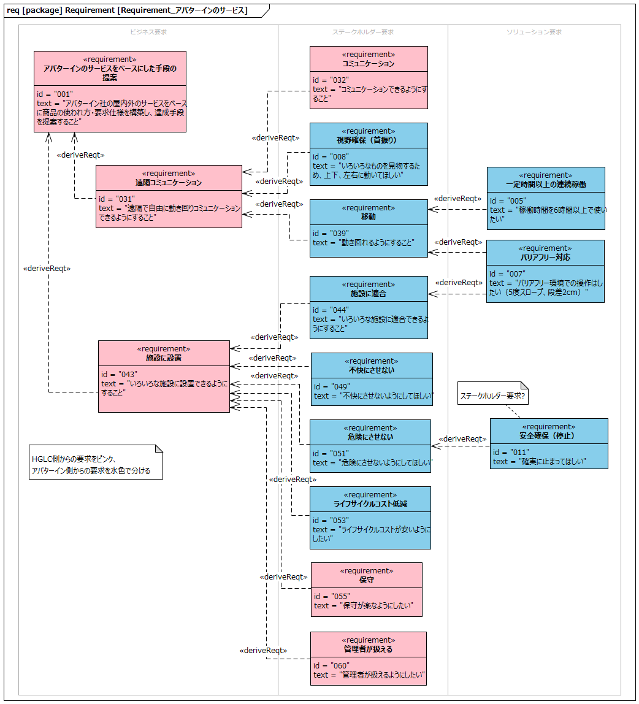

 
### 要求一覧

|id|要求階層|要求名|説明|備考|
|:---|:---|:---|:---|:---|
|001|ビジネス|アバターインのサービスをベースにした手段の提案|アバターイン社の屋内外のサービスをベースに商品の使われ方・要求仕様を構築し、哲西手段を提案すること||
|031|ビジネス|遠隔コミュニケーション|遠隔で自由に動き回りコミュニケーションできるようにすること|
|043|ビジネス|施設に設置|アバターイン社の屋内外のサービスをベースに商品使われ方・要求仕様構築し、達成手段を提案すること||
|032|ステークホルダー|コミュニケーション|コミュニケーションできるようにすること||
|008|ステークホルダー|視野確保（首振り）|いろいろなものを見物するため、上下、左右に動いてほしい||
|039|ステークホルダー|移動|自由に動き回れるようにすること||
|044|ステークホルダー|施設に適合|いろいろな施設に設置できるようにすること||
|049|ステークホルダー|不快にさせない|不快にさせないこと||
|051|ステークホルダー|危険にさせない|周囲に危険を与えないこと||
|053|ステークホルダー|ライフサイクルコスト低減|ライフサイクルコストを安くしたい||
|055|ステークホルダー|保守|楽に保守できること（保守がしやすいこと）||
|060|ステークホルダー|管理者が扱える|管理者が扱えるようにしたい||
|005|ソリューション|一定時間以上の連続稼働|稼働時間を6時間以上で使いたい||
|007|ソリューション|バリアフリー対応|バリアフリー環境での操作はしたい（5度スロープ、段差2cm）||
|011|ソリューション|安全確保（停止）|周囲に危険を与えないこと||

## 遠隔コミュニケーションに関する要求

### 要求図

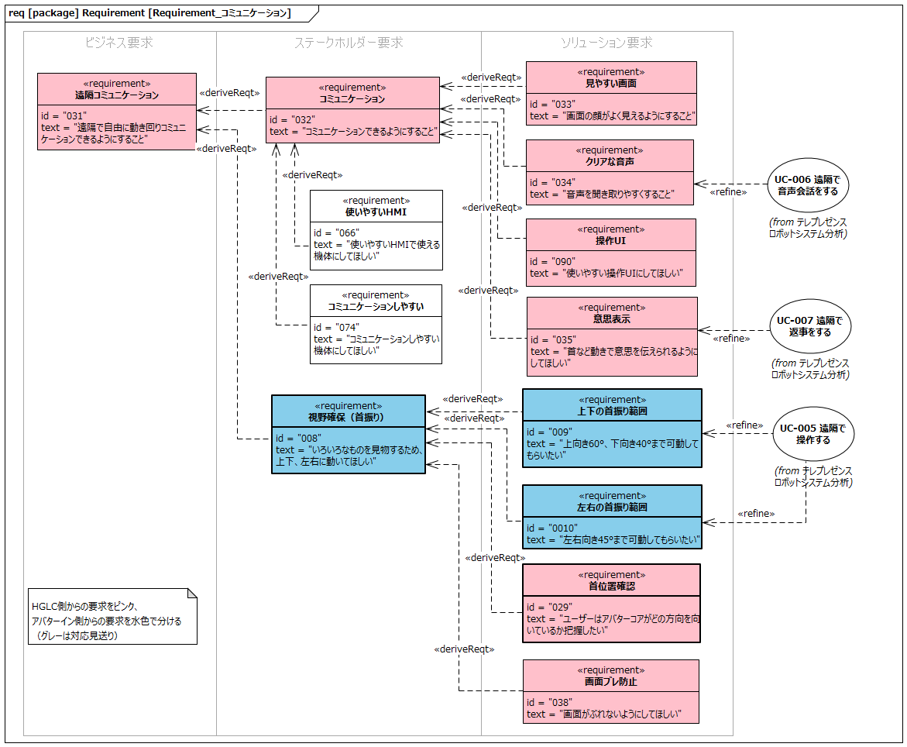

### 要求一覧

|id|要求階層|要求名|説明|備考|
|:---|:---|:---|:---|:---|
|031|ビジネス|遠隔コミュニケーション|遠隔で自由に動き回りコミュニケーションできるようにすること||
|032|ステークホルダー|コミュニケーション|コミュニケーションできるようにすること||
|066|ステークホルダー|使いやすいHMI|使いやすいHMIで使える機体にすること||
|008|ステークホルダー|視野確保（首振り）|いろいろなものを見物するため、上下、左右に動いてほしい||
|033|ソリューション|見やすい画面|画面の顔がよく見えるようにすること||
|034|ソリューション|クリアな音声|音声を聞き取りやすくすること|UC-006で詳細化|
|035|ソリューション|意思表示|首など動きで意思を伝えられるにすること|UC-007で詳細化|
|009|ソリューション|上下の首振り範囲|上向き60°、下向き40°まで可動してもらたい|UC-005で詳細化|
|010|ソリューション|左右の首振り範囲|左右向き45°まで可動してもらたい|UC-005で詳細化|
|029|ソリューション|首位置確認|ユーザーはAvatarCoreがどの方向を向いているか把握したい||
|038|ソリューション|画面ブレ防止|画面がぶれないようにしてほしい||

## 移動に関する要求

### 要求図

### 要求一覧

|id|要求階層|要求名|説明|備考|
|:---|:---|:---|:---|:---|
|039|ステークホルダー|移動|自由に動き回れるようにすること||
|005|ソリューション|一定時間以上の連続稼働|稼働時間を6時間以上で使いたい||
|015|ソリューション|充電ステーション|充電ステーションを設けてもらいたい||
|016|ソリューション|ドッキング|可能であれば、自動でドッキングしてもらいたい|UC-014で詳細化|
|023|ソリューション|ドッキング準備|充電ステーションの近くまでユーザーに移動してもらいたい|UC-014で詳細化|
|025|ソリューション|リモコン操作|近接操作者がリモコンで操作したい(近接操作者が無線で実機走行を停止したい)||
|024|ソリューション|マルチステーション|複数の充電ステーションを利用したい||
|018|ソリューション|バッテリー情報|バッテリの情報をCANに送信してもらいたい|UC-010で詳細化|
|021|ソリューション|スリープ|AvatarCoreをスリープ状態にしてバッテリの節約をしたい||
|022|ソリューション|自動電源OFF|一定時間操作がなければ電源を切りたい||
|007|ソリューション|バリアフリー対応|バリアフリー環境での操作はしたい（5度スロープ、段差2cm）||
|041|ソリューション|屋外走行|屋外を走行できるようにすること||
|028|ソリューション|平面走行|段差、くぼみを避けたい||
|086|ソリューション|走破性|バリアフリー環境の屋外・屋内路面を走れること||
|087|ソリューション|対環境性|対環境性を有すること||
|088|ソリューション|温度対応|5～40℃の環境で稼働できること||
|0??|ソリューション|防水・防塵対応|3mm降雨に対する防水および塵埃・圃場の砂塵に対する防塵対応をすること||

## 施設適合に関する要求

### 要求図

### 要求一覧

|id|要求階層|要求名|説明|備考|
|:---|:---|:---|:---|:---|
|043|ビジネス|施設に設置|アバターイン社の屋内外のサービスをベースに商品使われ方・要求仕様構築し、達成手段を提案すること||
|044|ステークホルダー|施設に適合|いろいろな施設に設置できるようにすること||
|049|ステークホルダー|不快にさせない|不快にさせないこと||
|051|ステークホルダー|危険にさせない|周囲に危険を与えないこと||
|011|ステークホルダー|安全確保（停止）|確実に止まってほしい||
|046|ソリューション|施設の保護|施設を汚さない・傷つけないようにすること||
|047|ソリューション|運搬|容易に運搬できること|UC-026で詳細化|
|048|ソリューション|人との共存（デザイン）|人と共存するのに違和感のないデザインとすること||
|030|ソリューション|騒音キャンセル|ユーザー（遠隔操作者）への走行音を聞こえないようにしたい（抑えたい）||
|050|ソリューション|騒音低減|不快にさせないこと||
|052|ソリューション|危害を加えない|人に危害を加えないこと||
|006|ソリューション|速度制限|速度は4km/h程度で走ってもらいたい|UC-005で詳細化|
|026|ソリューション|速度維持|急発進、急停止をしない||
|012|ソリューション|ストップスイッチ|ストップスイッチを付けて止めたい|UC-011-1/2で詳細化|
|013|ソリューション|動作範囲|エリアワイヤーを用いた境界を設定してほしい||
|058|ソリューション|エリアワイヤー検知|エリアワイヤーを検知してほしい|UC-008で詳細化|
|059|ソリューション|エリアワイヤーの検知状態に応じた制御|エリアワイヤーの検知状態に応じて制御してほしい|UC-008で詳細化|
|014|ソリューション|障害物検知|障害物センサを付けたい||
|027|ソリューション|フェールセーフ|一定時間走行指示がなければ実機の走行を停止したい|（要確認）|

## 管理・保守に関する要求

### 要求図

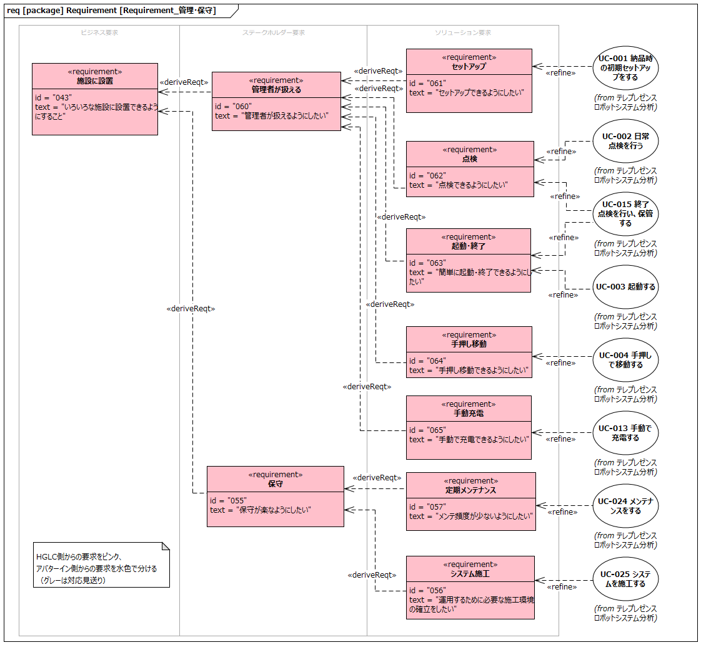

### 要求一覧

|id|要求階層|要求名|説明|備考|
|:---|:---|:---|:---|:---|
|043|ビジネス|施設に設置|アバターイン社の屋内外のサービスをベースに商品使われ方・要求仕様構築し、達成手段を提案すること||
|060|ステークホルダー|管理者が扱える|管理者が扱えるようにしたい||
|055|ステークホルダー|保守|楽に保守できること（保守がしやすいこと）||
|061|ソリューション|セットアップ|簡単にセットアップできるようにすること|UC-001で詳細化|
|062|ソリューション|点検|点検できるようにすること|UC-002,UC-015で詳細化|
|063|ソリューション|起動・終了|簡単に起動・終了できること|UC-003,UC-015で詳細化|
|064|ソリューション|手押し移動|手押し移動できること|UC-004で詳細化|
|065|ソリューション|手動充電|手動で充電できるようにすること|UC-013で詳細化|
|057|ソリューション|定期メンテナンス|メンテナンス頻度を少なくしたい|UC-024で詳細化|
|056|ソリューション|システム施工|運用に必要な施工環境を確立すること|UC-025で詳細化|

## 量産性・コスト・C/Fに関する要求

### 要求図

### 要求一覧

|id|要求階層|要求名|説明|備考|
|:---|:---|:---|:---|:---|
|002|ビジネス|量産性を考慮した構造|67期に試作した実機ベースとし、量産性を考慮した構造とすること||
|003|ビジネス|適切なコスト目標と仕様|先々行SEDチームと連携し、適切なコスト目標と仕様を提案すること||
|004|ビジネス|キャッシュフローの期間圧縮|CFフローの期間短縮を念頭に置き、DRの残項目をミニマムにすること||
|070|ステークホルダー|年間生産台数|年間4000台以上確保できる機体にすること||
|071|ステークホルダー|信頼性|信頼性のある機体にすること||
|073|ステークホルダー|アバターコアに適合|アバターコアに適合した機体にすること||
|072|ステークホルダー|事業性|事業性のある価格の機体にすること||
|086|ステークホルダー|残項目ミニマム|DRの残項目をミニマムにすること||
|053|ステークホルダー|ライフサイクルコスト低減|ライフサイクルコストを安くしたい||
|067|ステークホルダー|リーズナブル|リーズナブルな料金で使える機体にすること||
|019|ソリューション|電源スイッチ|実機の電源スイッチを1つに統一したい(MiimoMainECUとアバターコアのスイッチ統一)||
|020|ソリューション|電源管理|MiimoMainECU側でアバターコアの電源ON・OFFをしたい||
|085|ソリューション|試作実機ベース|アバターコアに適合した機体にすること||
|017|ソリューション|CAN通信|ロボット内の通信はCANに統一してもらいたい||
|054|ソリューション|リース費用|リース費用を安くしたい||

# システムの構成

テレプレゼンスロボットシステムは、アバターアプリ（クライアント）、アバタークラウド（サーバー）、テレプレゼンスロボット本体および充電ステーション、エリアワイヤにより構成される。

エリア信号発生器および充電器は充電ステーションが設置できない環境で使用する際のオプションとしてシステムの構成に含まれる。また、エリア、バリケードについてはシステムの構成要素の一部ではあるが開発の対象ではないため本文書における分析の対象からは除外する。

ユーザー（遠隔操作者）およびアバター設置者はアバターアプリを介して、テレプレゼンスロボットの遠隔操作、テレプレゼンスロボットの先にいる接触者とのコミュニケーションを行うことができる。

テレプレゼンスロボットは頭部、胴体部、走行部の大きく3つのブロックから構成されており、頭部と胴体部を合わせてポール、走行部をベースと呼ぶ。

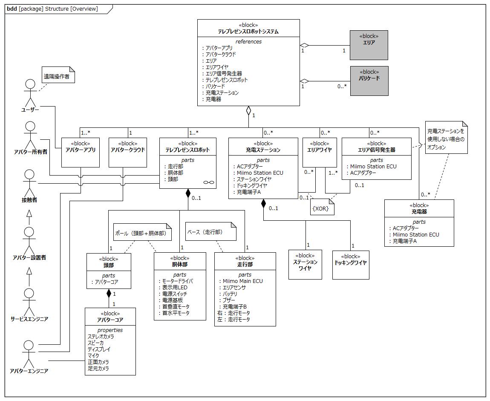

# ユースケース分析

テレプレゼンスロボットシステムにおけるユースケースを元にテレプレゼンスロボット本体に対する要求を整理する。

テレプレゼンスロボットシステムのユースケース一覧を下記に記載する。

各ユースケースの概要を下記に記載する

|ユースケース名|概要|アクター|
|:---|:---|:---|
|UC-001 納品時の初期セットアップをする|アバター設置者がテレプレゼンスロボットを組み立て、セットアップを行う|・アバター設置者|
|UC-002 日常点検を行う|アバター設置者がテレプレゼンスロボットを使用する前に日常点検を行う|・アバター設置者|
|UC-003 起動する|アバター設置者がテレプレゼンスロボットを起動する|・アバター設置者|
|UC-004 手押しで移動する|アバター設置者が手押しでテレプレゼンスロボットを移動する|・アバター設置者|
|UC-005 遠隔で操作する|ユーザーがテレプレゼンスロボットを遠隔操作する|・ユーザー|
|UC-006 遠隔で音声会話する|ユーザーがテレプレゼンスロボットの先にいる接触者と音声会話をする|・ユーザー ・接触者|
|UC-007 遠隔で返事をする|ユーザーがテレプレゼンスロボットを介して接触者に返事をする|・ユーザー ・接触者|
|UC-008 障害物に接近すると減速・停止する|テレプレゼンスロボットが障害物に一定の距離まで接近すると減速・停止する|・ユーザー ・障害物|
|UC-009 ~~障害物に接近すると回避する~~（削除）|||
|UC-010 バッテリ低下時に停止し、通知する|バッテリ低下時に停止し、その旨をユーザーに通知する|・ユーザー|
|UC-011 一時停止する|アバター設置者が一時停止ボタンによりテレプレゼンスロボットを停止させる|・アバター設置者|
|UC-012 異常を検知して停止する|テレプレゼンスロボットが異常を検知して停止する|・アバター設置者|
|UC-013 手動で充電する|アバター設置者がテレプレゼンスロボットを充電する|・アバター設置者|
|UC-014 自動で充電する|ユーザーがテレプレゼンスロボットを充電ステーションの近くに移動させて、テレプレゼンスロボットを自動充電する|・ユーザー|
|UC-015 終了点検を行い、保管する|保管庫に移動し終了点検を行い、システムを終了する|・アバター設置者|
|UC-016 雨天時に操作する|屋外使用中に雨が降ってきた場合に屋内に移動する|・ユーザー ・アバター設置者|
|UC-017 夜間に操作する|夜間は街灯の明るさを頼りに移動する|・ユーザー ・アバター設置者|
|UC-018 手動操縦する|テレプレゼンスロボットが見える位置でロボットを操縦する|・アバター設置者|
|UC-024 メンテナンスをする|予め定められたメンテナンスを実施し、製品診断を行う|・サービスエンジニア|
|UC-025 システムを施工する|テレプレゼンスロボットの運用に必要なシステム施工を行う|・アバター設置者 ・アバターエンジニア|
|UC-026 運搬する|テレプレゼンスロボットをイベント会場などに運搬する|・アバター所有者|

各ユースケースにおけるアクターの定義について以下に記載する

|アクター|定義|備考|
|:---|:---|:---|
|ユーザー|遠隔で操作を行う者||
|接触者|アバター（テレプレゼンスロボット）と対面し、会話をする者||
|アバター設置者|アバター（テレプレゼンスロボット）を設置、運用する者、施設運営者と呼ばれる場合もある||
|アバター所有者|アバター（テレプレゼンスロボット）を所有する者、施設管理者という場合がある||
|メーカー|アバター(テレプレゼンスロボット)の製造、販売に関わる企業||
|アバターエンジニア|アバター設置者、所有者に対して、技術支援をする者|avatarin社|
|サービスエンジニア|アバター製品のメンテ、トラブル対応をする者|avatarin社 Honda|

以降の節で、各ユースケースごとにテレプレゼンスロボットシステム内のインタラクションを分析し、テレプレゼンスロボット本体に対する要求を抽出する

## UC-001: 納品時の初期セットアップをする

**ユースケース概要**

- アバター設置者は製品（テレプレゼンスロボット）をリースまたは購入し、設置場所に届いたら製品の初期セットアップをする。  
- 初期設定項目
  - アバターアプリに製品（テレプレゼンスロボット）を登録
  - テレプレゼンスロボットの初期動作確認

ユースケース「納品時の初期セットアップをする」におけるブロック間のインタラクションを以下に示す

- 事前条件
	- テレプレゼンスロボットは電源OFFしていること
- 事後条件
	- テレプレゼンスロボットの初期設定が完了していること
	- テレプレゼンスロボットは電源OFFしていること
- 不変条件
	- なし
- 代替フロー
    - なし
- 例外フロー
    - アバターアプリに接続できない
    - ポールとコーンの取り付けができない
- 備考
	- なし

上記インタラクションを実現するためにテレプレゼンスロボットに要求される項目を以下に抽出する

|要求|備考|
|:---|:---|
|テレプレゼンスロボットの電源をONする||
|テレプレゼンスロボットの電源をOFFする||
|テレプレゼンスロボットとアバタークラウドの設定を行う||

## UC-002: 日常点検を行う

**ユースケース概要**

- 始業時、予め決められた点検項目を確認する。
- 項目によって、頻度は毎日に限らず、毎週、毎月になることもあり得る
- 必要に応じて部品の一部を取り外して確認することもあり得る。
- 詳細な点検項目、内容、方法は、マニュアルで定義する。

**◆テレプレゼンスロボット電源OFFの点検項目例**

- 消耗品の状態（タイヤ、キャスター）
- 締結部のがたつき
- 外装の割れ

など

**◆テレプレゼンスロボット起動中の点検項目例**

- ディスプレイ
- 音声出力機能の確認
- 一時停止機能の確認
- カメラ、センサの機能確認
- 走行部の回転、異音、振動の確認

など

ユースケース「日常点検を行う」におけるブロック間のインタラクションを以下に示す

- 事前条件
	- テレプレゼンスロボットは電源OFFしていること
- 事後条件
	- 日常点検が完了していること
	- テレプレゼンスロボットは電源OFFしていること
- 不変条件
	- なし
- 代替フロー
    - なし
- 例外フロー
    - 部品が破損している
    - センサーが正常に動作しない
    - バリケード、エリアワイヤ、自動充電が適切に作動しない
- 備考
	- なし

上記インタラクションを実現するためにテレプレゼンスロボットに要求される項目を以下に抽出する

|要求|備考|
|:---|:---|
|テレプレゼンスロボットはセンサー、バッテリの状態を通知する||
|テレプレゼンスロボットに状態を表示する||

## UC-003: 起動する

**ユースケース概要**

- 電源OFFしている状態から電源が供給されテレプレゼンスロボットを起動する
- 起動は、管理者、または施設管理者が近くにいる状態で行う。無人では行わない。
- 起動時に自己診断を行う。
- 起動処理後は、一時停止に移行する。

ユースケース「起動する」におけるブロック間のインタラクションを以下に示す

- 事前条件
	- 日常点検の起動前項目に異常がないこと
- 事後条件
	- テレプレゼンスロボットが起動していること
	- 自己診断結果に異常がないこと
	- テレプレゼンスロボットが一時停止状態となっていること
- 不変条件
	- なし
- 代替フロー
    - なし
- 例外フロー
    - 自己診断で異常が発生した
- 備考
	- なし

上記インタラクションを実現するためにテレプレゼンスロボットに要求される項目を以下に抽出する

|要求|備考|
|:---|:---|
|テレプレゼンスロボットをスタンバイモード（停止保持状態）にする||
|テレプレゼンスロボットは自己診断を行う||
|テレプレゼンスロボットはアバタークラウドに接続する||
|テレプレゼンスロボットは起動処理の完了を通知する||

## UC-004: 手押しで移動する

**ユースケース概要**

- テレプレゼンスロボットを手動操縦で制御できないときに、手押しで移動する。
- テレプレゼンスロボットは電源OFF状態であることを想定する。
- 台車に載せることも想定する。その場合、二人以上で持ち上げること

ユースケース「手押しでテレプレゼンスロボットを移動する」におけるブロック間のインタラクションを以下に示す

- 事前条件
	- なし
- 事後条件
	- 手押しでの移動ができること
- 不変条件
	- テレプレゼンスロボットは電源OFFしていること
- 代替フロー
    - なし
- 例外フロー
    - なし
- 備考
	- なし

上記インタラクションを実現するためにテレプレゼンスロボットに要求される項目を以下に抽出する

|要求|備考|
|:---|:---|
|テレプレゼンスロボットの電源をOFFする||

## UC-005: 遠隔で操作する

**ユースケース概要**

- アバターアプリからテレプレゼンスロボットを操作する
- キーボードの上、下、左、右を使って動かす
- マウスを使って、アプリ上の首振り操作をする

ユースケース「遠隔で操作する」におけるブロック間のインタラクションを以下に示す

- 事前条件
	- 起動処理（アバタークラウドへの接続）が完了したテレプレゼンスロボットが存在すること
- 事後条件
	- アバターアプリからテレプレゼンスロボットを操作できること
- 不変条件
	- なし
- 代替フロー
    - なし
- 例外フロー
    - アバターアプリからテレプレゼンスロボットの操作ができない
- 備考
	- なし

上記インタラクションを実現するためにテレプレゼンスロボットに要求される項目を以下に抽出する

|要求|備考|
|:---|:---|
|テレプレゼンスロボットの首の位置を初期化する||
|テレプレゼンスロボットを遠隔で操作する||

## UC-006: 遠隔で音声会話をする

**ユースケース概要**

- ユーザーと接触者がテレプレゼンスロボットを介して会話する
- 会話中もUC-005の遠隔操作が行える

ユースケース「遠隔で音声会話をする」におけるブロック間のインタラクションを以下に示す

- 事前条件
	- 起動処理（アバタークラウドへの接続）が完了したテレプレゼンスロボットが存在すること
- 事後条件
	- テレプレゼンスロボットを介してユーザーと接触者が音声会話できること
- 不変条件
	- 音声会話中にテレプレゼンスロボットの遠隔操作ができる
- 代替フロー
    - なし
- 例外フロー
    - テレプレゼンスロボットを介した音声会話ができない
    - 音声会話中にテレプレゼンスロボットの遠隔操作ができない
- 備考
	- なし

上記インタラクションを実現するためにテレプレゼンスロボットに要求される項目を以下に抽出する

|要求|備考|
|:---|:---|
|テレプレゼンスロボットのカメラ・マイクを初期化する||
|テレプレゼンスロボットを介して映像・音声を送受信する||

## UC-007: 遠隔で返事をする

**ユースケース概要**

- ユーザーがテレプレゼンスロボットの首を振り接触者にYes、Noを伝える。

ユースケース「遠隔で返事をする」におけるブロック間のインタラクションを以下に示す

- 事前条件
	- 起動処理（アバタークラウドへの接続）が完了したテレプレゼンスロボットが存在すること
- 事後条件
	- テレプレゼンスロボットを介してユーザーに返事ができること
- 不変条件
	- なし
- 代替フロー
    - なし
- 例外フロー
    - テレプレゼンスロボットを介してユーザーに返事ができない
- 備考
	- なし

上記インタラクションを実現するためにテレプレゼンスロボットに要求される項目を以下に抽出する

|要求|備考|
|:---|:---|
|テレプレゼンスロボットの首の位置を初期化する|UC-005と同一|
|テレプレゼンスロボットでYES動作（首の上下動作）をする||
|テレプレゼンスロボットでNO動作（首の左右動作）をする||

## UC-008: ワイヤに接近またはまたいだ場合、減速、停止する

**ユースケース概要**

- テレプレゼンスロボットの移動中に常時発生する
- テレプレゼンスロボットは、エリアワイヤの内側、外側を検出し、減速・停止する
- ワイヤ近傍の信号の大きさにより、減速する。
- ワイヤから離れる方向に旋回することで速度を回復する。

ユースケース「ワイヤに接近またはまたいだ場合、減速、停止する」におけるブロック間のインタラクションを以下に示す

- 事前条件
	- テレプレゼンスロボットが移動している。
- 事後条件
	- 減速エリアを検知し減速すること
	- 停止エリアを検知し停止すること
- 不変条件
	- 減速・停止エリアにおいても旋回動作は行えること
- 代替フロー
    - なし
- 例外フロー
    - 減速・停止エリアを検知しても減速・停止しない
    - 減速・停止エリア以外の場所で減速・停止する
- 備考
	- なし

上記インタラクションを実現するためにテレプレゼンスロボットに要求される項目を以下に抽出する

|要求|備考|
|:---|:---|
|テレプレゼンスロボットはエリア検出方式を設定する||
|テレプレゼンスロボットは減速エリアを検知し減速する|エリアワイヤの敷設が必要|
|テレプレゼンスロボットは停止エリアを検知し停止する|エリアワイヤの敷設が必要|

## UC-010: バッテリ低下時に停止し、通知する

**ユースケース概要**

- バッテリ容量が少ない時は一時停止する。
- バッテリが低下したら、帰還通知をアバターアプリに通知する
- バッテリの過放電を検知し、アバターアプリに通知する

ユースケース「バッテリ低下時に停止し、通知する」におけるブロック間のインタラクションを以下に示す

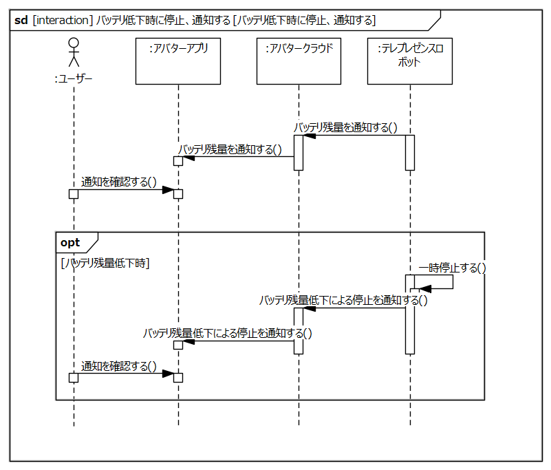

- 事前条件
	- 起動処理（アバタークラウドへの接続）が完了したテレプレゼンスロボットが存在すること
- 事後条件
	- テレプレゼンスロボットが停止し、アバターアプリに通知が送られていること
- 不変条件
	- なし
- 代替フロー
    - なし
- 例外フロー
    - アバターアプリに通知が送られない
- 備考
	- UC-013のテレプレゼンスロボットを充電器に挿すことでWarning状態を解除する

上記インタラクションを実現するためにテレプレゼンスロボットに要求される項目を以下に抽出する

|要求|備考|
|:---|:---|
|テレプレゼンスロボットはバッテリ残量を通知する||
|テレプレゼンスロボットはバッテリ残量が低下したら、停止する||
|テレプレゼンスロボットはバッテリ残量低下により停止したことを通知する||

## UC-011-1: 一時停止する

**ユースケース概要**

- テレプレゼンスロボットの移動中に、アバター設置者が危険を察知し一時停止ボタンを操作をする。また、起動直後、自動充電開始直後、手動充電開始直後も一時停止状態となる。
- 停止したら、情報をアバターアプリに連絡する

ユースケース「一時停止する」におけるブロック間のインタラクションを以下に示す

- 事前条件
	- なし
- 事後条件
	- テレプレゼンスロボットが停止していること
	- テレプレゼンスロボットが一時停止となっていること
- 不変条件
	- なし
- 代替フロー
    - なし
- 例外フロー
    - 一時停止がアバターアプリに通知されない
    - 一時停止ボタンを押しても停止しない
- 備考
	- なし

上記インタラクションを実現するためにテレプレゼンスロボットに要求される項目を以下に抽出する

|要求|備考|
|:---|:---|
|テレプレゼンスロボットを一時停止操作により一時停止する||
|テレプレゼンスロボットの一時停止を通知する||

## UC-011-2: 一時停止を解除する

**ユースケース概要**

- 一時停止状態の場合、停止ボタンを再度押下することにより一時停止を解除する。
- 一時停止解除したら、情報をアバターアプリに連絡する

ユースケース「一時停止を解除する」におけるブロック間のインタラクションを以下に示す

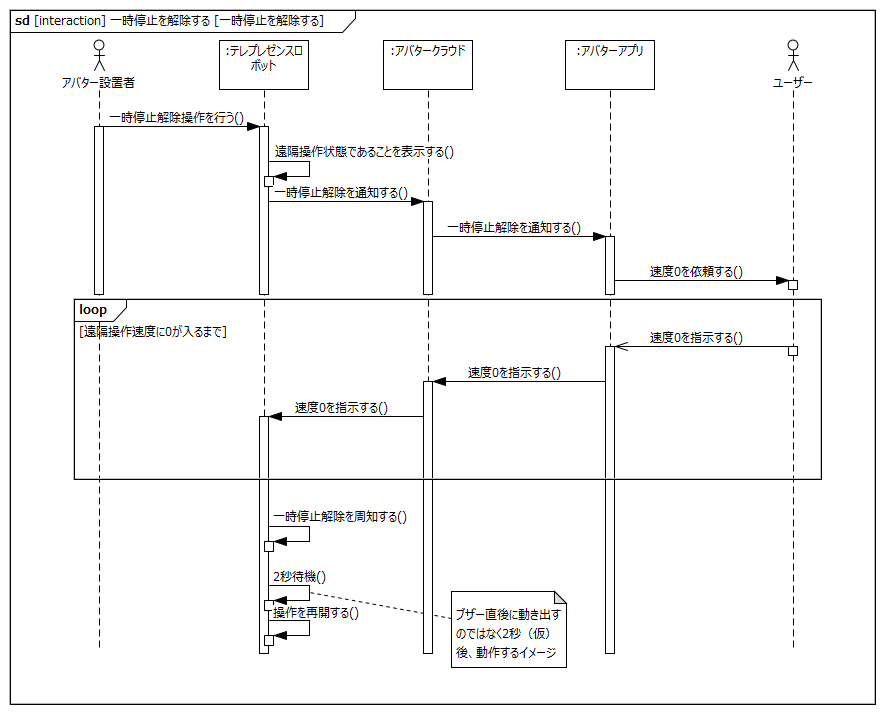

- 事前条件
	- なし
- 事後条件
	- テレプレゼンスロボットが停止していること
	- テレプレゼンスロボットが一時停止となっていること
- 不変条件
	- なし
- 代替フロー
    - なし
- 例外フロー
    - 一時停止がアバターアプリに通知されない
    - 一時停止ボタンを押しても停止しない
- 備考
	- なし

上記インタラクションを実現するためにテレプレゼンスロボットに要求される項目を以下に抽出する

|要求|備考|
|:---|:---|
|テレプレゼンスロボットを一時停止解除操作により一時停止解除する||
|テレプレゼンスロボットの一時停止解除を通知する||
|テレプレゼンスロボットは速度0を受信する||

## UC-012: 異常を検知して停止する

**ユースケース概要**

- テレプレゼンスロボットが内部での異常を検知し、停止する。
- 停止したら、故障情報をアバターアプリに連絡する
- 可能な場合は異常からの復帰する

**異常項目例**

- 走行モータ回転異常
- 首モータ異常
- センサ異常
- CAN異常
- バッテリ異常
- 停止スイッチ異常
- アバターコア異常

**異常（エラー）の種類**

|種類|定義・振る舞い|ロボットの状態|復帰|
|:---|:---|:---|:---|
|Caution|保護機能が動作し走行を停止|エリア外、傾斜、過負荷状態を検知|復帰ボタンを操作|
|Warning|異常を検知し、走行を停止|バッテリ異常、モータ異常|復帰ボタンを操作|
|Fault|デバイスの破損等の重大な異常を検知し、走行を停止|通信異常、デバイス破損|修理および再起動|

ユースケース「異常を検知して停止する」には次の2つのインタラクション（シナリオ）がある、それぞれのブロック間のインタラクションを以下に示す

### 異常検知し停止する

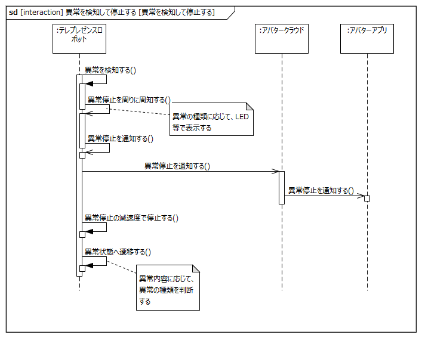

- 事前条件
	- テレプレゼンスロボットは電源ONされていて、点検や手動操作している
- 事後条件
	- テレプレゼンスロボットが停止していること
	- テレプレゼンスロボットが異常停止中となっていること
- 不変条件
	- テレプレゼンスロボットは電源ONされていること
- 代替フロー
    - なし
- 例外フロー
    - 異常を検知しても停止しない
- 備考
	- なし

### 異常状態から復帰する

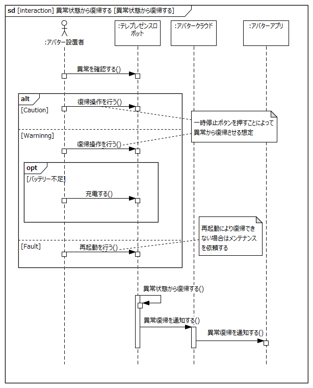

- 事前条件
	- テレプレゼンスロボットは電源ONされていて、異常により停止している
- 事後条件
	- テレプレゼンスロボットが復帰操作によりCautionおよびWarning状態から復帰できること
	- テレプレゼンスロボットが再起動によりFault状態から復帰できること
- 不変条件
	- なし
- 代替フロー
    - テレプレゼンスロボットを再起動してもFault状態が復帰できない
- 例外フロー
    - CautionおよびWarning状態から復帰できないこと
- 備考
	- テレプレゼンスロボットを再起動してもFault状態が解消されない場合はメンテナンスが必要

上記インタラクションを実現するためにテレプレゼンスロボットに要求される項目を以下に抽出する

|要求|備考|
|:---|:---|
|異常を検知する||
|異常停止状態を通知する||
|異常状態から復帰する||
|異常復帰を通知する||

## UC-013: 手動で充電する

**ユースケース概要**

- テレプレゼンスロボットのバッテリを充電する
- テレプレゼンスロボットの充電は保管庫付近でおこなう

ユースケース「手動で充電する」におけるブロック間のインタラクションを以下に示す

- 事前条件
	- 充電ステーションが利用可能な状態であること
- 事後条件
	- 充電が完了していること
	- 一時停止状態となっていること
- 不変条件
	- なし
- 代替フロー
    - なし
- 例外フロー
    - 充電ステーションに接続できない
    - 充電ステーションに接続しても充電が開始されない
    - 満充電にならない
- 備考
	- なし

上記インタラクションを実現するためにテレプレゼンスロボットに要求される項目を以下に抽出する

|要求|備考|
|:---|:---|
|テレプレゼンスロボットの充電ステーションに接続する|接続後充電を開始する|
|テレプレゼンスロボットを充電中に充電ステーションから取り外すことができる||

## UC-014: 自動で充電する

**ユースケース概要**

- テレプレゼンスロボットのバッテリを充電する
- アバターアプリからの帰還指示により、自動充電が行える

ユースケース「自動で充電する」におけるブロック間のインタラクションを以下に示す

- 事前条件
	- 充電ステーションが利用可能な状態であること
	- 遠隔操作が可能な状態であること
- 事後条件
	- 充電が完了していること
	- 一時停止状態となっていること
- 不変条件
	- なし
- 代替フロー
    - なし
- 例外フロー
    - アバターアプリにステーションの検出が反映されない
    - ドッキング動作が行えない
    - 充電が開始されない
    - 満充電にならない
- 備考
	- なし

上記インタラクションを実現するためにテレプレゼンスロボットに要求される項目を以下に抽出する

|要求|備考|
|:---|:---|
|テレプレゼンスロボットは充電ステーションを検出する||
|テレプレゼンスロボットは帰還指示により充電ステーションに自動でドッキングする||
|テレプレゼンスロボットは充電状況をアバターアプリに通知する||
|テレプレゼンスロボットは充電中に充電ステーションから離れることができる||

## UC-015: 終了点検を行い、保管する

**ユースケース概要**

- 充電したテレプレゼンスロボットを保管庫内まで移動し、停車する。
- 充電場所＝保管場所とは限らない。
- 充電場所は屋内が望ましいが、限定しない。

テレプレゼンスロボットを保管庫の所定の場所に停車する

ユースケース「終了点検を行い、保管する」におけるブロック間のインタラクションを以下に示す

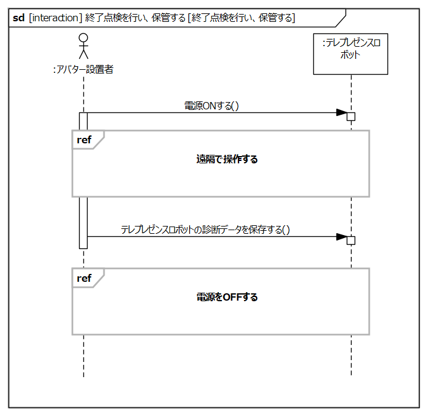  

- 事前条件
    - テレプレゼンスロボットが充電されている。
    - テレプレゼンスロボットが電源OFFしている。
- 事後条件
    - テレプレゼンスロボットが保管場所に停車している。
    - テレプレゼンスロボットが電源OFFしている。
- 不変条件
	- なし
- 代替フロー
    - 遠隔操作できな場合は手押しで移動する（UC-004）
- 例外フロー
    - 診断ができない
    - 診断データが保存できない
- 備考
	- なし

上記インタラクションを実現するためにテレプレゼンスロボットに要求される項目を以下に抽出する

|要求|備考|
|:---|:---|
|電源ONする||
|電源OFFする||
|診断データを保存する||

## UC-016: 雨天時に操作する

**ユースケース概要**

- 雨天での屋外使用は行わない
- 屋外から屋内にテレプレゼンスロボットを移動する
- 滑りやすい床（濡れた斜面など）では速度を維持・制限する

ユースケース「雨天時に操作する」におけるブロック間のインタラクションを以下に示す

- 事前条件
    - テレプレゼンスロボットが移動している
- 事後条件
    - テレプレゼンスロボットが屋内に移動されている
- 不変条件
	- なし
- 代替フロー
    - 雨量が多い場合にはカッパをかける
- 例外フロー
    - なし
- 備考
	- なし

上記インタラクションを実現するためにテレプレゼンスロボットに要求される項目を以下に抽出する

|要求|備考|
|:---|:---|
|テレプレゼンスロボットは少量の雨に対して防水できる|一定雨量を超えた場合はカッパが必要|

## UC-017: 夜間に操作する

**ユースケース概要**

- 街灯により歩行できる明るさの場所でのみで使用する

ユースケース「終了点検を行い、保管する」におけるブロック間のインタラクションを以下に示す

- 事前条件
    - テレプレゼンスロボットは移動している
- 事後条件
    - 屋内に移動している
- 不変条件
	- なし
- 代替フロー
    - なし
- 例外フロー
    - 街灯が消える
    - 周囲が暗すぎて移動できない
- 備考
	- なし

上記インタラクションを実現するためにテレプレゼンスロボットに要求される項目を以下に抽出する

|要求|備考|
|:---|:---|
|テレプレゼンスロボットは周囲の明るさを確認する||
|テレプレゼンスロボットは明るさの不足を通知する||

## UC-024 メンテナンスをする

### 診断シナリオ（履歴を読み出す、テストを実行する）

**ユースケース概要**

- 1年に1回、予め決められたメンテナンス(UC-002)を実施と製品の機能診断を行う。
  - 詳細なメンテナンス、製品診断の項目、内容、方法は、マニュアルで定義する。

※実施には、ホンダのサービス部門と整合が必要のため、今回のシナリオは、量産中Miimoをベースに記載する

- 走行部機能診断
  - 運転履歴を読み出す
    - 運転時間
    - 故障履歴
    - ドライブレコーダー
  - 運転履歴のリセット
  - 走行モータ　動作テスト
  - エリアセンサ　認識テスト
  - バッテリ充電テスト
- 胴体部診断
  - 首モータ　動作テスト
- 頭部機能診断
  - アバターコアになるため省略

など

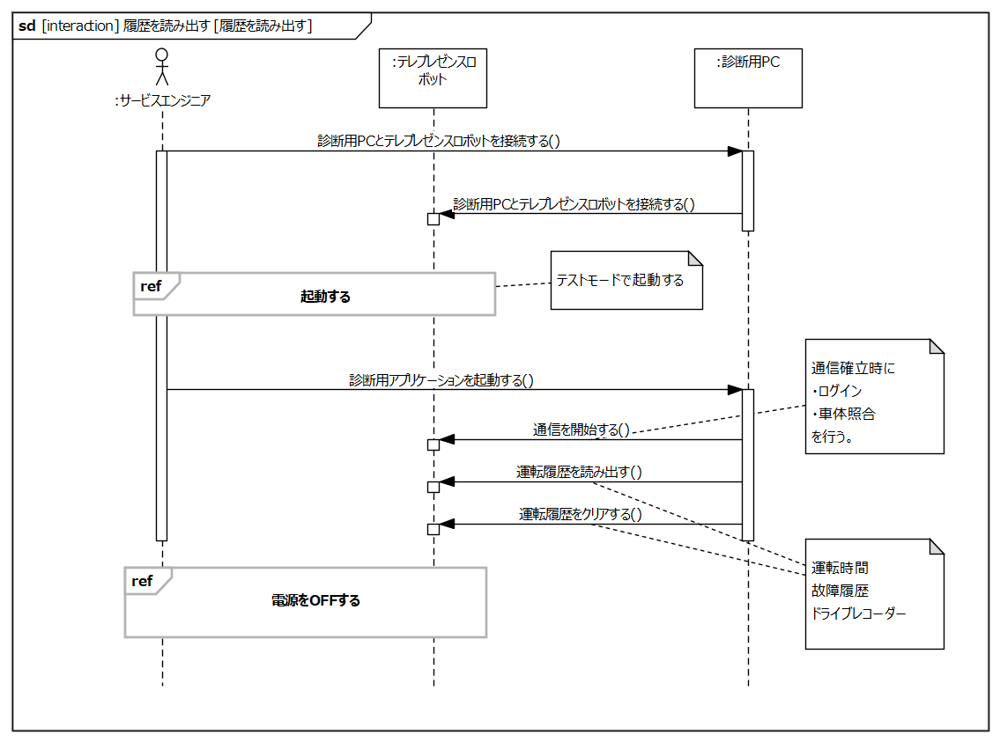
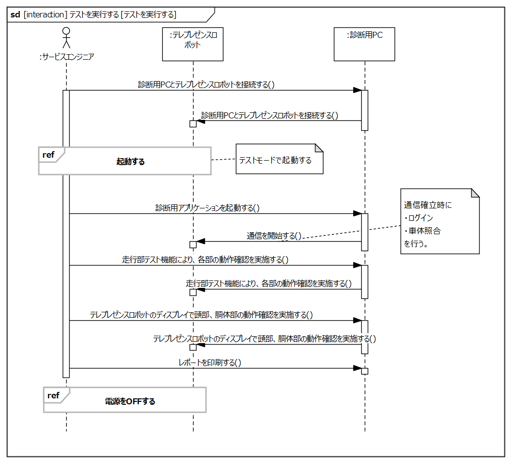

- 事前条件
    - テレプレゼンスロボットが電源OFFであること
- 事後条件
    - テレプレゼンスロボットのメンテナンス、製品診断が完了している
- 不変条件
	- なし
- 代替フロー
    - なし
- 例外フロー
  - テレプレゼンスロボットとの通信が出来ない
  - 診断時
    - 履歴データが読み出せないない
    - テスト実施時、各部が動作しない
- 備考
	- なし

上記インタラクションを実現するためにテレプレゼンスロボットに要求される項目を以下に抽出する

|要求|備考|
|:---|:---|
|テレプレゼンスロボットは診断PCと接続する||
|テレプレゼンスロボットは診断PCと通信する||
|テレプレゼンスロボットは走行部の運転履歴を読み出す||
|テレプレゼンスロボットは走行部の運転履歴をリセットする||
|テレプレゼンスロボットは走行部のテスト機能より、各部の動作確認を実施する||
|テレプレゼンスロボットはディスプレイから頭部・胴体部の動作確認を実施する||

### ソフトウェアアップデートする

**ユースケース概要**

- 走行部のソフトウェアをアップデートする
- 頭部（アバターコア）のソフトウェアをアップデートする

※実施には、ホンダのサービス部門と整合が必要のため、今回のシナリオは、量産中Miimoをベースに記載する

- ソフトアップデート
  - 走行部　ソフト書き換え
  - 頭部　　ソフト書き換え
    - アバターコアになるため省略

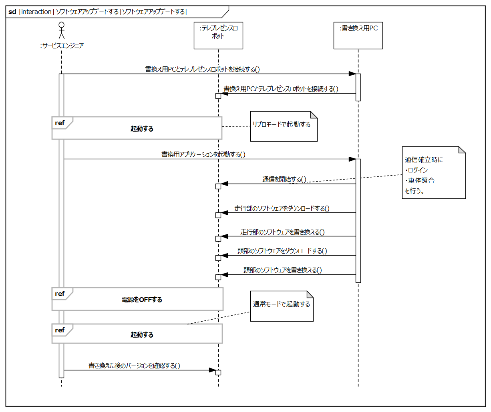

- 事前条件
    - テレプレゼンスロボットが電源OFFであること
- 事後条件
    - テレプレゼンスロボットのメンテナンス、製品診断が完了している
- 不変条件
	- なし
- 代替フロー
    - なし
- 例外フロー
  - テレプレゼンスロボットとの通信が出来ない
  - ソフトウェアアップデート時
    - 書き換えできない
- 備考
	- なし

上記インタラクションを実現するためにテレプレゼンスロボットに要求される項目を以下に抽出する

|要求|備考|
|:---|:---|
|テレプレゼンスロボットは書き換え用PCと接続する||
|テレプレゼンスロボットは書き換え用PCと通信する||
|テレプレゼンスロボットは走行部ソフトを書き換える||
|テレプレゼンスロボットは頭部ソフトを書き換える||

### 部品交換する

**ユースケース概要**

- 必要に応じて、部品や消耗品を交換・補充することもあり得る
  - 部品交換
    - 車体　摩耗や破損が発生した部品（タイヤ、キャスター、カバーなど）
    - 電装　故障している部品

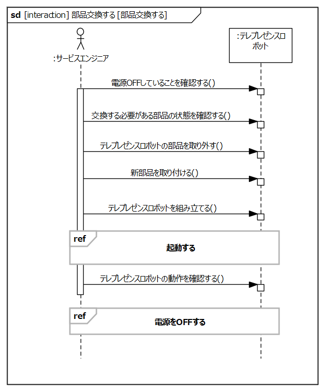

- 事前条件
    - テレプレゼンスロボットが電源OFFであること
- 事後条件
    - テレプレゼンスロボットのメンテナンス、製品診断が完了している
- 不変条件
	- なし
- 代替フロー
    - なし
- 例外フロー
  - 部品が取り付けられない
  - 部品が動作しない
- 備考
	- なし

## UC-025 システムを施工する

**ユースケース概要**

- テレプレゼンスロボットの運用に必要なシステム施工を行う

ユースケース「システムを施工する」におけるブロック間のインタラクションを以下に示す

- 事前条件
  - 施設における運用エリアはバリアフリー環境である
  - 施設における運用エリアに障害物がない
  - 施設における運用エリアに通信環境がある
- 事後条件
  - テレプレゼンスロボットの運用に必要なシステム施工が完了している
- 不変条件
  - なし
- 代替フロー
- 例外フロー
  - エリアワイヤ、エリア信号発生器、充電ステーションを設置できない
  - エリアワイヤに躓き防止策を施せない
  - バリケードなどでテレプレゼンスロボットがエリア外に出ないように配慮できない
  - エリア内にテレプレゼンスロボットの転倒リスクがある
  - エリアワイヤの有効性が確認できない
  - テレプレゼンスロボットが自動充電できない
- 備考
  - なし

上記インタラクションを実現するためにテレプレゼンスロボットに要求される項目を以下に抽出する

|要求|備考|
|:---|:---|
|エリアワイヤの有効性を確認する|UC-008を実施することで有効性を確認する|
|自動充電できるか確認する|UC-014を実施することで自動充電できるか確認する|

## UC-026 運搬する

- テレプレゼンスロボットをイベント会場などに運搬する
- ワゴンタクシーなどに載せやすいように、支柱を収める

**ユースケース概要**

ユースケース「運搬する」におけるブロック間のインタラクションを以下に示す

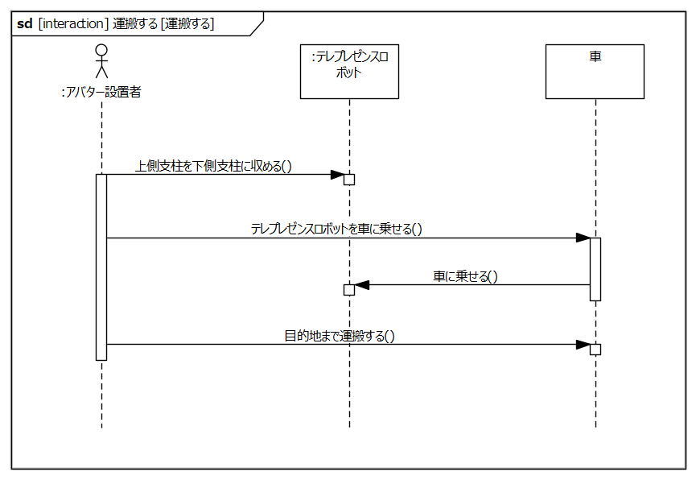

- 事前条件
  - テレプレゼンスロボットは電源OFFしている
- 事後条件
  - テレプレゼンスロボットの運搬が完了している
- 不変条件
  - なし
- 代替フロー
  - なし
- 例外フロー
  - 支柱を収めることができない
  - テレプレゼンスロボットを車載できない
- 備考
  - なし

上記インタラクションを実現するためにテレプレゼンスロボットに要求される項目を以下に抽出する

|要求|備考|
|:---|:---|
|テレプレゼンスロボットの上側支柱を下側支柱に収める|
|テレプレゼンスロボットを車に乗せる|

# テレプレゼンスロボット本体の要求項目

前章の各ユースケースの分析結果をテレプレゼンスロボット本体の要求項目として一覧に整理したものを以下に記載する。

|ID|要求項目|関連するUC|備考|
|:---|:---|:---|:---|
|REQ-001|テレプレゼンスロボットの電源をONする|UC-001, UC-015||
|REQ-002|テレプレゼンスロボットの電源をOFFする|UC-001, UC-004, UC-015||
|REQ-003|テレプレゼンスロボットとアバタークラウドの接続設定を行う|UC-001||
|REQ-004|テレプレゼンスロボットの各センサーの状態を通知する|UC-002||
|REQ-005|テレプレゼンスロボットの各センサーの状態を表示する|UC-002|表示用LEDのイメージ|
|REQ-006|テレプレゼンスロボットをスタンバイモード（停止保持状態）にする|UC-003||
|REQ-007|テレプレゼンスロボットは自己診断を行う|UC-003, UC-015||
|REQ-008|テレプレゼンスロボットはアバタークラウドに接続する|UC-003||
|REQ-009|テレプレゼンスロボットは起動処理の完了を通知する|UC-003||
|REQ-010|テレプレゼンスロボットの首の位置を初期化する|UC-005, UC-007||
|REQ-011|テレプレゼンスロボットを遠隔で操作する|UC-005||
|REQ-012|テレプレゼンスロボットのカメラ・マイクを初期化する|UC-006||
|REQ-013|テレプレゼンスロボットを介して映像・音声を送受信する|UC-006||
|REQ-014|テレプレゼンスロボットでYES動作（首の上下動作）をする|UC-007||
|REQ-015|テレプレゼンスロボットでNO動作（首の左右動作）をする|UC-007||
|REQ-016|テレプレゼンスロボットのエリア検出方式を設定する|UC-008, UC-025||
|REQ-017|テレプレゼンスロボットは減速エリアを検知し減速する|UC-008, UC-025|エリアワイヤの敷設が必要|
|REQ-018|テレプレゼンスロボットは停止エリアを検知し停止する|UC-008, UC-025|エリアワイヤの敷設が必要|
|REQ-019|テレプレゼンスロボットはバッテリ残量を通知する|UC-002, UC-010, UC-024||
|REQ-020|テレプレゼンスロボットはバッテリ残量が低下したら、停止する|UC-010||
|REQ-021|テレプレゼンスロボットはバッテリ残量低下により停止したことを通知する|UC-010||
|REQ-022|テレプレゼンスロボットを一時停止操作により一時停止する|UC-011, UC-012||
|REQ-023|テレプレゼンスロボットの一時停止を通知する|UC-011, UC-012||
|REQ-024|テレプレゼンスロボットの一時停止状態を解除する|UC-011, UC-012||
|REQ-025|テレプレゼンスロボットの一時停止解除を通知する|UC-011, UC-012||
|REQ-026|テレプレゼンスロボットは内部の異常を検知し停止する|UC-012||
|REQ-027|テレプレゼンスロボットを充電ステーションに接続する（充電を開始する）|UC-013||
|REQ-028|テレプレゼンスロボットを充電中に充電ステーションから取り外す|UC-013, UC-014|遠隔操作でも外せる|
|REQ-029|テレプレゼンスロボットは充電ステーションを検出する|UC-014||
|REQ-030|テレプレゼンスロボットは帰還指示により充電ステーションに自動でドッキングする（充電を開始する）|UC-014||
|REQ-031|テレプレゼンスロボットは充電状況を通知する|UC-014||
|REQ-032|テレプレゼンスロボットは自己診断結果を保存する|UC-015|UC-003も保存必要?|
|REQ-033|テレプレゼンスロボットは少量の雨に対して防水できる|UC-016|一定雨量を超えた場合はカッパが必要|
|REQ-034|テレプレゼンスロボットは周囲の明るさを確認する|UC-017||
|REQ-035|テレプレゼンスロボットは明るさの不足を通知する|UC-017||
|REQ-036|テレプレゼンスロボットは診断PCと接続する|UC-024||
|REQ-037|テレプレゼンスロボットは診断PCと通信する|UC-024||
|REQ-038|テレプレゼンスロボットは走行部の運転履歴を読み出す|UC-024||
|REQ-039|テレプレゼンスロボットは走行部の運転履歴をリセットする|UC-024||
|REQ-040|テレプレゼンスロボットは走行部のテスト機能より、各部の動作確認を実施する|UC-024||
|REQ-041|テレプレゼンスロボットはディスプレイから頭部・胴体部の動作確認を実施する|UC-024||
|REQ-042|テレプレゼンスロボットは書き換え用PCと接続する|UC-024||
|REQ-043|テレプレゼンスロボットは書き換え用PCと通信する|UC-024||
|REQ-044|テレプレゼンスロボットは走行部ソフトを書き換える|UC-024||
|REQ-045|テレプレゼンスロボットは頭部ソフトを書き換える|UC-024||
|REQ-046|テレプレゼンスロボットの上側支柱を下側支柱に収める|UC-026||
|REQ-047|テレプレゼンスロボットを車に乗せる|UC-026||
|REQ-048|テレプレゼンスロボットは復帰操作により異常状態を解消する|UC-012||

# テレプレゼンスロボット本体のユースケース

前述の要求一覧を**テレプレゼンスロボット本体のユースケース**として整理（分類・統合）したものを以下に記載する。

|ID|ユースケース名|概要|アクター|関連要求|
|:---|:---|:---|:---|:---|
|SysRS-01|起動する|テレプレゼンスロボットを起動し、各種操作が行えるようにする|・アバタークラウド ・アバター設置者|REQ-001, REQ-006, REQ-007, REQ-008, REQ-032|
|SysRS-02|接続設定を行う|テレプレゼンスロボットをアバタークラウドに接続できるように設定する|・アバタークラウド|REQ-003|
|SysRS-03|遠隔で操作する|指定した操作コマンドによりテレプレゼンスロボットを遠隔操作する|・アバタークラウド|REQ-010, REQ-011,  REQ-014, REQ-015, REQ-030|
|SysRS-04|遠隔で会話する|ユーザーがテレプレゼンスロボットを介して接触者と会話する|・アバタークラウド ・接触者|REQ-012, REQ-013|
|SysRS-05|遠隔で設定する|遠隔でテレプレゼンスロボットのエリア検出方式などの設定を行う|・アバタークラウド|REQ-016|
|SysRS-06|一時停止する|電源スイッチ操作によりテレプレゼンスロボットを一時停止する|・アバター設置者|REQ-022|
|SysRS-07|一時停止を解除する|電源スイッチ操作によりテレプレゼンスロボットの一時停止を解除する|・アバター設置者|REQ-024|
|SysRS-08|走行エリアを検出する|エリア信号により走行エリアを検出し、速度を制御する|・アバタークラウド|REQ-017, REQ-018|
|SysRS-09|充電ステーションを検出する|ステーション信号により充電ステーションを検出し、充電ステーション近傍を通知する|・アバタークラウド ・充電ステーション|REQ-029|
|~~SysRS-10~~|バッテリ残量低下を検知し停止する|SysRS-11に統合のため廃止 ~~テレプレゼンスロボットのバッテリ残量低下を検知し停止する~~|・アバタークラウド|REQ-020|
|SysRS-11a|異常を検知し停止する|テレプレゼンスロボット内部の異常を検知し停止する|・アバタークラウド|REQ-026|
|SysRS-11b|異常から復帰する|テレプレゼンスロボットは復帰操作により異常状態から復帰する|・アバタークラウド|REQ-048|
|SysRS-12|状態を表示する|テレプレゼンスロボットの状態を本体の表示用LEDに表示する|・アバター設置者|REQ-005, REQ-023, REQ-025|
|SysRS-13|状態を通知する|テレプレゼンスロボットの状態をアバタークラウドに通知する|・アバタークラウド|REQ-004, REQ-009, REQ-021, REQ-023, REQ-025, REQ-031, REQ-035|
|SysRS-14|データを送信する|バッテリ残量などのデータをアバタークラウドに送信する|・アバタークラウド|REQ-019|
|SysRS-15|シャットダウンする|テレプレゼンスロボットの使用を終了し電源を切る|・アバター設置者|REQ-002, REQ-007, REQ-032|
|SysRS-16|充電する|テレプレゼンスロボットを充電する|・充電ステーション|REQ-027, REQ-028|
|SysRS-17|周囲の明るさを確認する|テレプレゼンスロボットの周囲の明るさを確認する||REQ-034|
|SysRS-19|運転履歴を読み出す|テレプレゼンスロボットは診断PCと接続・通信し履歴を読み出す|・サービスエンジニア|REQ-036, REQ-037, REQ-038|
|SysRS-20|運転履歴をクリアする|テレプレゼンスロボットは診断PCと接続・通信し履歴をクリアする|・サービスエンジニア|REQ-036, REQ-037, REQ-039|
|SysRS-21|動作確認を実施する|テレプレゼンスロボットは診断PCと接続・通信し、頭部・胴体部・走行部のモータ等動作確認等を行う|・サービスエンジニア|REQ-036, REQ-037, REQ-040, REQ-041|
|SysRS-22|ソフトウェアアップデートを行う|テレプレゼンスロボットは書き換え用PCと接続・通信しソフトウェアアップデートを行う|・サービスエンジニア|REQ-042, REQ-043, REQ-044, REQ-045|

この一覧について、ユースケースごとにテレプレゼンスロボット本体を頭部、胴体部、走行部の3ブロックに分割し、各ブロックレベルで詳細化を行う。

尚、この一覧に記載されていないREQ-033, REQ-046, REQ-047は機能的な振る舞いとは異なる要求となるため、この一覧とは別に扱う（SysRS-18、SysRS-23はこれらの要求を含むユースケースで使用されている）

## テレプレゼンスロボット本体の状態の整理

各ユースケースの要求の詳細化に先立ち、テレプレゼンスロボットの状態および状態遷移について整理を行う

### 状態一覧

<!-- TODO:状態の洗い出し、整理 -->

テレプレゼンスロボットが持つ状態を以下の通り抽出した

|状態|定義|備考|
|:---|:---|:---|
|電源OFF|テレプレゼンスロボット全体には電源が入っていない状態|内部状態は「SM-01:電源OFF」を参照|
|起動中|テレプレゼンスロボット全体の起動を行っている状態||
|動作中|テレプレゼンスロボット全体の電源が入っている状態|内部状態は「SM-02:動作中」を参照|
|異常|異常が発生している状態|内部状態は「SM-03:異常」を参照|
|リプロ|リプロモードで起動している状態|診断PCからのテストモード遷移指示により遷移し、終了時はシステム全体の終了処理を行い電源OFFとなる想定|
|テスト|テストモードで起動している状態|書き換え用PCからのリプロモード遷移指示により遷移し、終了時はシステム全体の終了処理を行い電源OFFとなる想定|

※:DC-ON検知時はサブシステム（バッテリ）の状態として「SM-04:バッテリ」の内部状態が制御されている想定

### 状態遷移図

テレプレゼンスロボット全体の状態遷移図を以下に記載する

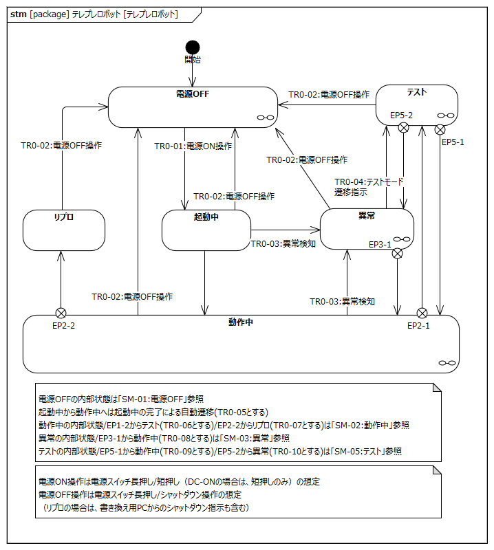

上記の状態遷移図より、要求に影響を与える状態遷移を以下に示す

|No.|状態遷移|トリガー|影響を受ける要求|備考|
|---:|:---|:---|:---|:---|
|TR0-01|電源OFF → 起動中|電源ON操作|SysRS-01|電源ON操作は電源スイッチ短押し/長押し（充電ステーション接続時は短押しのみ）を想定|
|TR0-02|起動中/動作中/異常/テスト/リプロ → 電源OFF|電源OFF操作|SysRS-15,SysRS-11b,SysRS-19,SysRs-20,SysRS-21,SysRs-22|電源OFF操作はシャットダウン操作/電源スイッチ長押しを想定|
|TR0-03|起動中/動作中 → 異常|異常検知|SysRS-11a||
|※1|EP3-2 → 動作中|なし(自動遷移)|SysRS-11b|遷移元（異常）内部での異常復帰操作により遷移する想定|
|※2|EP2-1/EP3-1 → テスト|なし(自動遷移)|SysRS-19,SysRS-20,SysRS-21|遷移元（動作中/異常）内部でのテストモード遷移指示により遷移する想定|
|※3|EP2-2 → リプロ|なし(自動遷移)|SysRS-22|遷移元（動作中）内部でのリプロモード遷移指示により遷移する想定|

※1:遷移元（異常）の詳細は「SM-03:異常」参照  
※2:遷移元（動作中/異常）の詳細は「SM-02:動作中」/「SM-03:異常」参照  
※3:遷移元（動作中）の詳細は「SM-02:動作中」参照

<!-- TODO:状態遷移図は適切な粒度・範囲で分割する -->

**SM-01:電源OFF**

「電源OFF」の内部状態を以下の通り抽出し、状態遷移図を記述した

|状態|定義|備考|
|:---|:---|:---|
|状態表示|テレプレゼンスロボットで部分的に電源が入っている状態|充電ステーションに接続し状態表示/異常検知できる範囲でロボットの一部が起動している想定※1※2|
|状態非表示|テレプレゼンスロボット全体が電源OFFである状態|充電ステーションから取り外されロボット全体が終了している想定|

※1:サブシステム（バッテリ）の状態として「SM-04:バッテリ」の内部状態が制御されている想定  
※2:異常検知時は「SM-03:異常」の内部状態が制御されている想定

上記の状態遷移図より、要求に影響を与える状態遷移を以下に示す

|No.|状態遷移|トリガー|影響を受ける要求|備考|
|---:|:---|:---|:---|:---|
|TR1-01|開始 → 状態非表示|電源OFF操作[DC-OFF]|SysRS-15|ロボット全体を終了する想定（終了中の状態表示する）|
|TR1-02|開始 → 状態表示|電源OFF操作[DC-ON]|SysRS-15|状態表示/異常検知できる範囲を残してロボットを終了する想定（終了中の状態表示する）|
|TR1-03|状態表示 → 状態非表示|DC-OFF検知|SysRS-15|システム全てを終了する想定（終了中の状態表示しない）|
|TR1-04|状態非表示 → 状態表示|DC-ON検知|SysRS-01|状態表示/異常検知できる範囲でロボットの一部を起動する想定（起動中の状態表示しない）|

**SM-02:動作中**

「動作中」の内部状態を以下の通り抽出し、状態遷移図を記述した

|状態|定義|備考|
|:---|:---|:---|
|一時停止|遠隔操作不可で停止（速度0）である状態|※1|
|遠隔操作モード|遠隔操作可能で走行操作指示（前進/後退/旋回）/帰還指示を受け付ける状態|帰還指示は速度0時のみ受け付けの想定|
|自律走行中|自律走行している状態|「ドッキング移動中」/「リリース移動中」を包含|
|ドッキング移動中|帰還指示を受けて自律走行している状態||
|リリース移動中|リリース指示を受けて自律走行している状態||
|ステーション待機中|充電ステーションに接続された状態|内部状態は「SM-02-1:ステーション待機中」を参照※2|

※1:一時停止からはテストモード、リプロモードを起動可能な想定  
※2:DC-ON検知時はサブシステム（バッテリ）の状態として「SM-04:バッテリ」の内部状態が制御されている想定

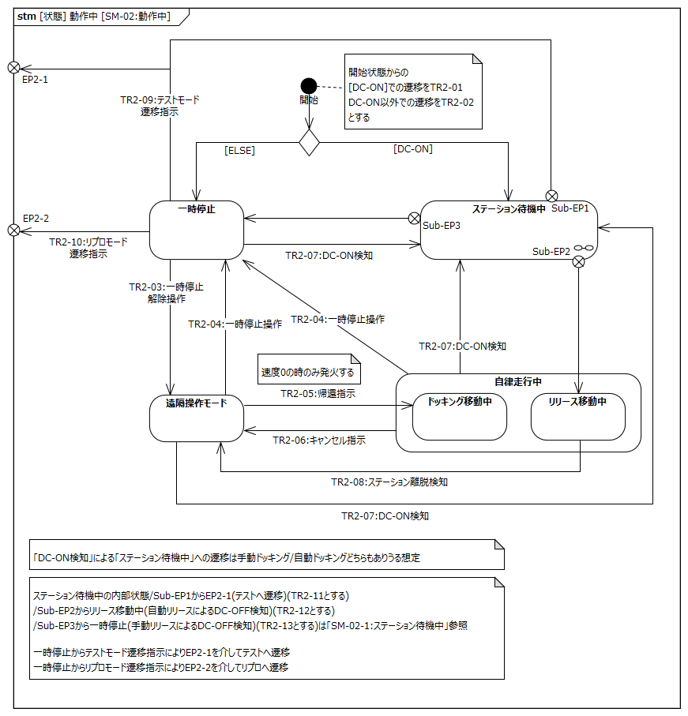

上記の状態遷移図より、要求に影響を与える状態遷移を以下に示す

|No.|状態遷移|トリガー|影響を受ける要求|備考|
|---:|:---|:---|:---|:---|
|TR2-01|動作中の開始 → 一時停止|開始状態からの自動遷移[DC-OFF]|SysRS-01,SysRS-06|開始状態は起動中/異常からの遷移を想定|
|TR2-02|動作中の開始 → ステーション待機中|開始状態からの自動遷移[DC-ON]|SysRS-01|開始状態は起動中/異常からの遷移を想定|
|TR2-03|一時停止 → 遠隔操作モード|一時停止解除操作|SysRS-07|一時停止解除操作は電源スイッチ短押しの想定|
|TR2-04|遠隔操作モード/自律走行中 → 一時停止|一時停止操作|SysRS-03,SysRS-07|一時停止操作は電源スイッチ短押しの想定|
|TR2-05|遠隔操作モード → ドッキング移動中|帰還指示|SysRS-03|帰還指示はアバターアプリから送信される想定。帰還指示は、速度0の時のみ発火する|
|TR2-06|自律走行中 → 遠隔操作モード|キャンセル指示|SysRS-03|キャンセル指示はアバターアプリから送信される想定|
|TR2-07|一時停止/遠隔操作モード/自律走行中 → ステーション待機中|DC-ON検知|SysRS-03|※1|
|TR2-08|ステーション待機中 → リリース移動中|DC-OFF検知|SysRS-03||
|TR2-09|リリース移動中 → 遠隔操作モード|ステーション離脱検知|SysRS-03|ステーション離脱検知はリリースの自律走行終了のタイミング※2|
|TR2-10|ステーション待機中 → 一時停止|手動リリース|SysRS-06|手押しで充電ステーションから切り離す操作|
|TR2-11|一時停止 → EP2-1|テストモード遷移指示|SysRS-19,SysRS-20,SysRS-21|※3|
|TR2-12|一時停止 → EP2-2|リプロモード遷移指示|SysRS-22|※4|
|※3※5|Sub-EP1 → EP2-1|なし(自動遷移)|SysRS-19,SysRS-20,SysRS-21|遷移元（ステーション待機中）内部でのテストモード遷移指示により遷移する想定|

※1:DC-ON検知は手動ドッキング/自動ドッキングどちらもありうる想定  
※2:充電ステーションから遠隔操作での走行操作指示が可能な距離（20cmを想定）離れた時点を想定  
※3:EP2-1を介して全体の状態遷移図のテストへ遷移する  
※4:EP2-2を介して全体の状態遷移図のリプロへ遷移する  
※5:遷移元（ステーション待機中）の詳細は「SM-02-1:ステーション待機中」参照  

**SM-02-1:ステーション待機中**

「動作中」内の「ステーション待機中」の内部状態を以下の通り抽出し、状態遷移図を記述した

|状態|定義|備考|
|:---|:---|:---|
|リリース待ち無し|リリース動作を受けていない状態|※1|
|リリース待ち|リリースコマンドを受けて安全確認操作待ちの状態|安全確認操作は電源スイッチ短押しの想定|
|リリース動作準備|安全確認操作を受けてDC-OFF検知する以前の状態||
※1:リリース待ち無しからはテストモードを起動可能な想定

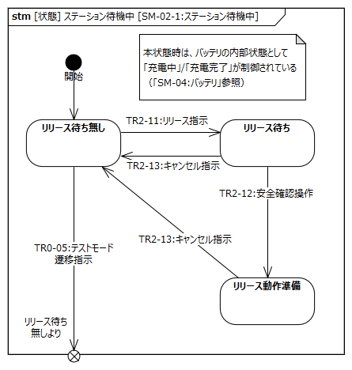

上記の状態遷移図より、要求に影響を与える状態遷移を以下に示す

|No.|状態遷移|トリガー|影響を受ける要求|備考|
|---:|:---|:---|:---|:---|
|TR21-01|リリース待ち無し → リリース待ち|リリース指示|SysRS-03|リリース指示はアバターアプリから送信される想定|
|TR21-02|リリース待ち → リリース動作準備|安全確認操作|SysRS-03|安全確認操作は電源スイッチ短押しの想定|
|TR21-03|リリース待ち/リリース動作準備 → リリース待ち無し|キャンセル指示|SysRS-03|キャンセル指示はアバターアプリから送信される想定|
|TR21-04|リリース待ち無し → Sub-EP1|テストモード遷移指示|SysRS-19,SysRS-20,SysRS-21|※1|

※1:Sub-EP1を介して最終的に全体の状態遷移図のテストへ遷移する  

**SM-03:異常**

「異常」の内部状態を以下の通り抽出し、状態遷移図を記述した（「電源OFF」の「状態表示」で異常がある場合も、ここで分析する）

|状態|定義|備考|
|:---|:---|:---|
|Fault|動作中状態の中でデバイス自体が破損している、異常を検出し、走行停止している状態|電源OFF→電源ONによる復帰を必要とするエラーを想定※1|
|Warning1|バッテリ残量低下により走行ができない状態|バッテリ残量低下を想定※1※2|
|Warning2|異常レベルがWarning2の状態|走行モータ回転異常などを想定※3※4|
|Caution|異常レベルがCautionの状態|過負荷作業警告などのエラーを想定※3※4|

※1:異常復帰操作（電源スイッチ短押し）を受け付けない想定  
※2:充電ステーションへのドッキングにより異常が解消される想定（DC-ONでは発生しない）  
※3:異常復帰操作（電源スイッチ短押し）を受け付ける想定（「電源OFF」の「状態表示」での異常発生時は電源スイッチ短押しは電源ON操作となる想定）  
※4:テストモードの起動は可能な想定（「電源OFF」の「状態表示」での異常発生時は除く）  

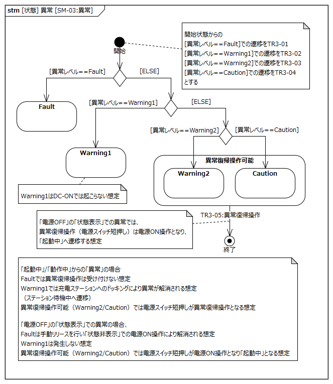

上記の状態遷移図より、要求に影響を与える状態遷移を以下に示す

|No.|状態遷移|トリガー|影響を受ける要求|備考|
|---:|:---|:---|:---|:---|
|TR3-01|開始 → Fault|異常検知[異常レベル==Fault]|SysRS-11a||
|TR3-02|開始 → Warning1|異常検知[異常レベル==Warning1]|SysRS-11a|DC-ON時は起こらない遷移の想定|
|TR3-03|開始 → Warning2|異常検知[異常レベル==Warning2]|SysRS-11a||
|TR3-04|開始 → Caution|異常検知[異常レベル==Caution]|SysRS-11a||
|TR3-05|Warning2/Caution → EP3-2|異常復帰操作|SysRS-11b|異常復帰操作は電源スイッチ短押しを想定※1|
|TR3-06|Warning1 → EP3-2|手動ドッキング|SysRS-11b|※2|
|TR3-07|Warning2/Caution → EP3-1|テストモード遷移指示|SysRS-19,SysRS-20,SysRS-21|※3|

※1:全体の状態遷移図中の異常の場合、EP3-2を介して動作中へ遷移する想定 ・「電源OFF」の「状態表示」での異常の場合、異常復帰操作（電源スイッチ短押し）が電源ON操作となり、「起動中」へ遷移する想定  
※2:全体の状態遷移図中の異常の場合、EP3-2を介して動作中へ遷移する想定 ・「電源OFF」の「状態非表示」の場合は、異常有無自体が外部観測不能（手動ドッキング後、「電源OFF」の「状態表示」でWarning1は解消される想定）  
※3:全体の状態遷移図中の異常の場合、EP3-1を介してテストへ遷移する想定 ・「電源OFF」の場合はテストモード遷移指示ができない想定

**SM-04:バッテリ**

「バッテリ」の内部状態を以下の通り抽出し、状態遷移図を記述した

|状態|定義|備考|
|:---|:---|:---|
|充電中|充電ステーションに接続されバッテリを充電している状態|充電容量100%検知により充電完了に遷移する想定|
|充電完了|充電ステーションに接続されバッテリを充電していない状態|充電容量不足（閾値はTBD）検知により充電中に遷移する想定|

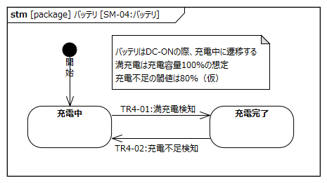

上記の状態遷移図より、要求に影響を与える状態遷移を以下に示す

|No.|状態遷移|トリガー|影響を受ける要求|備考|
|---:|:---|:---|:---|:---|
|TR4-01|充電中 → 充電完了|満充電検知|SysRS-16|※1|
|TR4-02|充電完了 → 充電中|充電不足検知|SysRS-16|※1|

※1:充電ステーションに接続された状態（「ステーション接続中」/「異常」/「テスト」/「電源OFF」の「状態表示」）であれば独立に制御される

## SysRS-01:起動する

**ユースケース概要**

テレプレゼンスロボットを起動し、各種操作が行えるようにする。

電源スイッチの押下により、まず走行部に起動し、走行部から頭部に電源を供給する。起動時にシステムの自己診断を行い異常がないことを確認する。

**テレプレゼンスロボット内部の処理**

- 事前条件
    - アバタークラウドへの接続設定が完了していること
- 事後条件
    - 一時停止状態になること
    - アバタークラウドに接続されていること（アバターアプリとの通信ができること）
- 備考
    - 起動処理中にFault状態を解消する
    - 自己診断結果がNGの場合、起動処理の異常をLEDなどに表示する
	- 一時停止状態が解除され外部指示状態になるまで遠隔操作指示は受け付けない
    - TR0-01より
      - 電源ON操作をされた場合は、ロボット全体を起動する（起動中の状態表示する）
        - 上記電源ON操作は
          - DC-OFFの場合、電源スイッチ短押し/長押しである想定
          - DC-OFFの場合、電源スイッチ短押しである（長押しは無視する）想定
    - TR2-01,TR2-02より
      - 起動処理終了後は一時停止（充電ステーションに接続された状態であれば、ステーション待機中）となる
    - TR1-04より
      - 「電源OFF」の「状態非表示」で充電ステーションに接続された場合、状態表示/異常検知できる範囲でロボットの一部を起動する（起動中の状態表示しない）
        - ロボットの一部はMiimo Main ECUと表示LEDの起動を想定

**要求抽出**

上記の内部の処理を元に要求を抽出する。

|要求|備考|
|:---|:---|
|頭部は走行部からの電源供給により起動し、起動処理を開始する||
|頭部は自己診断を行う||
|頭部はアバタークラウドに接続する||
|頭部は自己診断で異常があった場合およびアバタークラウドへの接続に失敗した場合、その結果を走行部に通知する||
|頭部は起動処理の完了をアバタークラウドに送信する||
|頭部は起動処理の結果を表示する||
|胴体部は頭部による自己診断を受ける|アバターコアによる診断|
|胴体部は起動処理の結果を走行部から受け表示する|表示用LEDなど|
|走行部は胴体部の電源ON操作により起動し、起動処理を開始する|起動処理中にFault状態を解消する|
|走行部は頭部に電源を供給する||
|走行部は自己診断を行う||
|走行部は自己診断が正常に完了した場合、一時停止状態に設定する||
|走行部は自己診断で異常があった場合、診断結果を保存する||
|走行部は起動処理の結果を頭部に送信する||
|走行部は起動処理の結果を胴体部に送信する||

## SysRS-02:接続設定を行う

**ユースケース概要**

テレプレゼンスロボットをアバタークラウドに接続できるように設定する

**テレプレゼンスロボット内部の処理**

- 事前条件
    - アバタークラウド側の接続準備が整っていること
- 事後条件
    - アバタークラウドに接続し、アバターアプリとの通信ができる
- 備考
	- なし

**要求抽出**

上記の内部の処理を元に要求を抽出する。

|要求|備考|
|:---|:---|
|頭部はアバタークラウドへの接続設定を行う||
|頭部はアバタークラウドとの疎通確認を行う||

## SysRS-03:遠隔で操作する

**ユースケース概要**

指定した操作コマンドによりテレプレゼンスロボットを遠隔操作する。

操作コマンドの概念モデルを以下に記載する。操作コマンドにはロボットのベースを制御するためのコマンドと首を制御するためのコマンドがある。

ベース操作コマンドは走行指示するための走行操作コマンドと自動運転指示する機能コマンドをサブクラスとする。  走行操作コマンドには走行コマンド、旋回コマンドがある。  
機能コマンドには帰還コマンド、リリースコマンド、キャンセルコマンドがある。  
帰還コマンドは充電ステーションにドッキングするまで自動で走行・旋回する動作を指示する（頭部側の走行指示による充電ステーション近傍までの自動運転と充電ステーション近傍での走行部へのドッキング動作モード指示による自動運転を想定）。  
リリースコマンドは充電ステーションからリリースされるまで自動で走行・旋回する動作を指示する（充電ステーションドッキング状態での走行部へのリリース動作モード指示による自動運転を想定）。  
キャンセルコマンドは帰還中、リリース中の自動運転動作を中止するコマンドである（走行部側の自動運転のキャンセル指示と頭部側での自動運転のキャンセル指示のどちらかを想定）。  

首操作コマンドには首位置初期化コマンド、首水平動作コマンド、首垂直動作コマンド、YES動作コマンド、NO動作コマンドがある。  
首位置初期化コマンドは首水平動作、首垂直動作のコマンドに依存する。  
YES動作コマンドは首垂直動作に依存し、NO動作コマンドは首水平動作に依存する。

**テレプレゼンスロボット内部の処理**

遠隔で操作が行われた際の、テレプレゼンスロボット内部の処理の流れをアクティビティ図で整理したものを記載する

- 事前条件
    - テレプレゼンスロボットが起動していること
    - アバタークラウドへの接続が完了していること
- 事後条件
    - ユーザーが遠隔操作でロボットを操作できること
- 備考
	- 本ユースケース（UC）の実行中に、以下の各UCも実行される。詳細については各UCの記述を参照のこと
        - 走行エリアを検出する
        - 充電ステーションを検出する
        - バッテリ残量低下を検知し停止する
        - 異常を検知し停止する
    - TR2-05より
      - 遠隔操作モードでは、走行操作コマンドと帰還コマンド（速度0の場合のみ）を受け付ける
    - TR2-06,TR2-07,TR2-08,TR2-09より
      - 自律走行中はキャンセルコマンドを受け付ける
        - 帰還コマンドによる自律走行は充電ステーションに接続されるまで実行される
        - リリースコマンドによる自律走行は充電ステーションから一定距離（20cmを想定）離れるまで実行される
        - キャンセルコマンド受付後は遠隔操作可能とする
    - TR21-01,TR21-02より
      - リリースコマンド受付後、リリース待ちとなり、安全確認操作を受けて自律走行を開始する
    - TR21-03より
      - 自律走行開始後、DC-OFF検知するまでにキャンセルコマンドを受け付けた場合、リリース待ち無し状態となる
        - このタイミングが実質的にあり得るかはQA中

**要求抽出**

上記の内部の処理を元に要求を抽出する。

|要求|備考|
|:---|:---|
|頭部は外部指示が有効であることを確認する||
|頭部は操作コマンドにより送信先を選択する||
|頭部は外部指示が無効の場合はベース操作コマンドを破棄する|首操作コマンドは破棄しない|
|頭部は有効と判断したベース操作コマンドを走行部に送信する|有効無効判定（減速・停止変換）は「走行エリアを検出する」を参照|
|頭部は首操作コマンドを実行できる状態であることを確認する||
|頭部は首操作コマンドを実行できる状態でなければ、首操作コマンドを破棄する||
|頭部は首操作コマンドを首操作指示に変換する|首操作指示：首操作指示コマンドを現在水平モータ角度、現在垂直モータ角度に展開したもの|
|胴体部は首操作指示を受けて、首を動かす||
|走行部は一時停止を解除し外部指示を有効であることを頭部に通知する||
|走行部はベース操作コマンドを実行できる状態であることを確認する||
|走行部はベース操作コマンドに従い走行する||

 

## SysRS-04:遠隔で会話する

**ユースケース概要**

ユーザーがテレプレゼンスロボットを介して接触者と会話する

**テレプレゼンスロボット内部の処理**

- 事前条件
    - テレプレゼンスロボットが起動していること
    - アバタークラウドへの接続が完了していること
- 事後条件
    - ユーザーと接触者が会話できること
- 備考
	- なし

**要求抽出**

上記の内部の処理を元に要求を抽出する。

|要求|備考|
|:---|:---|
|頭部は映像・音声デバイスを初期化する||
|頭部は受信したデータを変換し出力する||
|頭部は入力された映像・音声をデータに変換し送信する||

## SysRS-05:遠隔で設定する

**ユースケース概要**

遠隔でテレプレゼンスロボットの設定を行う

設定コマンドには頭部に対して設定を行う頭部設定コマンドと、走行部に対して設定を行うベース設定コマンドの2つがある。

**テレプレゼンスロボット内部の処理**

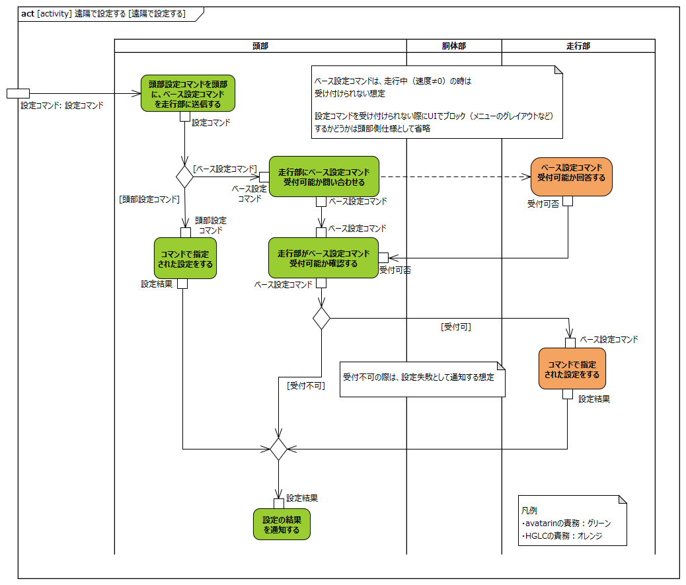

- 事前条件
    - アバタークラウドへの接続が完了していること
- 事後条件
    - 指示通りに設定が変更されていること
- 備考
	- なし

**要求抽出**

上記の内部の処理を元に要求を抽出する。

|要求|備考|
|:---|:---|
|頭部は頭部設定コマンドを頭部に、ベース設定コマンドに走行部に送信する||
|頭部はベース設定コマンド受付可否を走行部に問い合わせる||
|頭部はベース設定コマンド受付可の場合、ベース設定コマンドに走行部に送信する。受付不可の場合、設定失敗とする||
|頭部は頭部設定コマンドで指定された設定をする||
|頭部は設定の結果をアバタークラウドに返す||
|走行部はベース設定コマンドを受付可能か回答する|ベース設定コマンドは、走行中（速度≠0）の時は受け付けない想定|
|走行部はベース設定コマンドで指定された設定をする||
|走行部は設定の結果を頭部に通知する||

## SysRS-06:一時停止する

**ユースケース概要**

電源スイッチ操作によりテレプレゼンスロボットを一時停止する

**テレプレゼンスロボット内部の処理**

- 事前条件
    - アバタークラウドへの接続が完了していること
    - 外部指示状態で遠隔操作が行われていること
- 事後条件
    - テレプレゼンスロボットが一時停止していること
    - 一時停止状態であることがアバタークラウドに送信されていること
- 備考
    - TR2-01より
      - 起動中の完了後は一時停止状態となる
    - TR2-04より
      - 遠隔操作モード/自律走行中は一時停止操作により、一時停止状態となる
      	- 一時停止操作は電源スイッチ短押し操作である想定
    - TR2-10より
      - ステーション待機中から手動リリースされた場合、一時停止状態となる

**要求抽出**

上記の内部の処理を元に要求を抽出する。

|要求|備考|
|:---|:---|
|頭部は一時停止状態をアバタークラウドに送信する||
|胴体部は遠隔操作中に一時停止操作されたら走行部に一時停止を伝達する||
|胴体部は一時停止状態であることを表示する|所定のLEDを点灯|
|走行部は一時停止信号を受信したら直ちに一時停止する||
|走行部は一時停止した後に内部の状態を一時停止状態に設定する||
|走行部は一時停止状態であることを頭部に通知する||

## SysRS-07:一時停止を解除する

**ユースケース概要**

電源スイッチ操作によりテレプレゼンスロボットの一時停止を解除する

**テレプレゼンスロボット内部の処理**

- 事前条件
    - アバタークラウドへの接続が完了していること
    - 一時停止状態であること
- 事後条件
    - 一時停止状態が解除されていること
    - 外部指示状態へ移行し、遠隔操作が行えること
- 備考
	- TR2-03より
    	- 一時停止状態での一時停止解除操作は遠隔操作モードとなる
        	- 一時停止解除操作は電源スイッチ短押し操作である想定

**要求抽出**

上記の内部の処理を元に要求を抽出する。

|要求|備考|
|:---|:---|
|頭部は一時停止状態が解除されることをアバタークラウドに送信する||
|頭部は走行部に走行停止（速度0）コマンドを送る|要確認|
|胴体部は一時停止中に一時停止解除操作されたら走行部に一時停止解除を伝達する||
|胴体部は一時停止状態が解除されたら、正常動作中であることを表示する|所定のLEDを点灯|
|走行部は一時停止解除を受けたら、直ちに頭部に一時停止解除を通知する||
|走行部は一時停止解除解除中に頭部からの走行停止コマンドを受けたら、一時停止を解除を周知し、一定時間待機する|ブザーで周知する想定|
|走行部は一定時間待機後に一時停止状態を解除し、外部指示を有効にする||

## SysRS-08:走行エリアを検出する

**ユースケース概要**

エリア信号により走行エリアを検出し、速度を制御する

**テレプレゼンスロボット内部の処理**

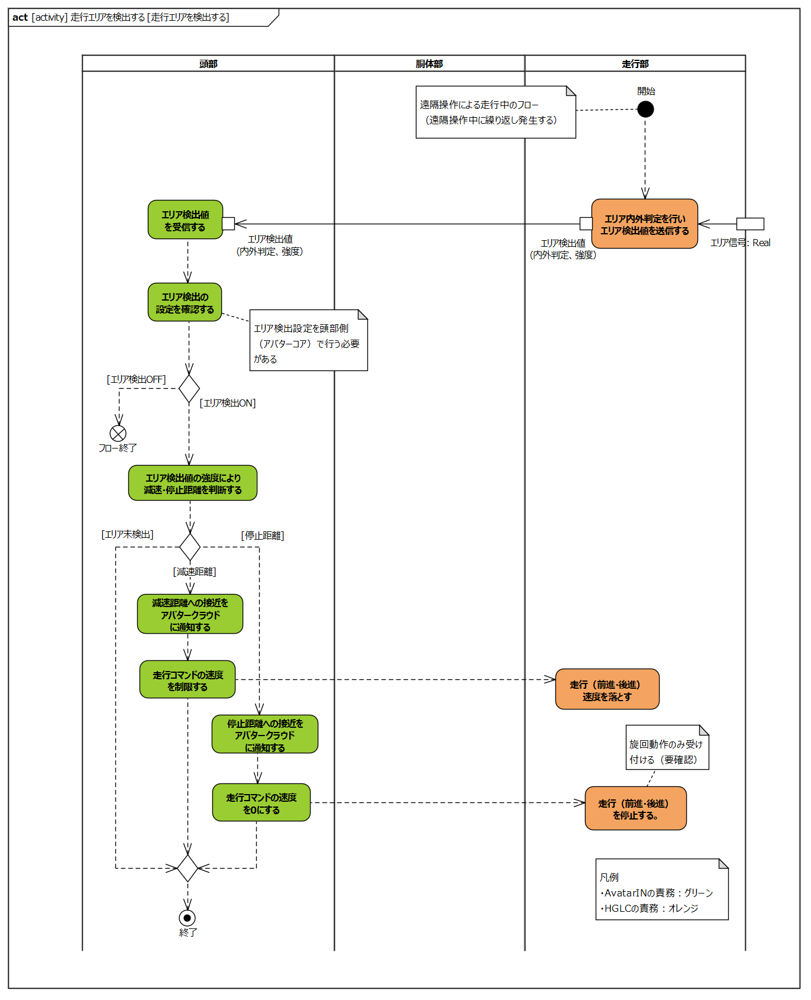

- 事前条件
    - アバタークラウドへの接続が完了していること
- 事後条件
    - エリア検出の設定に応じて走行制御が行われること
- 備考
    - エリア検出OFFの場合、エリア検出を行わない

**要求抽出**

上記の内部の処理を元に要求を抽出する。

|要求|備考|
|:---|:---|
|頭部は走行部からエリア検出値（内外判定、強度）を受信する||
|頭部はエリア検出の設定を確認し、エリア検出設定が有効な場合のみエリア検出を行う||
|頭部はエリア検出値の強度に応じてエリアワイヤに対する減速・停止距離を判断する||
|頭部は減速距離に近づいたら、それをアバタークラウドに通知する||
|頭部は減速距離に近づいたら、走行コマンドの速度を制限する||
|頭部は停止距離に近づいたら、それをアバタークラウドに通知する||
|頭部は停止距離に近づいたら、走行コマンドの速度を0にする||
|走行部はエリアワイヤとの間に生じるエリア信号からエリア検出を行いエリア検出値を送信する||
|走行部は頭部からの走行コマンドの速度制限指示にしたがい走行速度を落とす||
|走行部は頭部からの走行コマンドの速度0指示にしたがい走行を停止する||

## SysRS-09:充電ステーションを検出する

**ユースケース概要**

ステーション信号により充電ステーションを検出し、ステーション近傍を通知する

**テレプレゼンスロボット内部の処理**

- 事前条件
    - アバタークラウドへの接続が完了していること
- 事後条件
    - テレプレゼンスロボットが充電ステーション近傍にある場合、それがアバタークラウドに通知されていること
- 備考
	- なし

**要求抽出**

上記の内部の処理を元に要求を抽出する。

|要求|備考|
|:---|:---|
|頭部は走行部からステーション検出値（内外判定、強度）を受信する||
|頭部はステーション検出の設定を確認し、ステーション検出設定が有効な場合のみステーション検出を行う||
|頭部はステーション検出値の強度に応じてステーション近傍およびステーションワイヤに対する減速・停止距離を判断する||
|頭部は減速距離に近づいたら、それをアバタークラウドに通知する||
|頭部は減速距離に近づいたら、走行コマンドの速度を制限する||
|頭部は停止距離に近づいたら、それをアバタークラウドに通知する||
|頭部は停止距離に近づいたら、走行コマンドの速度を0にする||
|走行部はステーションワイヤとの間に生じるステーション信号からステーション検出を行いステーション検出値を送信する||
|走行部は頭部からの走行コマンドの速度制限指示にしたがい走行速度を落とす||
|走行部は頭部からの走行コマンドの速度0指示にしたがい走行を停止する||

## 【廃止】SysRS-10:バッテリ残量低下を検知し停止する

SysRS-11と統合のため廃止

<!-- **ユースケース概要**

テレプレゼンスロボットのバッテリ残量低下を検知し停止する

**テレプレゼンスロボット内部の処理**

- 事前条件
    - アバタークラウドへの接続が完了していること
    - 外部指示状態で遠隔操作が行われていること
- 事後条件
    - すべての動作を停止し、遠隔操作を行えないこと
    - バッテリ残量低下により停止していることがアバタークラウドに通知されていること
- 備考
	- テレプレゼンスロボットを充電器に挿すことでWarning状態を解除する
    - ST-16、ST-19より
      - バッテリ残量低下による警告（Warning1状態）は充電ステーション接続により解消される（異常復帰操作せず状態表示が変わる）
        - 異常復帰操作は電源スイッチ短押し操作である想定
    - ST-40、ST-41より
      - バッテリ残量低下による警告が解消されて他のWarningがあった場合は、他のWarningがあることを状態表示する。
      - 他のWarningがありバッテリ残量低下による警告が発生した場合は、バッテリ残量低下による警告が発生したことを状態表示する。

**要求抽出**

上記の内部の処理を元に要求を抽出する。

|要求|備考|
|:---|:---|
|頭部はバッテリ残量をモニタに表示する||
|頭部はバッテリ残量をアバタークラウドに送信する||
|頭部はバッテリ残量の低下をモニタに表示する||
|頭部はバッテリ残量の低下による停止をアバタークラウドに通知する||
|頭部はバッテリ残量不足により遠隔操作による動作を停止する||
|頭部はバッテリ残量不足により映像・音声の送受信を停止する||
|胴体部はバッテリ残量の低下を本体に表示する|LEDランプ等|
|胴体部は頭部からの指示を受けて首振り動作を停止する||
|走行部はバッテリ残量を確認する||
|走行部はバッテリ残量を頭部に送信する||
|走行部はバッテリ残量が低下した場合、頭部にバッテリ残量の低下を通知する||
|走行部は頭部からの指示を受けて走行・旋回動作を停止する|| -->

## SysRS-11a:異常を検知し停止する

**ユースケース概要**

テレプレゼンスロボット内部の異常を検知し停止する

**テレプレゼンスロボット内部の処理**

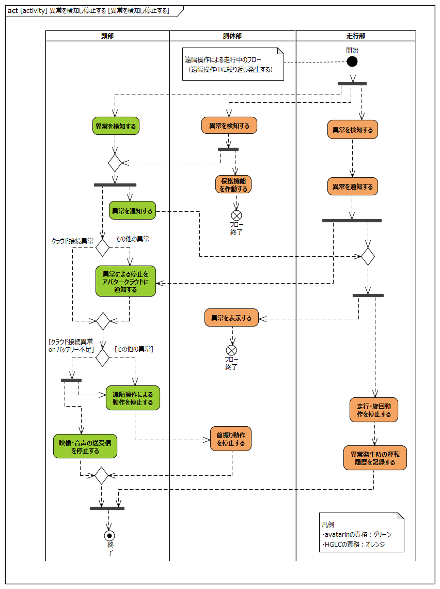

- 事前条件
    - アバタークラウドへの接続が完了していること
    - 外部指示状態で遠隔操作が行われていること
- 事後条件
    - すべての動作を停止し、遠隔操作を行えないこと
    - テレプレゼンスロボットの異常により停止していることがアバタークラウドに通知されていること（クラウド接続異常以外の場合）
- 備考
    - TR0-03より
      - 起動中/動作中に異常検知することで異常状態となる
    - TR3-01、TR3-02、TR3-03、TR3-04より
      - 検知された異常レベルによりFault/Warning1/Warning2/Cautionの状態に遷移する
      - Warning1は充電ステーションに接続された状態では発生しない想定

**要求抽出**

上記の内部の処理を元に要求を抽出する。

|要求|備考|
|:---|:---|
|頭部は頭部内の異常を検知する||
|頭部は頭部および胴体内の異常を走行部に通知する|本体（本体（LEDなど）エラー表示のため|
|頭部はクラウド接続異常以外の異常をアバタークラウドに通知する|走行部の異常を含む|
|頭部は本体の異常により遠隔操作による動作を停止する||
|頭部はクラウド接続異常およびバッテリ不足により映像・音声の送受信を停止する||
|胴体部は胴体内の異常を検知し、頭部に通知する||
|胴体部は胴体内の異常を検知したら保護機能を作動する||
|胴体部は本体の異常を本体に表示する|LEDランプ等|
|胴体部は頭部からの指示を受けて首振り動作を停止する||
|走行部は走行部内の異常を検知する||
|走行部は走行部内の異常を頭部に通知する||
|走行部は走行部異常検知か頭部異常検知を胴体部に通知する|「胴体部は本体の異常を本体に表示する」、「走行部は異常を検知したら走行・旋回動作を停止する」前のジョイン/フォーク要素から抽出|
|走行部は異常を検知したら走行・旋回動作を停止する|頭部の指示は待たない|
|走行部は異常発生時の運転履歴を記録する||

## SysRS-11b:異常状態から復帰する

**ユースケース概要**

テレプレゼンスロボットは復帰操作により異常状態から復帰する

**テレプレゼンスロボット内部の処理**

- 事前条件
    - アバタークラウドへの接続が完了していること
    - 異常状態により停止していること
- 事後条件
	- テレプレゼンスロボットが復帰操作によりCautionおよびWarning状態から復帰できること
	- テレプレゼンスロボットが再起動によりFault状態から復帰できること
- 備考
	- テレプレゼンスロボットを再起動してもFault状態が解消されない場合はメンテナンスが必要
    - TR0-02,TR2-01,TR2-02,TR3-05,TR3-06より
      - Faultの場合、異常復帰操作は受け付けない
        - 電源OFF操作のみ可能とする
          - 「電源OFF」の「状態表示」ではFault解消のためには手動リリースによる「状態非表示」への遷移後、電源ONする必要がある
      - Warning1の場合、充電ステーションへの接続により異常が解消される
        - UC-004より、一旦「電源OFF」の「状態非表示」として、手動ドッキングにより「状態表示」へ遷移する想定
      - Warning2/Cautionの場合、異常復帰操作により異常が解消され「動作中」に遷移する
        - 異常復帰操作は電源スイッチ短押しを想定
        - DC-OFFの場合は「動作中」の「一時停止」、DC-ONの場合は「動作中」の「ステーション待機中」となる
        - 「電源OFF」の「状態表示」では電源スイッチ短押しが電源ON操作になるため、「起動中」に遷移する

**要求抽出**

上記の内部の処理を元に要求を抽出する。

|要求|備考|
|:---|:---|
|頭部は走行部からの指示により異常状態を解消する||
|頭部は異常状態が解消されたことをアバタークラウドに通知する||
|胴体部はCautionおよびWarning2状態の時に復帰操作を受け付ける||
|胴体部はFault状態の時に電源OFF操作を受け付ける|Fault状態でも電源をOFFできるようにする。電源OFFについてはSysRS-15で詳細化|
|胴体部は電源ON操作を受け付ける|SysRS-01で詳細化|
|胴体部は異常状態が解消されたことを表示する||
|走行部はWarning1状態の時に充電ステーションへの接続による復帰操作を受け付ける||
|走行部は復帰操作によりCautionおよびWarning状態を解消する|復帰操作として電源スイッチ操作および充電ステーション接続を想定|
|走行部は起動時にFault状態を解消する|Fault状態を解消できない場合はサービスエンジニアへメンテナンスを依頼する|
|走行部は異常状態が解消されたことを確認する||

## SysRS-12:状態を表示する

**ユースケース概要**

テレプレゼンスロボットの状態を本体の表示用LEDに表示する

**2021年12月21日現在**想定される状態は、以下の通り

|状態|LED点灯パターン|
|:---|:---|
|電源OFF|無点灯|
|起動|青点滅(遅)|
|終了|青点滅(遅)|
|Fault|赤点灯|
|Warning1|橙点滅(早)|
|Warning2|橙点灯|
|Caution|黄点滅(早)|
|リリース待ち|青点滅(早)|
|充電中|緑点滅(遅)|
|充電完了|緑点灯|
|一時停止|青点滅(早)|
|リリース動作|青点灯|
|ドッキング動作|青点灯|
|遠隔操作|青点灯|
|---|---|
|リプロ|白色点灯|
|テスト|青、赤、緑の点灯を2秒ごとに行う|
※並び順が上の状態の表示を優先（リプロ、テストはTBD）

**テレプレゼンスロボット内部の処理**

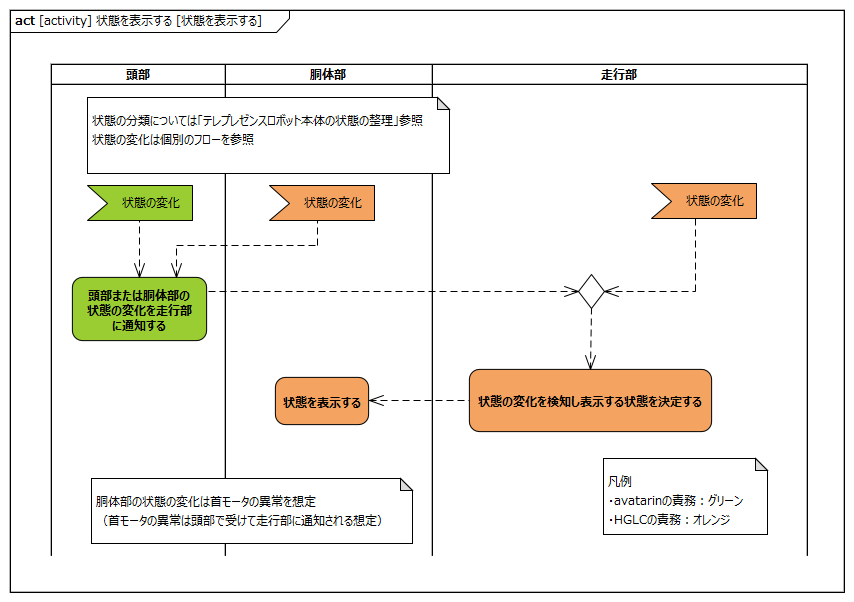

- 事前条件
    - テレプレゼンスロボットが起動していること
- 事後条件
    - 胴体部に状態が表示されていること
- 備考
	- なし

  
**要求抽出**

上記の内部の処理を元に要求を抽出する。

|要求|備考|
|:---|:---|
|頭部は頭部または胴体部の状態の変化を検知したら走行部に状態情報を送信する|胴体部の状態変化は首モータの異常を想定|
|胴体部は状態の変化を検知したら頭部に状態情報を送信する||
|胴体部は状態を表示する|LEDランプを想定|
|走行部は状態の変化を検知したら、状態情報を送信する||
|走行部は各部から状態の変化を受信し表示する状態を決定する|・表示する状態の分類については「テレプレゼンスロボット本体の状態の整理」章を参照 ・イベント（走行部に送られる状態の変化通知）は個別のフローを参照|

## SysRS-13:状態を通知する

**ユースケース概要**

テレプレゼンスロボットの状態をアバタークラウドに通知する

**テレプレゼンスロボット内部の処理**

- 事前条件
    - テレプレゼンスロボットが起動していること
    - アバタークラウドへの接続が完了していること
- 事後条件
    - テレプレゼンスロボット本体の状態がアバタークラウドに通知されること
- 備考
	- 送信する状態は「状態を表示する」を参照

**要求抽出**

上記の内部の処理を元に要求を抽出する。

|要求|備考|
|:---|:---|
|頭部は走行部から状態情報を受けてアバタークラウドに送信する|・受け付ける状態情報については「状態を表示する」を参照|

## SysRS-14:データを送信する

**ユースケース概要**

バッテリ残量などのデータをアバタークラウドに送信する

**2021年10月27日現在**想定されるデータは、以下の通り

|データ名|概要|
|:---|:---|
|動作状態|停止、動作、ドッキング、充電、エラー→「状態を通知する」参照|
|動作速度|並進速度、回転速度|
|バッテリ情報|容量、電圧、電流|
|エリア情報|内側、外側、エリア強度|
|ステーション情報|ドッキングON/OFF、近傍、ステーション強度|
|ストップスイッチ情報|停止状態ON/OFF、シャットダウン指示|
|LED情報|動作状態をLEDで表現→「状態を通知する」参照|
|エラー情報|Miimo側のエラー|

**テレプレゼンスロボット内部の処理**

- 事前条件
    - テレプレゼンスロボットが起動していること
    - アバタークラウドへの接続が完了していること
- 事後条件
    - バッテリ残量などのデータがアバタークラウドに送信されること
- 備考
	- なし

**要求抽出**

上記の内部の処理を元に要求を抽出する。

|要求|備考|
|:---|:---|
|頭部はセンサーで値を取得する|・現状は無しの想定|
|頭部はアバタークラウドにデータを送信する||
|胴体部はセンサーで値を取得する|・現状は無しの想定|
|走行部はセンサーで値を取得する|・現状は電池容量のみの想定|
|走行部は頭部にセンサーの値を送信する||

## SysRS-15:シャットダウンする

**ユースケース概要**

テレプレゼンスロボットをシャットダウンする。シャットダウンは、以下の操作より行う。
1. 電源スイッチを長押し
2. 画面の終了ボタンをタッチ

**テレプレゼンスロボット内部の処理**

- 事前条件
    - なし
- 事後条件
    - 運転履歴が保存されること
      - 自己診断に異常があった場合は診断結果を保存する
    - 電源OFFとなること
- 備考
    - TR0-02より
      - 起動中/動作中/異常/テスト/リプロでは電源OFF操作を受け付ける
        - 電源OFF操作は、電源スイッチ長押し/シャットダウン操作を想定
    - TR1-01より
      - 充電ステーションから取り外された状態での電源OFF操作はシステム全てを終了する（終了中の状態表示する）
    - TR1-02より
      - 充電ステーションに接続された状態での電源OFF操作は状態表示/異常検知できる範囲を残してシステムを終了する（終了中の状態表示する）
    - TR1-03より
      - 「電源OFF」の「状態表示」で充電ステーションから取り外された場合、システム全てを終了する（終了中の状態表示しない）

**要求抽出**

上記の内部の処理を元に要求を抽出する。

|要求|備考|
|:---|:---|
|頭部は頭部のシャットダウン操作を走行部に通知する|ディスプレイ上の終了ボタンをタッチする想定|
|頭部は頭部のシャットダウン操作または、走行部からのシャットダウン開始を受信し終了処理を開始する||
|頭部は自己診断を行う||
|頭部はロボット全体の診断結果をアバタークラウドに送信する||
|頭部はアバタークラウドを切断する||
|頭部は終了する||
|頭部は走行部へ終了処理完了通知を送信する||
|胴体部はシャットダウンしていることを表示する||
|胴体部は頭部による自己診断を受ける||
|胴体部は電源OFFにより状態表示をOFFにする||
|走行部はシャットダウン開始を受信する||
|走行部は頭部へシャットダウン開始を通知する||
|走行部は頭部への電源をOFFする|頭部から終了処理完了通知受信時、もしくは、シャットダウン開始通知後XX秒後|
|走行部は自己診断を行う||
|走行部は自己診断結果を頭部に送信する||
|走行部は自己診断が正常に完了した場合、運転履歴を保存する||
|走行部は自己診断で異常があった場合、運転履歴および診断結果を保存する||
|走行部は走行部を終了する||
|走行部は走行部の電源をOFFにする||

## SysRS-16:充電する

**ユースケース概要**

テレプレゼンスロボットはDC-ONを検知して充電を行う。DC-ON時、バッテリ容量が80%（仮）以下の場合、充電を行う。満充電を検知すると充電を停止する。  
またDC-OFFを検知した場合も充電を停止する。

**テレプレゼンスロボット内部の処理**

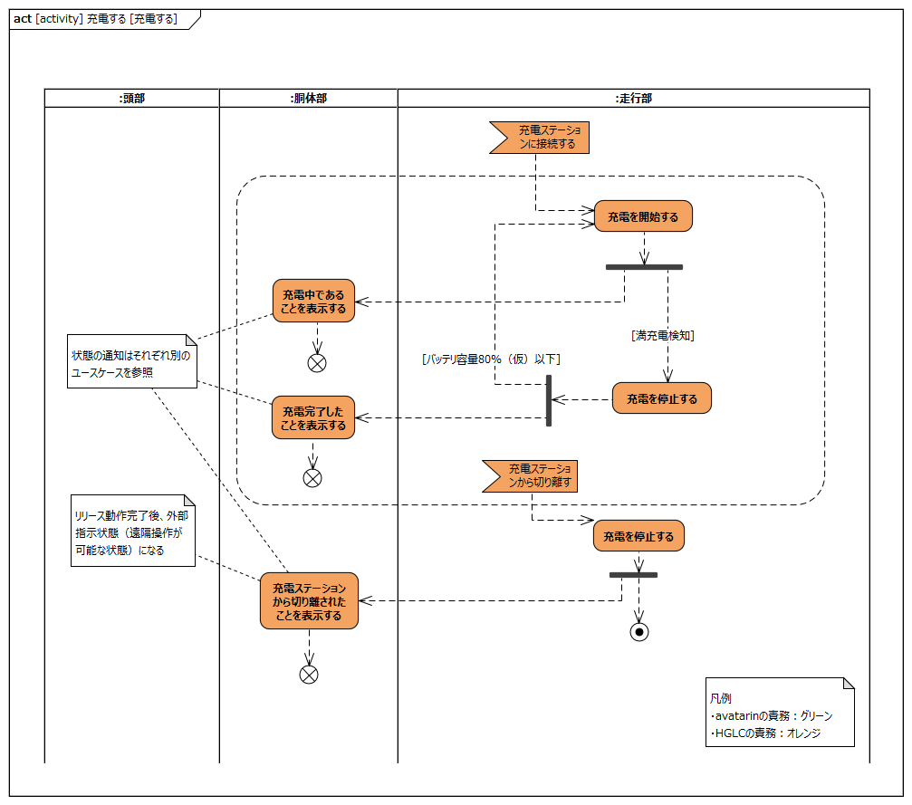

- 事前条件
    - なし
- 事後条件
    - 充電を停止する
- 備考
    - TR4-01,TR4-02より
      - 充電ステーションに接続された場合、充電中に遷移する
      - 満充電（充電容量100%）を検知した場合、充電完了に遷移する
      - 充電不足（閾値はTBD）を検知した場合、充電不足に遷移する
      - 充電ステーションに接続されてる間は、他の状態に依らず制御される（バッテリ異常を除く）

**要求抽出**

上記の内部の処理を元に要求を抽出する。

|要求|備考|
|:---|:---|
|胴体部は充電中であることを表示する||
|胴体部は充電完了したことを表示する||
|胴体部は充電ステーションから切り離されたことを表示する||
|走行部は充電ステーションに接続する||
|走行部は充電を開始する|DC-ON時に充電するが、バッテリ容量80%（仮）以下の時に充電を開始する|
|走行部は充電ステーション接続中に充電を停止する|満充電時|
|走行部は充電ステーションから切り離す||
|走行部は充電ステーションから切り離されたら充電を停止する|DC-OFF時|

## SysRS-19:運転履歴を読み出す

**ユースケース概要**

診断PCに接続し、運転履歴を読み出す。運転履歴には下記の概念モデルの通り、以下のデータが含まれる
 - 運転時間
 - 故障履歴
 - ドライブレコーダー

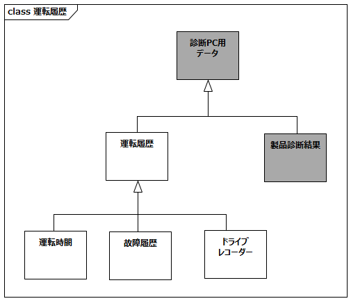

**テレプレゼンスロボット内部の処理**

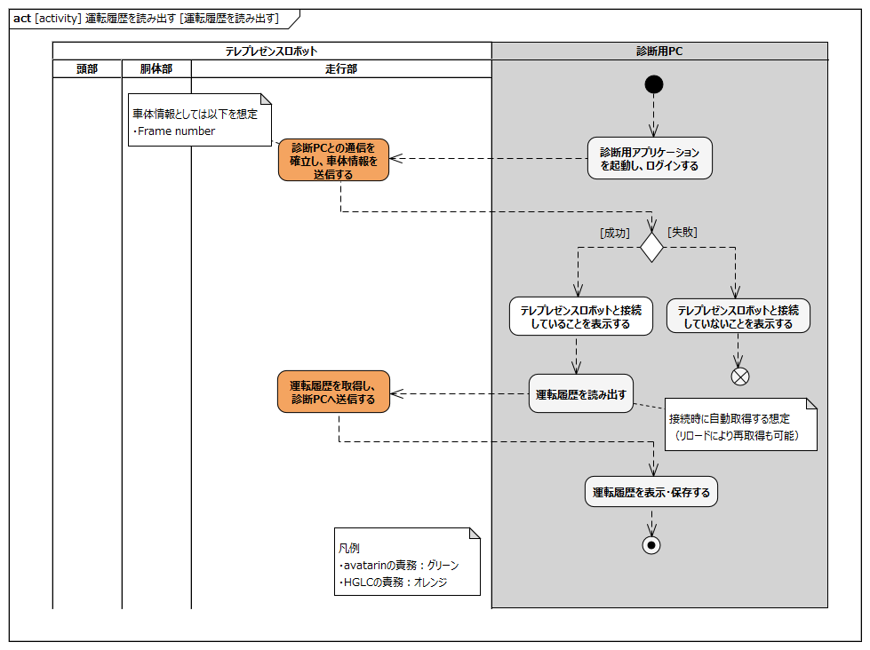

- 事前条件
    - テストモードで起動済みであること
- 事後条件
    - 運転履歴を読み出し診断PCに保存すること
- 備考
	- TR0-02,TR2-11,TR21-04,TR3-07より
    	- 診断PCからのテストモード遷移指示によりテストモードを起動する想定
    	- テストモードの起動は一時停止/リリース待ち無し/Warning2/Cautionの状態で可能な想定
    	- テスト終了後は電源OFF操作により終了する想定

**要求抽出**

上記の内部の処理を元に要求を抽出する。

|要求|備考|
|:---|:---|
|走行部は診断PCからのログインに応じて通信を確立し、車体情報を送信する|車体情報はFrame numberを想定|
|走行部は運転履歴を取得し診断PCへ送信する|運転履歴には次のデータを含む。運転時間、故障履歴、ドライブレコーダー|

## SysRS-20:運転履歴をクリアする

**ユースケース概要**

診断PCに接続し、運転履歴をクリアする。運転履歴の内容はSysRS-19と同じ。

**テレプレゼンスロボット内部の処理**

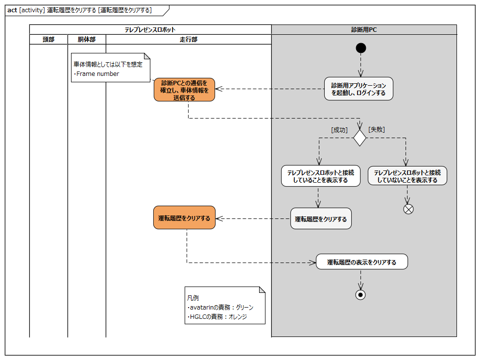

- 事前条件
    - テストモードで起動済みであること
- 事後条件
    - 運転履歴をクリアしていること
- 備考
	- TR0-02,TR2-11,TR21-04,TR3-07より
    	- 診断PCからのテストモード遷移指示によりテストモードを起動する想定
    	- テストモードの起動は一時停止/リリース待ち無し/Warning2/Cautionの状態で可能な想定
    	- テスト終了後は電源OFF操作により終了する想定

**要求抽出**

上記の内部の処理を元に要求を抽出する。

|要求|備考|
|:---|:---|
|走行部は診断PCからのログインに応じて通信を確立し、車体情報を送信する|車体情報はFrame numberを想定|
|走行部は診断PCからの指示で運転履歴をクリアする|運転履歴には次のデータを含む。運転時間、故障履歴、ドライブレコーダー|

## SysRS-21:動作確認を実施する

**ユースケース概要**

テレプレゼンスロボットは診断PCと接続・通信し、頭部・胴体部・走行部のモータ等動作確認等を行う

**テレプレゼンスロボット内部の処理**

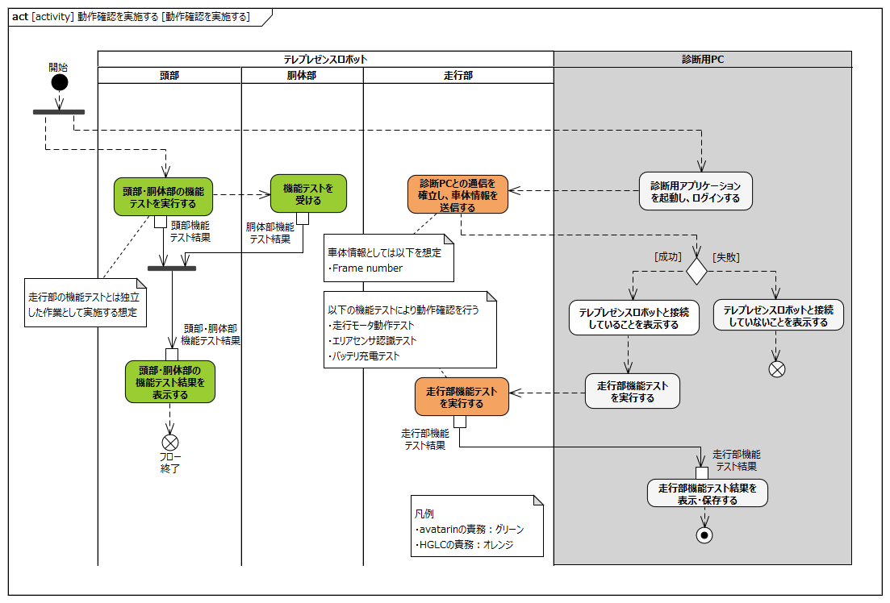

- 事前条件
    - テストモードで起動済みであること
- 事後条件
    - 走行部の機能テストの結果が診断PCに表示されていること
    - 頭部の機能テストの結果が頭部ディスプレイに表示されていること
- 備考
	- 頭部および走行部の機能テストはそれぞれ独立した作業として行う
	- TR0-02,TR2-11,TR21-04,TR3-07より
    	- 診断PCからのテストモード遷移指示によりテストモードを起動する想定
    	- テストモードの起動は一時停止/リリース待ち無し/Warning2/Cautionの状態で可能な想定
    	- テスト終了後は電源OFF操作により終了する想定

**要求抽出**

上記の内部の処理を元に要求を抽出する。

|要求|備考|
|:---|:---|
|頭部は走行部の機能テストを実行する|簡易的なテストが行えるように想定しておく|
|頭部は頭部・胴体部の機能テストを実行する||
|頭部は機能テスト結果を表示する||
|胴体部は頭部による機能テストを受ける||
|走行部は診断PCとの通信を確立し、車体情報を送信する|車体情報としてはFrame numberを想定|
|走行部は外部からの指示で機能テストを実行する|指示元には頭部or診断PCがありうる想定|

## SysRS-22:ソフトウェアアップデートを行う

**ユースケース概要**

テレプレゼンスロボットは書き換え用PCと接続・通信しソフトウェアアップデートを行う

**テレプレゼンスロボット内部の処理**

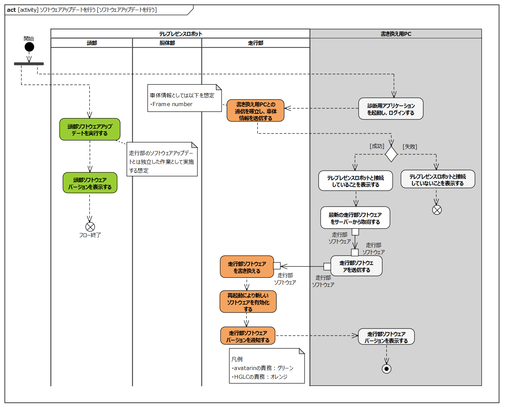

- 事前条件
    - リプロモードで起動済みであること
- 事後条件
    - 走行部のソフトウェアがアップデートされること
- 備考
	- 頭部および走行部のソフトウェアアップデートはそれぞれ独立した作業として行う
	- TR0-02,TR2-12より
    	- 書き換え用PCからのリプロモード遷移指示によりリプロモードを起動する想定
    	- リプロモードの起動は一時停止の状態でのみ可能な想定
    	- リプロ終了後は電源OFF操作により終了する想定

**要求抽出**

上記の内部の処理を元に要求を抽出する。

|要求|備考|
|:---|:---|
|頭部はソフトウェアアップデートを実行する||
|頭部はソフトウェアバージョンを表示する||
|走行部は書き換え用PCとの通信を確立し、車体情報を送信する|車体情報としてはFrame numberを想定|
|走行部は書き換え用PCから走行部ソフトウェアを受信し、ソフトウェアを書き換える||
|走行部は再起動により新しいソフトウェアを有効化する||
|走行部はソフトウェアのバージョンを書き換え用PCに通知する||

<!-- 

## xxx

**ユースケース概要**

hogehogefugafuga

**テレプレゼンスロボット内部の処理**

- 事前条件
    - アバタークラウドへの接続が完了していること
- 事後条件
    - 指示通りに設定が変更されていること
- 備考
	- todo

**要求抽出**

上記の内部の処理を元に要求を抽出する。

|要求|備考|
|:---|:---|
|||
||| -->
