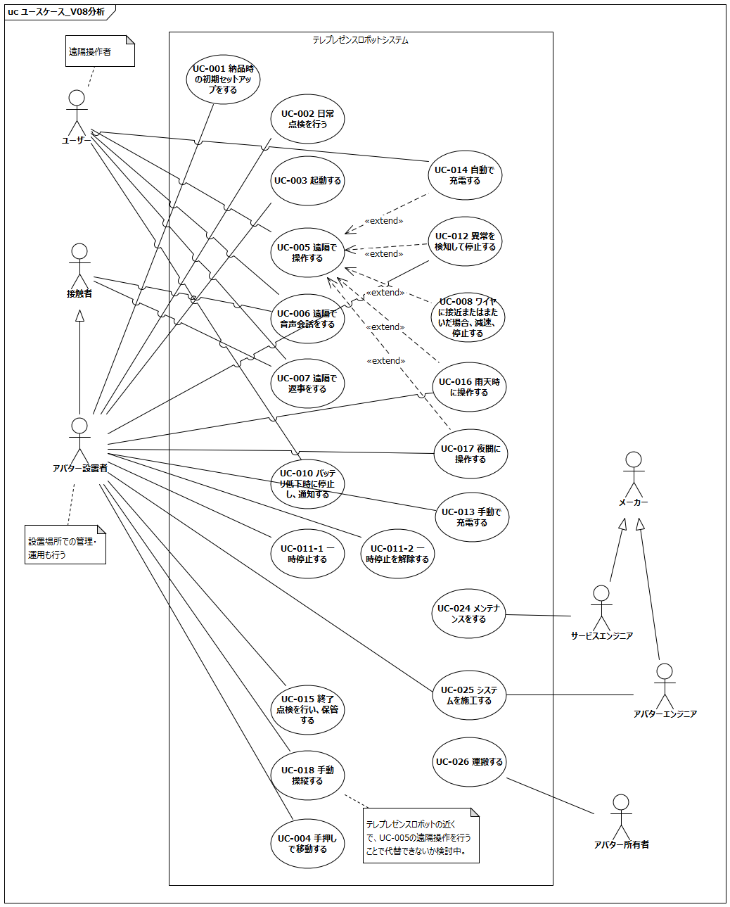

# はじめに
## 本書の目的

本書の目的は、テレプレゼンスロボットシステムにおけるテレプレゼンスロボット本体の要求を分析し、USDMによる要求記述のための要求を抽出することである。

## 適用

本要件の適用対象は、XXX とする。

## 用語の定義

|用語|説明|
|:---|:---|
|USDM|Universal Specification Describing Mannerの略で、要求を階層的に整理し仕様化するための方法論|
|インタラクション|相互作用|

# システムの構成

テレプレゼンスロボットシステムは、アバターアプリ（クライアント）、アバタークラウド（サーバー）、テレプレゼンスロボット本体および充電ステーションにより構成される。

ユーザ（遠隔操作者）およびアバター設置者はアバターアプリを介して、テレプレゼンスロボットの遠隔操作、テレプレゼンスロボットの先にいる接触者とのコミュニケーションを行うことができる。

テレプレゼンスロボットは頭部、胴体部、走行部の大きく3つのブロックから構成されており、頭部と胴体部を合わせてポール、走行部をベースと呼ぶ。

# ユースケース分析

テレプレゼンスロボットシステムにおけるユースケースを元にテレプレゼンスロボット本体に対する要求を整理する。

テレプレゼンスロボットシステムのユースケース一覧を下記に記載する。

<!-- TODO UC図を分けて書いたほうがよさそう -->

各ユースケースの概要を下記に記載する

|ユースケース名|概要|アクター|
|:---|:---|:---|
||||
|UC-003 起動する|アバター設置者がテレプレゼンスロボットを起動する|・アバター設置者|
||||
|UC-005 遠隔で操作する|ユーザーがテレプレゼンスロボットを遠隔操作する|・ユーザー|
|UC-006 遠隔で音声会話する|ユーザーがテレプレゼンスロボットの先にいる接触者と音声会話をする|・ユーザー ・接触者|
|UC-007 遠隔で返事をする|ユーザーがテレプレゼンスロボットを介して接触者に返事をする|・ユーザー ・接触者|
|UC-008 障害物に接近すると減速・停止する|テレプレゼンスロボットが障害物に一定の距離まで接近すると減速・停止する|・ユーザー ・障害物|
|UC-009 障害物に接近すると回避する|テレプレゼンスロボットが障害物に一定の距離まで接近すると回避動作を行う|・ユーザー ・障害物|
|UC-010 バッテリ低下時に停止し、通知する|バッテリ低下時に停止し、その旨をユーザーに通知する|・ユーザー|
|UC-011 非常停止する|アバター設置者が非常停止ボタンによりテレプレゼンスロボットを停止させる|・アバター設置者|
|UC-013 手動で充電する|アバター設置者がテレプレゼンスロボットを充電する|・アバター設置者|
|UC-014 自動で充電する|ユーザーがテレプレゼンスロボットを充電ステーションの近くに移動させて、テレプレゼンスロボットを自動充電する|・ユーザー|
||||

以降の節で、各ユースケースごとにテレプレゼンスロボットシステム内のインタラクションを分析し、テレプレゼンスロボット本体に対する要求を抽出する

## UC-001: 納品時の初期セットアップをする

ユースケース概要
管理者（avatarin）は製品をリースまたは購入し、事務所に届いたら製品の初期セットアップをする。  
初期設定項目は
* アバターアプリに製品登録
* テレプレゼンスロボットの初期動作確認

ユースケース「納品時の初期セットアップをする」におけるブロック間のインタラクションを以下に示す

- 事前条件
	- テレプレゼンスロボットは電源OFFしていること
- 事後条件
	- テレプレゼンスロボットの初期設定が完了していること
	- テレプレゼンスロボットは電源OFFしていること
- 不変条件
	- なし
- 関連する要件
	- T.B.D

上記インタラクションを実現するためにテレプレゼンスロボットに要求される項目を以下に抽出する

|要求|備考|
|:---|:---|
|電源をONする||
|電源をOFFする||
|テレプレゼンスロボットとアバタークラウドの設定を行う||

## UC-002: 日常点検を行う

ユースケース概要
* 始業時、予め決められた点検項目を確認する。
* 項目によって、頻度は毎日に限らず、毎週、毎月になることもあり得る
* 必要に応じて部品の一部を取り外して確認することもあり得る。
* 詳細な点検項目、内容、方法は、マニュアルで定義する。
* 必要に応じて、部品や消耗品を交換・補充することもあり得る。

◆テレプレゼンスロボット電源OFFの点検項目例
* 消耗品の状態（タイヤ、キャスター）
* 締結部のがたつき
* 外装の割れ

など

◆テレプレゼンスロボット起動中の点検項目例
* ディスプレイ
* 音声出力機能の確認
* 非常停止機能の確認
* カメラ、センサの機能確認
* 走行部の回転、異音、振動の確認

など

ユースケース「日常点検を行う」におけるブロック間のインタラクションを以下に示す

- 事前条件
	- テレプレゼンスロボットは電源OFFしていること
- 事後条件
	- 日常点検が完了していること
	- テレプレゼンスロボットは電源OFFしていること
- 不変条件
	- なし
- 関連する要件
	- T.B.D

上記インタラクションを実現するためにテレプレゼンスロボットに要求される項目を以下に抽出する

|要求|備考|
|:---|:---|
|テレプレゼンスロボットの首の位置を初期化する||
|テレプレゼンスロボットを遠隔で操作する||

## UC-003: 起動する

ユースケース「起動する」におけるブロック間のインタラクションを以下に示す

- 事前条件
	- 日常点検の起動前項目に異常がないこと
- 事後条件
	- テレプレゼンスロボットが起動していること
	- 自己診断結果に異常がないこと
	- テレプレゼンスロボットがスタンバイモードに移行していること
- 不変条件
	- なし
- 代替フロー
    - なし
- 例外フロー
    - 自己診断で異常が発生した
- 関連する要件
	- T.B.D

上記インタラクションを実現するためにテレプレゼンスロボットに要求される項目を以下に抽出する

|要求|備考|
|:---|:---|
|テレプレゼンスロボットをスタンバイモード（停止保持状態）にする||
|テレプレゼンスロボットは自己診断を行う||
|テレプレゼンスロボットはアバタークラウドに接続する||
|テレプレゼンスロボットは起動処理の完了を通知する||

## UC-004: 手押しでテレプレゼンスロボットを移動する

ユースケース概要
* テレプレゼンスロボットを手動操縦で制御できないときに、手押しで移動する。
* テレプレゼンスロボットは電OFF状態であることを想定する。
* 台車に載せることも想定する。その場合、二人以上で持ち上げること

ユースケース「手押しでテレプレゼンスロボットを移動する」におけるブロック間のインタラクションを以下に示す

- 事前条件
	- なし
- 事後条件
	- なし
- 不変条件
	- テレプレゼンスロボットは電源OFFしていること
- 関連する要件
	- T.B.D

上記インタラクションを実現するためにテレプレゼンスロボットに要求される項目を以下に抽出する

|要求|備考|
|:---|:---|
|テレプレゼンスロボットの電源をOFFする||

## UC-005: 遠隔で操作する

ユースケース「遠隔で操作する」におけるブロック間のインタラクションを以下に示す

<!-- TODO 遠隔操作のループ内に遠隔操作中に発生する他UCのrefを追記 -->

- 事前条件
	- 起動処理（アバタークラウドへの接続）が完了したテレプレゼンスロボットが存在すること
- 事後条件
	- アバターアプリからテレプレゼンスロボットを操作できること
- 不変条件
	- なし
- 代替フロー
    - なし
- 例外フロー
    - アバターアプリからテレプレゼンスロボットの操作ができない
- 関連する要件
	- T.B.D

上記インタラクションを実現するためにテレプレゼンスロボットに要求される項目を以下に抽出する

|要求|備考|
|:---|:---|
|テレプレゼンスロボットの首の位置を初期化する||
|テレプレゼンスロボットを遠隔で操作する||

## UC-006: 遠隔で音声会話をする

ユースケース「遠隔で音声会話をする」におけるブロック間のインタラクションを以下に示す

- 事前条件
	- 起動処理（アバタークラウドへの接続）が完了したテレプレゼンスロボットが存在すること
- 事後条件
	- テレプレゼンスロボットを介してユーザーと接触者が音声会話できること
- 不変条件
	- 音声会話中にテレプレゼンスロボットの遠隔操作ができる
- 代替フロー
    - なし
- 例外フロー
    - テレプレゼンスロボットを介した音声会話ができない
    - 音声会話中にテレプレゼンスロボットの遠隔操作ができない
- 関連する要件
	- T.B.D

上記インタラクションを実現するためにテレプレゼンスロボットに要求される項目を以下に抽出する

|要求|備考|
|:---|:---|
|テレプレゼンスロボットのカメラ・マイクを初期化する||
|テレプレゼンスロボットを介して映像・音声を送受信する||

## UC-007: 遠隔で返事をする

ユースケース「遠隔で返事をする」におけるブロック間のインタラクションを以下に示す

- 事前条件
	- 起動処理（アバタークラウドへの接続）が完了したテレプレゼンスロボットが存在すること
- 事後条件
	- テレプレゼンスロボットを介してユーザーに返事ができること
- 不変条件
	- なし
- 代替フロー
    - なし
- 例外フロー
    - テレプレゼンスロボットを介してユーザーに返事ができない
- 関連する要件
	- T.B.D

上記インタラクションを実現するためにテレプレゼンスロボットに要求される項目を以下に抽出する

|要求|備考|
|:---|:---|
|テレプレゼンスロボットの首の位置を初期化する|UC-005と同一|
|テレプレゼンスロボットでYES動作（首の上下動作）をする||
|テレプレゼンスロボットでNO動作（首の左右動作）をする||

## UC-008: 障害物に接近すると減速・停止する(pending)

ユースケース「障害物に接近すると減速・停止する」におけるブロック間のインタラクションを以下に示す

- 事前条件
	- TODO
- 事後条件
	- TODO
- 不変条件
	- なし
- 代替フロー
    - なし
- 例外フロー
    - TODO
- 関連する要件
	- T.B.D

上記インタラクションを実現するためにテレプレゼンスロボットに要求される項目を以下に抽出する

|要求|備考|
|:---|:---|
|||

## UC-009: 障害物に接近すると回避する(pendding)

ユースケース「障害物に接近すると回避する」におけるブロック間のインタラクションを以下に示す

- 事前条件
	- TODO
- 事後条件
	- TODO
- 不変条件
	- なし
- 代替フロー
    - なし
- 例外フロー
    - TODO
- 関連する要件
	- T.B.D

上記インタラクションを実現するためにテレプレゼンスロボットに要求される項目を以下に抽出する

|要求|備考|
|:---|:---|
|||

## UC-010: バッテリ低下時に停止し、通知する

ユースケース「バッテリ低下時に停止し、通知する」におけるブロック間のインタラクションを以下に示す

- 事前条件
	- 起動処理（アバタークラウドへの接続）が完了したテレプレゼンスロボットが存在すること
- 事後条件
	- テレプレゼンスロボットが停止し、アバターアプリに通知が送られていること
- 不変条件
	- なし
- 代替フロー
    - なし
- 例外フロー
    - アバターアプリに通知が送られない
- 関連する要件
	- T.B.D

上記インタラクションを実現するためにテレプレゼンスロボットに要求される項目を以下に抽出する

|要求|備考|
|:---|:---|
|テレプレゼンスロボットはバッテリ残量を通知する||
|テレプレゼンスロボットはバッテリ残量が低下したら、停止する||
|テレプレゼンスロボットはバッテリ残量低下により停止したことを通知する||

## UC-011: 非常停止する

ユースケース「非常停止する」におけるブロック間のインタラクションを以下に示す

- 事前条件
	- なし
- 事後条件
	- テレプレゼンスロボットが停止していること
- 不変条件
	- なし
- 代替フロー
    - なし
- 例外フロー
    - TODO
- 関連する要件
	- T.B.D

上記インタラクションを実現するためにテレプレゼンスロボットに要求される項目を以下に抽出する

|要求|備考|
|:---|:---|
|テレプレゼンスロボットを非常停止ボタンにより停止する||
|テレプレゼンスロボットの非常停止状態を解除する||

## UC-012: 異常を検知して停止する

異常項目
* 走行モータ回転異常
* 首モータ異常
* センサ異常
* CAN異常
* バッテリ異常
* 停止スイッチ異常
* アバターコア異常

ユースケース「異常を検知して停止する」におけるブロック間のインタラクションを以下に示す

- 事前条件
	- テレプレゼンスロボットは電源ONされていて、点検や手動操作している
- 事後条件
	- テレプレゼンスロボットが停止していること
- 不変条件
	- テレプレゼンスロボットは電源ONされていること
- 関連する要件
	- T.B.D

上記インタラクションを実現するためにテレプレゼンスロボットに要求される項目を以下に抽出する

|要求|備考|
|:---|:---|
|異常を検知する||
|非常停止状態を通知する||
|非常停止解除状態を通知する||
|非常停止状態を解除する||

## UC-013: 手動で充電する

ユースケース「手動で充電する」におけるブロック間のインタラクションを以下に示す

- 事前条件
	- 充電ステーションが利用可能な状態であること
	- テレプレゼンスロボットのロックが解除されていること（手押し可能な状態になっていること）
- 事後条件
	- 充電が完了していること
- 不変条件
	- なし
- 代替フロー
    - なし
- 例外フロー
    - TODO
- 関連する要件
	- T.B.D

上記インタラクションを実現するためにテレプレゼンスロボットに要求される項目を以下に抽出する

|要求|備考|
|:---|:---|
|テレプレゼンスロボットの充電ステーションに接続する|接続後充電を開始する|
|テレプレゼンスロボットを充電中に充電ステーションから取り外すことができる||

## UC-014: 自動で充電する

ユースケース「自動で充電する」におけるブロック間のインタラクションを以下に示す

- 事前条件
	- 充電ステーションが利用可能な状態であること
	- 遠隔操作が可能な状態であること
- 事後条件
	- 充電が完了していること
- 不変条件
	- なし
- 代替フロー
    - なし
- 例外フロー
    - TODO
- 関連する要件
	- T.B.D

上記インタラクションを実現するためにテレプレゼンスロボットに要求される項目を以下に抽出する

|要求|備考|
|:---|:---|
|テレプレゼンスロボットは充電ステーションを検出する||
|テレプレゼンスロボットは帰還指示により充電ステーションに自動でドッキングする||
|テレプレゼンスロボットは充電状況をアバターアプリに通知する||
|テレプレゼンスロボットは充電中に充電ステーションから離れることができる||

## UC-015: 終了点検を行い、保管する

UC概要
* 充電したテレプレゼンスロボットを保管庫内まで移動し、停車する。
* 充電場所＝保管場所とは限らない。
* 充電場所は屋内が望ましいが、限定しない。

テレプレゼンスロボットを保管庫の所定の場所に停車する

ユースケース「終了点検を行い、保管する」におけるブロック間のインタラクションを以下に示す

- 事前条件
  * テレプレゼンスロボットが充電されている。
  * テレプレゼンスロボットが電源OFFしている。
- 事後条件
  * テレプレゼンスロボットが保管場所に停車している。
  * テレプレゼンスロボットが電源OFFしている。
- 不変条件
	- なし
- 代替フロー
    - なし
- 例外フロー
    - TODO
- 関連する要件
	- T.B.D

上記インタラクションを実現するためにテレプレゼンスロボットに要求される項目を以下に抽出する

|要求|備考|
|:---|:---|
|電源ONする||
|電源OFFする||
|診断データを保存する||

# テレプレゼンスロボット本体の要求項目

前章の各ユースケースの分析結果をテレプレゼンスロボット本体の要求項目として整理したものを以下に記載する。

|要求項目|関連するUC|備考|
|:---|:---|:---|
||||
|テレプレゼンスロボットをスタンバイモード（停止保持状態）にする|UC-003||
|テレプレゼンスロボットは自己診断を行う|UC-003||
|テレプレゼンスロボットはアバタークラウドに接続する|UC-003||
|テレプレゼンスロボットは起動処理の完了を通知する|UC-003||
||||
|テレプレゼンスロボットの首の位置を初期化する|UC-005, UC-007||
|テレプレゼンスロボットを遠隔で操作する|UC-005||
|テレプレゼンスロボットのカメラ・マイクを初期化する|UC-006||
|テレプレゼンスロボットを介して映像・音声を送受信する|UC-006||
|テレプレゼンスロボットでYES動作（首の上下動作）をする|UC-007||
|テレプレゼンスロボットでNO動作（首の左右動作）をする|UC-007||
||||
|テレプレゼンスロボットはバッテリ残量を通知する|UC-010||
|テレプレゼンスロボットはバッテリ残量が低下したら、停止する|UC-010||
|テレプレゼンスロボットはバッテリ残量低下により停止したことを通知する|UC-010||
|テレプレゼンスロボットを非常停止ボタンにより停止する|UC-011||
|テレプレゼンスロボットの非常停止状態を解除する|UC-011||
||||
|テレプレゼンスロボットを充電ステーションに接続する（充電を開始する）|UC-013||
|テレプレゼンスロボットを充電中に充電ステーションから取り外す|UC-013, UC-014|遠隔操作でも外せる|
|テレプレゼンスロボットは充電ステーションを検出する|UC-014||
|テレプレゼンスロボットは帰還指示により充電ステーションに自動でドッキングする（充電を開始する）|UC-014||
|テレプレゼンスロボットは充電状況を通知する|UC-014||

以降の節でテレプレゼンスロボット本体の要求項目毎に頭部、胴体部、走行部の各ブロック毎に詳細化を行う。

## (ACT xx)

## テレプレゼンスロボットの首の位置を初期化する

|要求|備考|
|:---|:---|
|頭部は初期化コマンドを受け取り動作命令（首初期化）を取り出す||
|胴体部は動作命令（首初期化）をモータ駆動信号に変換する||
|胴体部はモータ駆動信号により首を初期位置に移動する||

## テレプレゼンスロボットを遠隔で操作する

<!-- (TODO) アクティビティ図見直し -->

## テレプレゼンスロボットのカメラ・マイクを初期化する

|要求|備考|
|:---|:---|
|頭部は初期化コマンドを受け取り動作命令（カメラ・マイク初期化）を取り出す||
|頭部は動作命令（カメラ・マイク初期化）を受けカメラ・マイクを初期化する||

## テレプレゼンスロボットを介して映像・音声を送受信する

<!-- (TODO) アクティビティ図見直し -->

|要求|備考|
|:---|:---|
|頭部は受信データを映像・音声に変換する||
|頭部は映像を出力する||
|頭部は音声を出力する||
|頭部は映像を撮影する||
|頭部は音声を入力する||
|頭部は入力された映像・音声を送信データに変換する||

## テレプレゼンスロボットでYES動作（首の上下動作）をする

|要求|備考|
|:---|:---|
|頭部はYES動作コマンドを受け取り動作命令（YES動作）を取り出す||
|胴体部は動作命令（YES動作）を受けモータ駆動信号に変換する||
|胴体部はモータ駆動信号に応じてYES動作を行う（首を上下に2回動かす）||

## テレプレゼンスロボットでNO動作（首の左右動作）をする

|要求|備考|
|:---|:---|
|頭部はNO動作コマンドを受け取り動作命令（NO動作）を取り出す||
|胴体部は動作命令（NO動作）を受けモータ駆動信号に変換する||
|胴体部はモータ駆動信号に応じてNO動作を行う（首を左右に2回動かす）||

## テレプレゼンスロボットを非常停止ボタンにより停止する

|要求|備考|
|:---|:---|
|胴体部は非常停止ボタンが押されたことを検出し非常停止信号に変換する|胴体部に非常停止ボタンがあると仮定|
|走行部は非常停止信号を受けモータ駆動を停止する||
|走行部は非常停止信号をCAN信号に変換し頭部へ送信する||
|頭部はCAN信号から非常停止通知を取り出す||
|頭部は非常停止通知をアバタークラウドに送信する||

## テレプレゼンスロボットの非常停止状態を解除する

|要求|備考|
|:---|:---|
|胴体部は非常停止ボタンが解除されたことを検出し非常停止解除信号に変換する|胴体部に非常停止ボタンがあると仮定|
|走行部は非常停止解除信号を受けを非常停止を解除する||
|走行部は非常停止解除信号をCAN信号に変換し頭部へ送信する||
|頭部はCAN信号から非常停止解除通知を取り出す||
|頭部は非常停止解除通知をアバタークラウドに送信する||

## テレプレゼンスロボットを充電ステーションに接続する（充電を開始する）

<!-- (TODO) アクティビティ図見直し -->

|要求|備考|
|:---|:---|
|走行部を充電ステーションに接続する||
|走行部は充電ステーションからの給電を確認する||
|走行部は満充電になるまで充電する||
|走行部は充電中であることを表示する||

## テレプレゼンスロボットを充電ステーションから取り外す

<!-- (TODO) アクティビティ図見直し -->

|要求|備考|
|:---|:---|
|走行部を充電ステーションから取り外す||

## テレプレゼンスロボットは充電ステーションを検出する

|要求|備考|
|:---|:---|
|||

## テレプレゼンスロボットは帰還指示により充電ステーションに自動でドッキングする（充電を開始する）

|要求|備考|
|:---|:---|
|||

## テレプレゼンスロボットは充電状況をアバターアプリに通知する

|要求|備考|
|:---|:---|
|||

## テレプレゼンスロボットはドッキング解除をアバターアプリに通知する

|要求|備考|
|:---|:---|
|||