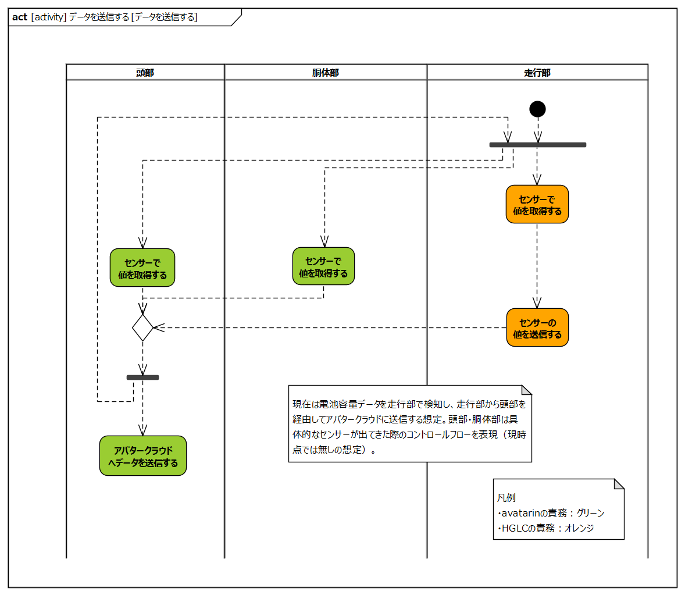
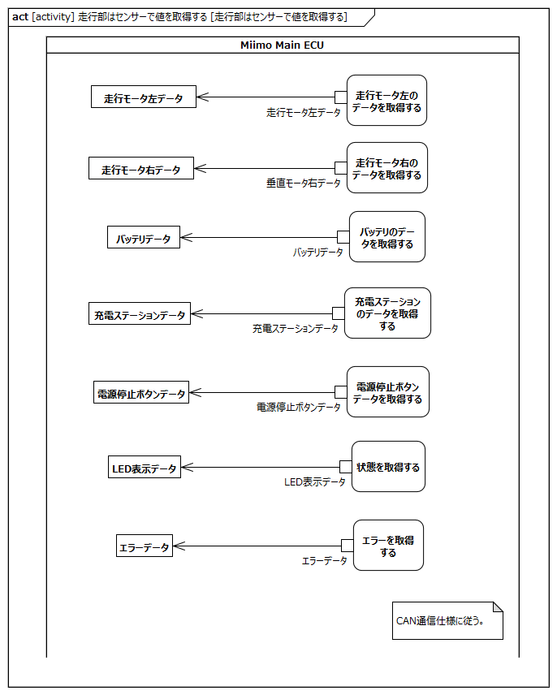
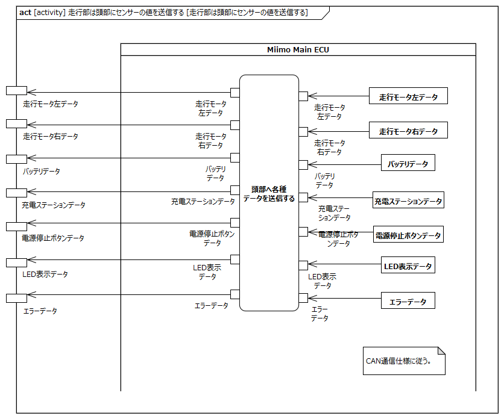

<!-- ↑表紙ページのための情報 -->

# はじめに

## 本書の目的

本書の目的は、USDMによる要求記述のため、テレプレゼンスロボット本体のL0要求「SysRS-14:データを送信する」のL1要求分析結果に基づき、HGLCが担当するL1要求に対してL2要求を抽出することである。

## 適用

本要件の適用対象は、テレプレゼンスロボット とする。

## 用語の定義

|用語|説明|
|:---|:---|
|特に無し|---|

## 関連資料

|資料名|説明|
|:---|:---|
|テレプレゼンスロボット要求一覧&USDM.xlsx|本文書の要求分析結果をまとめ、USDMの形式で記述したファイル|
|機能干渉マトリクス.xlsx|本文書の要求分析および今後の仕様化を進める際に検討が必要な機能干渉についてマトリクス表で整理を行ったファイル|
|テレプレゼンスロボット要求分析.docx|テレプレゼンスロボット本体のL0/L1要求分析についての検討過程を記述したファイル|

# L2要求分析

「SysRS-14:データを送信する」のアクティビティ図を以下に示す。

上記L0のアクティビティ図のアクション/デシジョン等から導出された胴体部・走行部のL1要求に対するL2要求分析を行う。  
※頭部に対してはavatarin側の責務のため、本書では対象外とする。

## 頭部はセンサーで値を取得する

avatarin側の責務のため、対象外とする。

## 頭部はアバタークラウドにデータを送信する

avatarin側の責務のため、対象外とする。

## 胴体部はセンサーで値を取得する

**L2要求抽出**

|要求|備考|
|:---|:---|
|垂直モータはセンサーでデータを取得する||
|水平モータはセンサーでデータを取得する||

## 走行部はセンサーで値を取得する

**L2要求抽出**

|要求|備考|
|:---|:---|
|Miimo Main ECUは走行モータ左のデータを取得する||
|Miimo Main ECUは走行モータ右のデータを取得する||
|Miimo Main ECUはバッテリのデータを取得する||
|Miimo Main ECUは充電ステーションのデータを取得する||
|Miimo Main ECUは電源停止ボタンのデータを取得する||
|Miimo Main ECUは状態を取得する||
|Miimo Main ECUはエラーを取得する||

## 走行部は頭部にセンサーの値を送信する

**L2要求抽出**

|要求|備考|
|:---|:---|
|Miimo Main ECUは頭部へ各種データを送信する||

