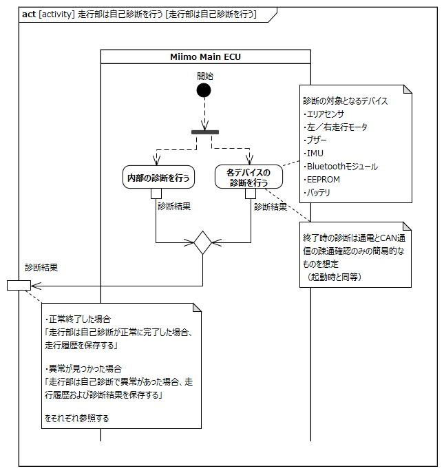
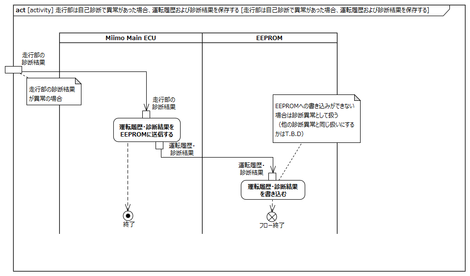

<!-- ↑表紙ページのための情報 -->

# はじめに

## 本書の目的

本書の目的は、USDMによる要求記述のため、テレプレゼンスロボット本体のL0要求「SysRS-15:シャットダウンする」のL1要求分析結果に基づき、HGLCが担当するL1要求に対してL2要求を抽出することである。

## 適用

本要件の適用対象は、テレプレゼンスロボット とする。

## 用語の定義

|用語|説明|
|:---|:---|
|特に無し|---|

## 関連資料

|資料名|説明|
|:---|:---|
|テレプレゼンスロボット要求一覧&USDM.xlsx|本文書の要求分析結果をまとめ、USDMの形式で記述したファイル|
|機能干渉マトリクス.xlsx|本文書の要求分析および今後の仕様化を進める際に検討が必要な機能干渉についてマトリクス表で整理を行ったファイル|
|テレプレゼンスロボット要求分析_L0L1要求抽出.docx|テレプレゼンスロボット本体のL0/L1要求分析についての検討過程を記述したファイル|

# L2要求分析

「SysRS-15:シャットダウンする」のアクティビティ図を以下に示す。

上記L0のアクティビティ図のアクション/デシジョン等から導出された胴体部・走行部のL1要求に対するL2要求分析を行う。  
※頭部に対してはavatarin側の責務のため、本書では対象外とする。

## 頭部は頭部のシャットダウン操作を走行部に通知する

avatarin側の責務のため、対象外とする。

## 頭部は頭部のシャットダウン操作または、走行部からのシャットダウン開始を受信し終了処理を開始する

avatarin側の責務のため、対象外とする。

## 頭部は自己診断を行う

avatarin側の責務のため、対象外とする。

## 頭部はロボット全体の診断結果をアバタークラウドに送信する

avatarin側の責務のため、対象外とする。

## 頭部はアバタークラウドを切断する

avatarin側の責務のため、対象外とする。

## 頭部は終了する

avatarin側の責務のため、対象外とする。

## 頭部は走行部へ終了処理完了通知を送信する

avatarin側の責務のため、対象外とする。

## 胴体部はシャットダウンしていることを表示する

**L2要求抽出**

|要求|備考|
|:---|:---|
|表示（LED等）はシャットダウン開始表示指示により、シャットダウン処理中であることを表示する|※1|
※1:LEDの色・点灯パターンで区別する想定

## 胴体部は頭部による自己診断を受ける

**L2要求抽出**

|要求|備考|
|:---|:---|
|垂直モータは頭部による診断を受ける|「SysRS-01:起動する」内の要求と同一|
|水平モータは頭部による診断を受ける|「SysRS-01:起動する」内の要求と同一|

## 胴体部は電源OFFにより状態表示をOFFにする

**L2要求抽出**

|要求|備考|
|:---|:---|
|表示（LED等）は電源OFFにより全ての状態表示をOFFにする||

## 走行部はシャットダウン開始を受信する

**L2要求抽出**

|要求|備考|
|:---|:---|
|Miimo Main ECUは胴体部の電源OFF操作または、頭部からのシャットダウン開始指示によりシャットダウン処理を開始する||
|Miimo Main ECUはシャットダウン開始表示指示を胴体部に通知する|シャットダウン処理中であることを表示するため|

## 走行部は頭部へシャットダウン開始を通知する

**L2要求抽出**

|要求|備考|
|:---|:---|
|Miimo Main ECUは頭部からシャットダウン開始指示を受信していない場合、頭部にシャットダウン開始指示を通知する||

## 走行部は頭部への電源をOFFする

**L2要求抽出**

|要求|備考|
|:---|:---|
|Miimo Main ECUは電源基板への電源供給をOFFする|※1※2|
|電源基板は頭部への電源供給をOFFにする||
|電源基板は胴体部への電源供給をOFFにする||
※1:頭部から終了処理完了通知受信時、もしくは、シャットダウン開始通知後XX秒後  
※2:オプション電源の出力をOFFにする想定

## 走行部は自己診断を行う

**L2要求抽出**

|要求|備考|
|:---|:---|
|Miimo Main ECUは内部の診断を行う||
|Miimo Main ECUはエリアセンサの診断を行う|※1|
|Miimo Main ECUは左走行モータの診断を行う|※1|
|Miimo Main ECUは右走行モータの診断を行う|※1|
|Miimo Main ECUはブザーの診断を行う|※1|
|Miimo Main ECUはIMUの診断を行う|※1|
|Miimo Main ECUはBluetoothモジュールの診断を行う|※1|
|Miimo Main ECUはEEPROMの診断を行う|※1|
|Miimo Main ECUはバッテリの診断を行う|※1|
※1:シャットダウン時の診断は通電とCAN通信の疎通確認のみの簡易的なものを想定（起動時と同等）

## 走行部は自己診断結果を頭部に送信する

**L2要求抽出**

|要求|備考|
|:---|:---|
|Miimo Main ECUは自己診断結果を頭部に送信する|※1|
※1:頭部からアバタークラウドへ送信するため

## 走行部は自己診断が正常に完了した場合、運転履歴を保存する

**L2要求抽出**

|要求|備考|
|:---|:---|
|Miimo Main ECUは自己診断が正常に完了した場合、運転履歴をEEPROMに送信する||
|EEPROMは運転履歴を書き込む||

## 走行部は自己診断で異常があった場合、運転履歴および診断結果を保存する

**L2要求抽出**

|要求|備考|
|:---|:---|
|Miimo Main ECUは自己診断で異常があった場合、運転履歴と診断結果をEEPROMに送信する||
|EEPROMは運転履歴と診断結果を書き込む|EEPROMへの書き込みができない場合も診断異常として扱う|

## 走行部は走行部を終了する

**L2要求抽出**

|要求|備考|
|:---|:---|
|Miimo Main ECUはシャットダウン処理を完了する||

## 走行部は走行部の電源をOFFにする

**L2要求抽出**

|要求|備考|
|:---|:---|
|Miimo Main ECUは電源を遮断する||
|バッテリはMiimo Main ECUへの電源供給を停止する||
|Miimo Main ECUはエリアセンサへの電源供給をOFFにする||
|Miimo Main ECUは左走行モータへの電源供給をOFFにする||
|Miimo Main ECUは右走行モータへの電源供給をOFFにする||
|Miimo Main ECUはブザーへの電源供給をOFFにする||
|Miimo Main ECUはIMUへの電源供給をOFFにする||
|Miimo Main ECUはBluetoothモジュールへの電源供給をOFFにする||
|Miimo Main ECUはEEPROMへの電源供給をOFFにする||