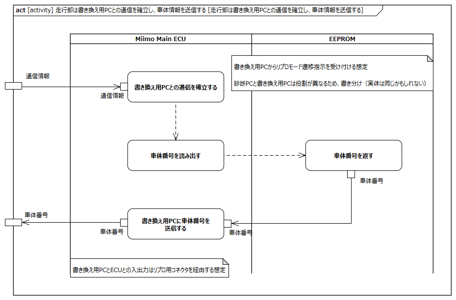
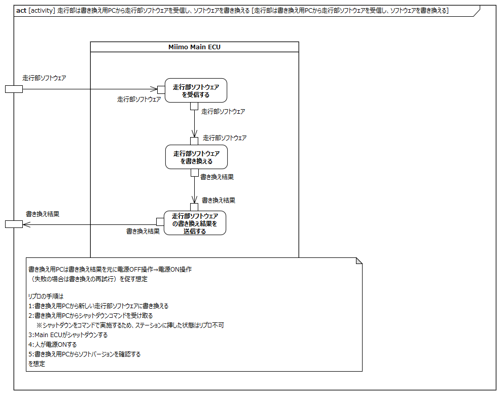
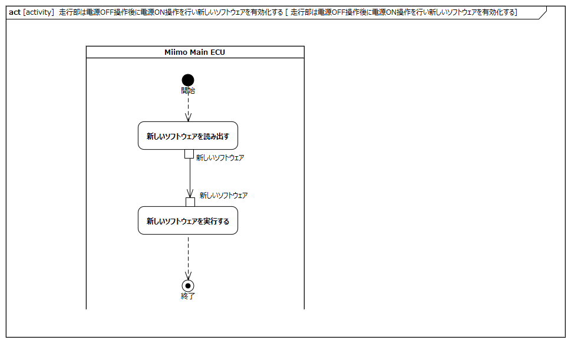
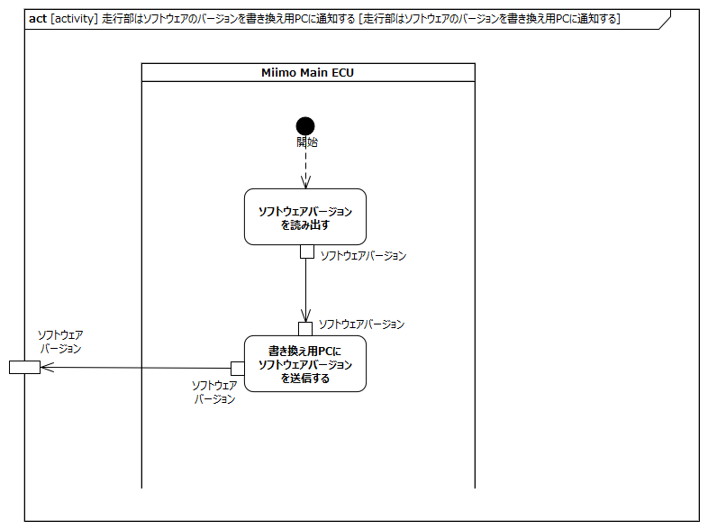

<!-- ↑表紙ページのための情報 -->

# はじめに

## 本書の目的

本書の目的は、USDMによる要求記述のため、テレプレゼンスロボット本体のL0要求「SysRS-22:ソフトウェアアップデートを行う」のL1要求分析結果に基づき、HGLCが担当するL1要求に対してL2要求を抽出することである。

## 適用

本要件の適用対象は、テレプレゼンスロボット とする。

## 用語の定義

|用語|説明|
|:---|:---|
|特に無し|---|

## 関連資料

|資料名|説明|
|:---|:---|
|テレプレゼンスロボット要求一覧&USDM.xlsx|本文書の要求分析結果をまとめ、USDMの形式で記述したファイル|
|機能干渉マトリクス.xlsx|本文書の要求分析および今後の仕様化を進める際に検討が必要な機能干渉についてマトリクス表で整理を行ったファイル|
|テレプレゼンスロボット要求分析_L0L1要求抽出.docx|テレプレゼンスロボット本体のL0/L1要求分析についての検討過程を記述したファイル|

# L2要求分析

「SysRS-22:ソフトウェアアップデートを行う」のアクティビティ図を以下に示す。

上記L0のアクティビティ図のアクション/デシジョン等から導出された胴体部・走行部のL1要求に対するL2要求分析を行う。  
※頭部に対してはavatarin側の責務のため、本書では対象外とする。

## 頭部はソフトウェアアップデートを実行する

avatarin側の責務のため、対象外とする。

## 頭部はソフトウェアバージョンを表示する

avatarin側の責務のため、対象外とする。

## 走行部は書き換え用PCとの通信を確立し、車体情報を送信する

**L2要求抽出**

|要求|備考|
|:---|:---|
|Miimo Main ECUは書き換え用PCとの通信を確立する|※1※2|
|Miimo Main ECUはメモリに車体番号の読み出しを依頼する||
|Miimo Main ECUはメモリから受けた車体番号を書き換え用PCに送信する|※2|
|メモリはMiimo Main ECUの依頼を受けて車体番号を返す||
※1:書き換え用PCとの通信確立の詳細は、リプロモードの起動として状態分析とともに要QA
※2:書き換え用PCとの通信はリプロ用コネクタを経由する想定

## 走行部は書き換え用PCから走行部ソフトウェアを受信し、ソフトウェアを書き換える

**L2要求抽出**

|要求|備考|
|:---|:---|
|Miimo Main ECUは書き換え用PCから走行部ソフトウェアを受信する||
|Miimo Main ECUはメモリに走行部ソフトウェアの書き換えを依頼する||
|Miimo Main ECUはメモリから受けたソフトウェア書き換え結果を書き換え用PCに送信する|※1※2|
|メモリはMiimo Main ECUの依頼を受けて走行部ソフトウェアを書き換え、その結果を返す||
※1:書き換え用PCは書き換え結果を元に再起動（失敗の場合は書き換えの再試行）を促す想定
※2:書き換え直後の再起動はリプロ用の再起動シーケンスとなる想定

## 走行部は再起動により新しいソフトウェアを有効化する

**L2要求抽出**

|要求|備考|
|:---|:---|
|Miimo Main ECUはメモリに新しいソフトウェアの読み出しを依頼する||
|Miimo Main ECUは新しいソフトウェアを実行する||
|メモリはMiimo Main ECUの依頼を受けて走行部ソフトウェアを返す||
※:走行部ソフトウェアの形式/読み出し/実行の詳細については要QA

## 走行部はソフトウェアのバージョンを書き換え用PCに通知する

**L2要求抽出**

|要求|備考|
|:---|:---|
|Miimo Main ECUはメモリにソフトウェアバージョンの読み出しを依頼する||
|Miimo Main ECUはメモリから受けたソフトウェアバージョンを書き換え用PCに送信する||
|メモリはMiimo Main ECUの依頼を受けてソフトウェアバージョンを返す||

