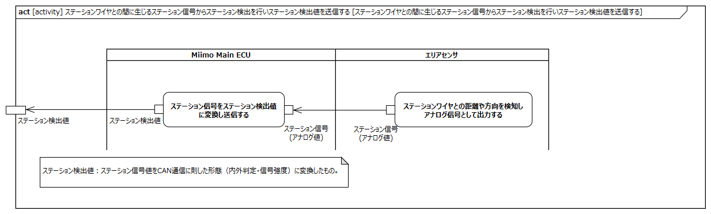
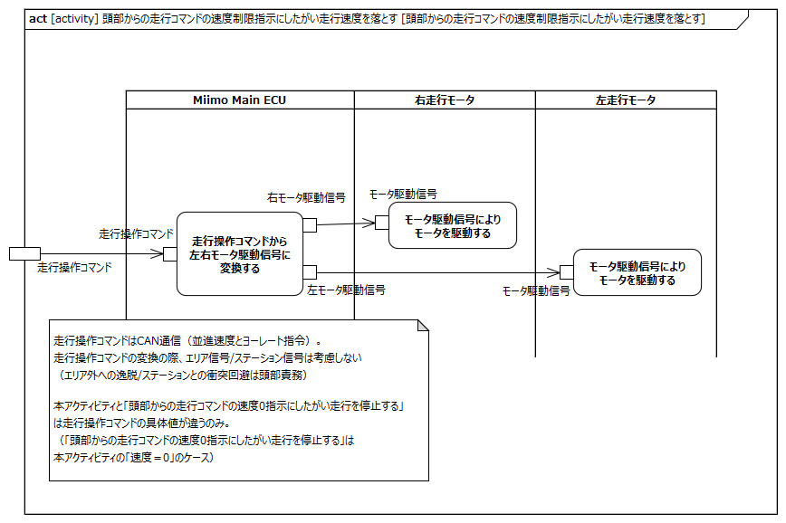
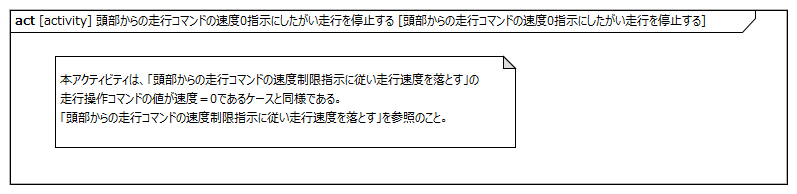

# はじめに

## 本書の目的

本書の目的は、USDMによる要求記述のため、テレプレゼンスロボット本体のL0要求「充電ステーションを検出する」のL1要求分析結果に基づき、HGLCが担当するL1要求に対してL2要求を抽出することである。

## 適用

本要件の適用対象は、テレプレゼンスロボット とする。

## 用語の定義

|用語|説明|
|:---|:---|
|特に無し|---|

## 関連資料

|資料名|説明|
|:---|:---|
|テレプレゼンスロボット要求一覧&USDM.xlsx|本文書の要求分析結果をまとめ、USDMの形式で記述したファイル|
|機能干渉マトリクス.xlsx|本文書の要求分析および今後の仕様化を進める際に検討が必要な機能干渉についてマトリクス表で整理を行ったファイル|
|テレプレゼンスロボット要求分析.docx|テレプレゼンスロボット本体のL0/L1要求分析についての検討過程を記述したファイル|

# L2要求分析

「充電ステーションを検出する」のアクティビティ図を以下に示す。

上記L0のアクティビティ図のアクション/デシジョン等から導出された胴体部・走行部のL1要求に対するL2要求分析を行う。  
※頭部に対してはavatarin側の責務のため、本書では対象外とする。

## 頭部は走行部からステーション検出値（内外判定、強度）を受信する

avatarin側の責務のため、対象外とする。

## 頭部はステーション検出の設定を確認し、ステーション検出設定が有効な場合のみステーション検出を行う

avatarin側の責務のため、対象外とする。

## 頭部はステーション検出値の強度に応じてステーション近傍およびステーションワイヤに対する減速・停止距離を判断する

avatarin側の責務のため、対象外とする。

## 頭部は減速距離に近づいたら、それをアバタークラウドに通知する

avatarin側の責務のため、対象外とする。

## 頭部は減速距離に近づいたら、走行コマンドの速度を制限する

avatarin側の責務のため、対象外とする。

## 頭部は停止距離に近づいたら、それをアバタークラウドに通知する

avatarin側の責務のため、対象外とする。

## 頭部は停止距離に近づいたら、走行コマンドの速度を0にする

avatarin側の責務のため、対象外とする。

## 走行部はステーションワイヤとの間に生じるステーション信号からステーション検出を行いステーション検出値を送信する

**L2要求抽出**

|要求|備考|
|:---|:---|
|Miimo Main ECUはステーション信号をavatarcoreへのステーション検出値に変換する|ステーション検出値：ステーション信号値をCAN通信に則した形態（内外判定・信号強度）に変換したもの|
|エリアセンサはステーションワイヤ/ドッキングワイヤのアナログ信号値をAD値に変換する||

## 走行部は頭部からの走行コマンドの速度制限指示にしたがい走行速度を落とす

**L2要求抽出**

|要求|備考|
|:---|:---|
|→L2要求としては「走行エリアを検出する」内の「走行部は頭部からの走行コマンドの速度制限指示にしたがい走行速度を落とす」と同様|頭部からの走行操作コマンドに従い駆動するのみ（ステーションとの衝突回避は頭部責務）|

## 走行部は頭部からの走行コマンドの速度0指示にしたがい走行を停止する

**L2要求抽出**

|要求|備考|
|:---|:---|
|→L2要求としては「走行部は頭部からの走行コマンドの速度制限指示にしたがい走行速度を落とす」の速度=0のケースと同様||
